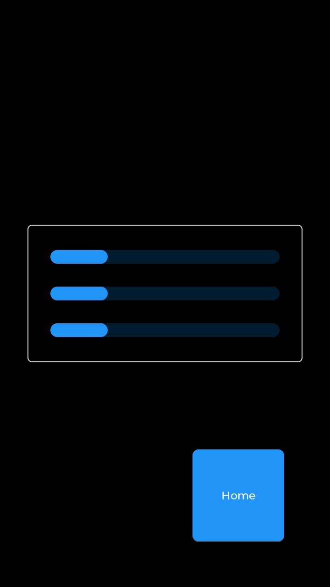

# pace-hmi-fw

## Description
This FW drives the RAMMP Wheelchair HMI (Human-Machine-Interface). This FW is meant to run on a TAB5 attached to the [RAMMP HMI PCB](https://github.com/rammp-org/pace-hmi-pcb)

## Compatible Hardware
- The FW runs on a TAB5 tablet (ESP32-P4)
- [RAMMP HMI PCB](https://github.com/rammp-org/pace-hmi-pcb)
- 3D Joystick (Hall Sensor) via ADCs
- Up to 4 buttons via GPIO
- WIP: Haptic Motor feedback via I2C (requires haptic driver)
- Ethernet for RTPS comms via W5500 ethernet controller

## Quick testing

### 3D Joystick
The joystick can be tested via the Settings screens. The joystick movement should correlate with the sliders values

### RTPS
The Tab5 publishes the joystick ADC values over Ethernet.
Run `scripts/rtps_adc_plot.py` to plot them live.

If it stays at "waiting for samples", force it to use the PC's wired Ethernet adapter: `--advertised-address <PC_ETHERNET_IP>`

**Note: Check that on the serial monitor that the Ethernet Link is up and the TAB5 gets an IP**
