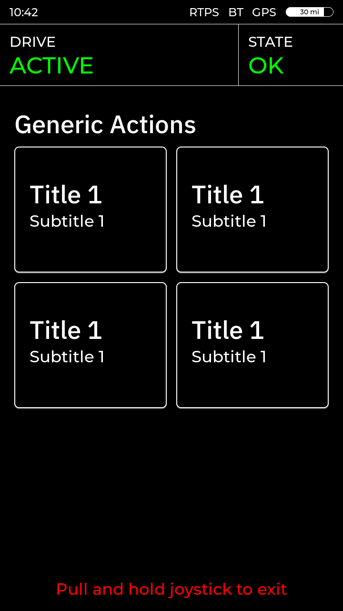
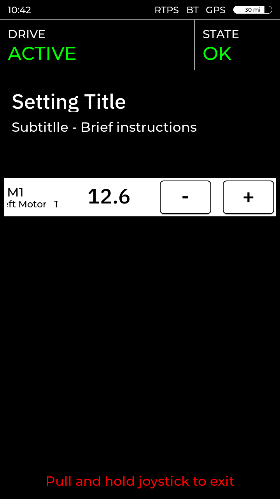
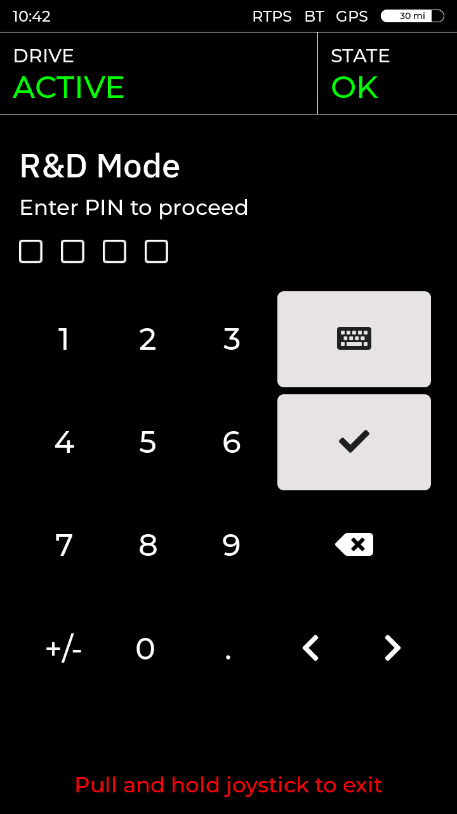
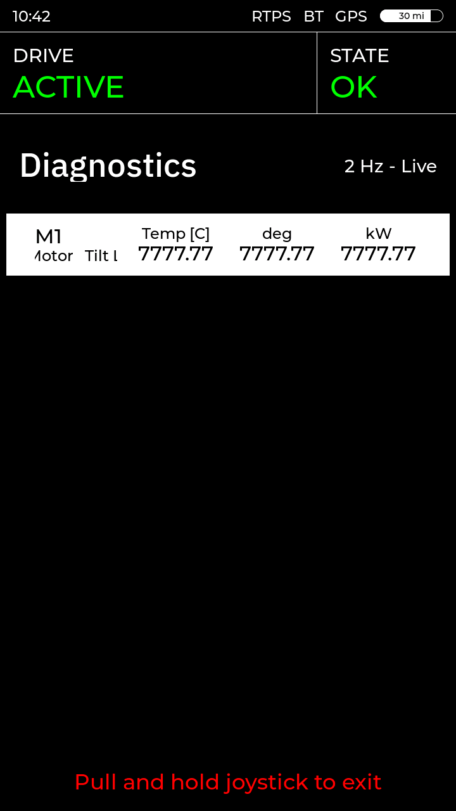
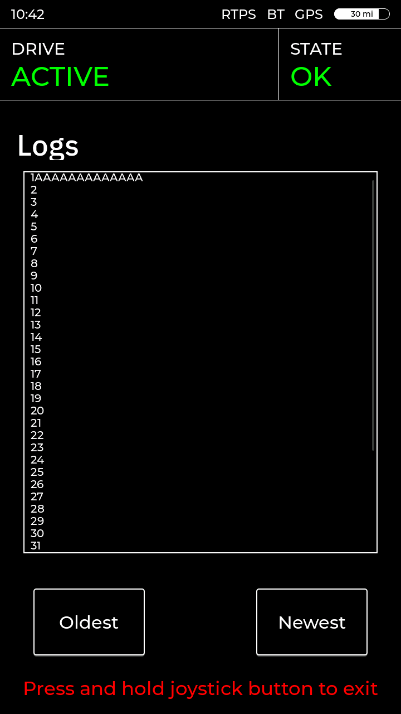

# pace-hmi-fw


Firmware for the RAMMP wheelchair HMI: an M5Stack Tab5 (ESP32-P4) on the [RAMMP HMI PCB](https://github.com/rammp-org/pace-hmi-pcb).

## Hardware
- Tab5 (ESP32-P4), 720x1280 portrait touch panel
- 3D hall joystick (X / Y / twist) on the ADCs, up to 4 buttons on GPIO
- W5500 SPI Ethernet for RTPS
- WIP: haptic motor over I2C

## Build and flash
- With ESP-IDF v6.0: `idf.py build flash monitor`
- Without a toolchain: download the programmer from **Actions → Build and Package Main → Artifacts** and run it.
- Or put the [release](https://github.com/rammp-org/pace-hmi-fw/releases) images in `precompiled/` and run `.\flash_precompiled.ps1` (needs esptool v5+).

## Screens
- Joystick only: **push up and hold** to enter, **pull and hold** (or hold the button) to leave. The bottom prompt says which.
- The UI is designed in SquareLine Studio ([pace-hmi-gui](https://github.com/rammp-org/pace-hmi-gui)); `main/ui/` is its export (`import_ui.ps1`). Don't edit it here.

| | | |
|:--:|:--:|:--:|
|  |  |  |
| Boot splash | Home pager | Drive: speed, drive mode |
|  |  |  |
| Seat functions | Generic actions | Setting page (brightness, actuators) |
|  |  |  |
| PIN before DEBUG ACTUATORS | Live MCB diagnostics | System logs |
|  | | |
| Joystick test and calibration | | |

- **Drive / Seat**: only enter while the MCB link is up and its state is OK; otherwise a red banner says why.
- **Generic actions**: one row per entry in `main/actions_spec.h` (haptic test, self test, seat up, restart).

## Settings menu

| row | what it does |
| --- | --- |
| CHANGE THEME | switch the colour theme (saved) |
| SCREEN BRIGHTNESS | backlight 5-100 % (saved); the side button and RTPS can set it too |
| DIAGNOSTICS | live readings from the MCB, see below |
| DEBUG ACTUATORS | PIN, then step each actuator with -/+ (the MCB moves it) |
| SELF TEST | checks the HMI; results on screen and on serial |
| SYSTEM LOGS | the last 500 serial log lines |
| FPS COUNTER | show the render rate |
| HAPTIC TEST | buzz the vibration motor |
| Joystick Test → CALIBRATE | 6-step stick calibration, saved to flash |

Saved settings live in LittleFS (`/storage`), so they survive a reboot.

## RTPS

- The spec is `main/rammp_rtps_spec.h`: topics, enums, tables and the message structs.
- Its top has an example: an MCB on the same espp / ESP-IDF stack sending Diagnostics.
- Messages are plain C++ structs serialized by espp/cdr as **XCDR1** (classic CDR), so any DDS / ROS 2 stack can talk to it.
- Every topic is best-effort; the MCB resends its state periodically.
- The MCB owns the chair's state; the HMI shows it and asks for changes.

| topic | type | direction | carries |
| --- | --- | --- | --- |
| `rammp/mcb/status` | `McbStatus` | MCB → HMI, 2 Hz | drive status, state, speed, clock, label and error text |
| `rammp/actuator/state` | `ActuatorState` | MCB → HMI, 2 Hz + on change | actuator positions, verdict on the last command |
| `rammp/mcb/diagnostics` | `Diagnostics` | MCB → HMI, 2 Hz | readings for each `RAMMP_DIAG_TABLE` row |
| `rammp/joystick/adc` | `AdcXYTwist` | HMI → MCB, ~30 Hz | calibrated X / Y / twist (-1..+1), buttons, drive mode |
| `rammp/actuator/command` | `ActuatorCommand` | HMI → MCB, per press | move actuator N by ±steps |
| `rammp/hmi/counter`, `command`, `brightness` | `std_msgs/UInt32` | bench PC | heartbeat, self-test run / ping, backlight % |
| `rammp/selftest/report` | `SelfTestReport` | HMI → PC | one per self-test check |

Example: an MCB (same espp / ESP-IDF stack) sending Diagnostics:

```cpp
#include "cdr.hpp"
#include "rtps_participant.hpp"
#include "rammp_rtps_spec.h"

espp::RtpsParticipant rtps({.interface_address = my_ip});
rtps.start();
rtps.add_writer({.topic = RAMMP_TOPIC_MCB_DIAGNOSTICS, .type_name = RAMMP_TYPE_DIAGNOSTICS,
                 .reliability = espp::RtpsParticipant::Reliability::BEST_EFFORT});

rammp::Diagnostics diag{.seq = seq++, .items = {{.values = {305, 150, 450}}}}; // T1: 30.5 C, 1.50 A, 45.0 deg
if (auto bytes = cdr::serialize<cdr::xcdr1>(diag))
  rtps.publish(RAMMP_TOPIC_MCB_DIAGNOSTICS, rammp::as_u8(*bytes));
```

Receiving works the same way: `add_reader({..., .on_sample = ...})`, then `cdr::deserialize<rammp::ActuatorCommand>(std::as_bytes(data))`.

How the messages reach the screens:
- **McbStatus** → the status labels on every screen, the drive speed, the error banner, and the TopBar clock.
- No McbStatus for 2 s → "RTPS LINK LOST"; Drive and Seat are refused.
- **ActuatorState** → the DEBUG ACTUATORS rows; a refused step flashes its row.
- Each -/+ press sends an **ActuatorCommand**, and the row shows what the MCB answers.
- **Diagnostics** → the DIAGNOSTICS rows; the rate label shows the arrival Hz.
- No Diagnostics for 2 s → every row turns red and blinks.
- **AdcXYTwist** goes out continuously once the MCB is found.

## Testing

| command | what it does |
| --- | --- |
| `python scripts/rtps_mcb_gui.py` | plays the MCB: status, error banner, actuators, diagnostics, drive view |
| `python scripts/rtps_selftest.py` | runs the self test over RTPS (exit 0 = pass) |
| `python scripts/rtps_mcb_sim.py` | CLI version of the GUI (`--cycle` walks every state) |
| `python scripts/rtps_adc_plot.py` | live joystick plot (needs matplotlib) |
| `cd sim; python run.py` | the screens on a PC, no board ([sim/README.md](sim/README.md)) |


- Nothing arriving? The PC picked the wrong network adapter: set **Via** in the GUI, or `--advertised-address <PC_IP>`.
- The serial log shows the Ethernet link, the IP, and every MCB status change.
