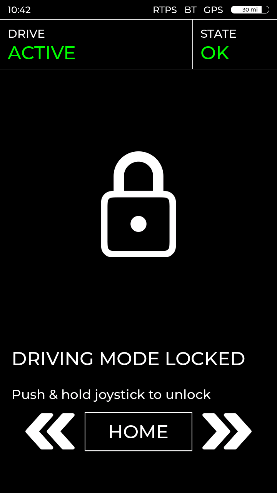
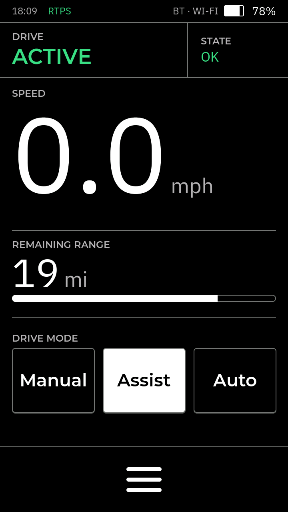
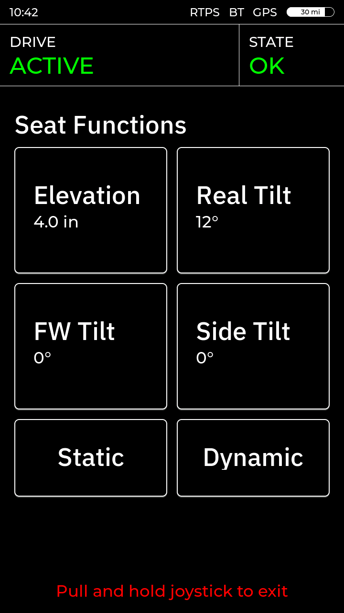
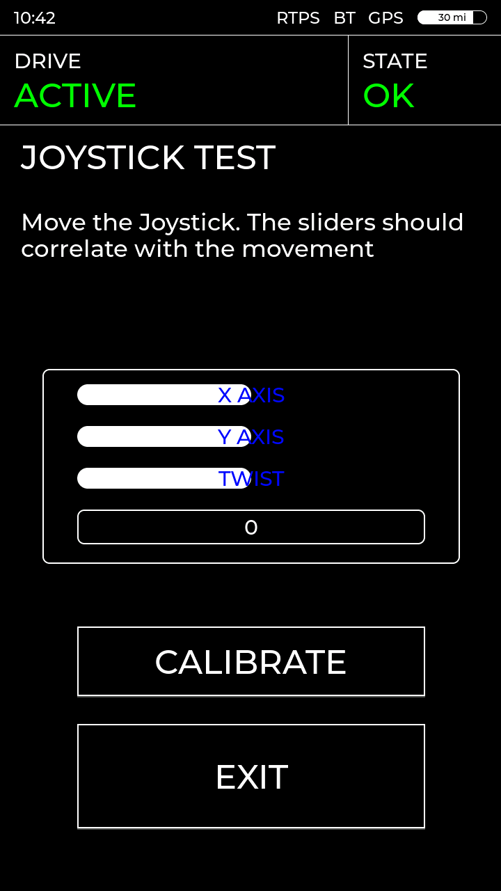
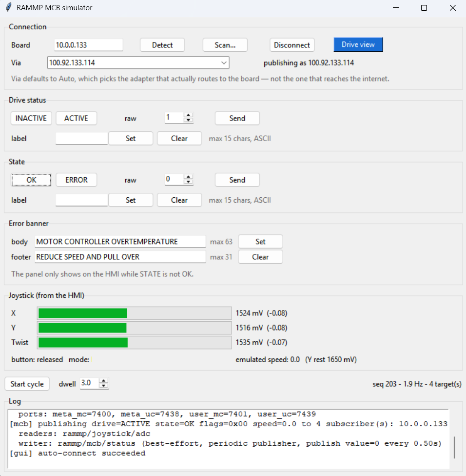
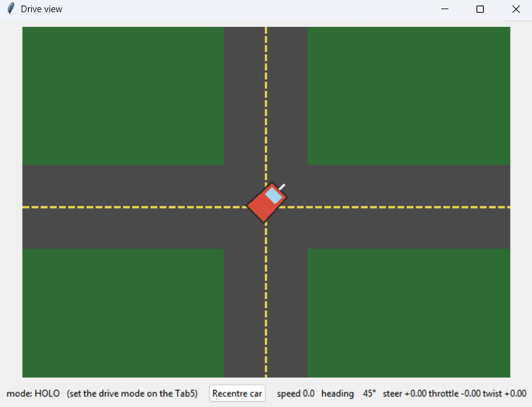

# pace-hmi-fw



## Description
This FW drives the RAMMP Wheelchair HMI (Human-Machine-Interface). This FW is meant to run on a TAB5 attached to the [RAMMP HMI PCB](https://github.com/rammp-org/pace-hmi-pcb)

## Compatible Hardware
- The FW runs on a TAB5 tablet (ESP32-P4)
- [RAMMP HMI PCB](https://github.com/rammp-org/pace-hmi-pcb)
- 3D Joystick (Hall Sensor) via ADCs
- Up to 4 buttons via GPIO
- WIP: Haptic Motor feedback via I2C (requires haptic driver)
- Ethernet for RTPS comms via W5500 ethernet controller

## Screens
The UI is designed in SquareLine Studio 1.6.1 in [pace-hmi-gui](https://github.com/rammp-org/pace-hmi-gui); `main/ui/` is that project's C export, mirrored in by `import_ui.ps1` — edit the design there, not here.

Navigation is joystick-only: push up and hold on a page to enter it, then hold the joystick button (or pull, on the seat screen) to come back. The prompt at the bottom of each screen says which.

| | | |
|:--:|:--:|:--:|
|  |  |  |
| Splash while the display, ADCs and Ethernet come up | Home pager; push & hold the joystick to unlock driving | Speed, remaining range and drive mode (Holo / Normal / Auto) |
|  |  | |
| Seat functions: elevation and tilts, static or dynamic | Bars follow the raw X/Y/twist ADC values | |

## Flashing without building

The easiest route needs nothing installed at all — no Python, no esptool, not even this
repo. Every CI build produces a self-contained programmer for each desktop OS, attached
to the workflow run under **Actions → Build and Package Main → Artifacts**:

```
rammp-hmi-p4_programmer_<version>_windows.exe
rammp-hmi-p4_programmer_<version>_macos.bin
rammp-hmi-p4_programmer_<version>_linux.bin
```

Download the one for your machine, plug in a board and run it. The firmware is baked in,
so the version in the filename is exactly what gets flashed.

Otherwise, if you already have this repo checked out: grab the images from the
[latest release](https://github.com/rammp-org/pace-hmi-fw/releases) — CI builds and
attaches them on every release — and extract them into a `precompiled/` folder at the
root of the repo, then:

```powershell
.\flash_precompiled.ps1            # one board attached: the port is found automatically
.\flash_precompiled.ps1 -Port COM6 # or name it
```

Double-clicking `flash_precompiled.bat` does the same thing for anyone who doesn't
live in a terminal. The only prerequisite is **esptool v5 or newer** — the script
uses the copy inside the ESP-IDF tools directory if it's installed, otherwise
`pip install esptool`.

`precompiled/` is **not committed** — it is build output, not source. Every `idf.py
build` regenerates it locally (the `precompiled` target in `CMakeLists.txt`), so if you
do have a toolchain the folder always holds the image this tree just produced, and
`flash_precompiled.ps1` flashes exactly that. `manifest.txt` beside the binaries records
the version, commit and SHA256 of each image; the `.elf` lands there too, for decoding a
backtrace against the image actually on the board.

## Quick testing

### 3D Joystick
Open **Joystick Test** from the home pager's settings page. The bars should correlate with the stick movement.

### RTPS
`scripts/rtps_mcb_gui.py` is the main test tool: it plays the Main Control Board from a PC, so the whole HMI ↔ MCB path can be exercised with no MCB on the bench. tkinter only, no dependencies.

```
python scripts/rtps_mcb_gui.py
```



It auto-connects on launch; **Detect** finds the board again if it moved, **Scan...** sweeps a subnet. Then, top to bottom:

- **Drive status** / **State** — preset buttons for the enums the FW knows, a raw spinbox for values it does not, and a free-text `label` that overrides the displayed text while the colour still follows the enum.
- **Error banner** — body and footer of the fault panel the HMI raises whenever STATE is not OK.
- **Joystick (from the HMI)** — live X/Y/twist mV, button and drive mode arriving back off the wire; the readouts to check the stick against.
- **Start cycle** — walks every state combination hands-free, `dwell` seconds each.

**Drive view** opens a top-down car driven by the real joystick — the quickest way to feel the drive modes (pick HOLO / Normal / Auto on the Tab5; it arrives with every sample). Its speed is the speed published back to the HMI, so the number on screen and the number on the Tab5 are the same one.



The rest of `scripts/` is stdlib-only too (the plot also needs `pip install matplotlib`):

| script | what it does |
| --- | --- |
| `rtps_adc_plot.py` | live X/Y dot with trail + twist bar, straight off the joystick stream |
| `rtps_mcb_sim.py` | the CLI version of the GUI, same publisher; `--cycle` walks every combination |
| `rtps_host.py` | raw harness — discovery dump, `std_msgs/msg/UInt32` send/receive, `--self-test` for the wire codecs |
| `rammp_rtps.py` | not a tool: the python view of the wire spec, imported by the others |

If nothing arrives, it left by the wrong adapter — RTPS uses exactly one, and on a PC with VirtualBox/Tailscale/VPN interfaces the automatic pick is usually a virtual one. Set **Via** in the GUI, or `--list-interfaces` / `--advertised-address <PC_ETHERNET_IP>` on the CLI tools.

**Note: Check that on the serial monitor that the Ethernet Link is up and the TAB5 gets an IP**

## RTPS spec
`main/rammp_rtps_spec.h` is the single source of truth for everything crossing the wire between this HMI and the Main Control Board — topics, type names, enums and message layouts. The MCB firmware includes that same header, and `scripts/rammp_rtps.py` scrapes it, so neither side nor the test tools can drift.

The MCB is the master and owns the vehicle state; the HMI is a slave that displays what it is told and asks for what the user wants.

| topic | type | direction and payload |
| --- | --- | --- |
| `rammp/mcb/status` | `rammp/msg/McbStatus` | MCB → HMI: drive status, system state, speed, plus optional label and error-banner text overrides |
| `rammp/joystick/adc` | `rammp/msg/AdcXYTwist` | HMI → MCB: raw X/Y/twist millivolts, button bits and the selected drive mode, ~30 Hz |

Both are best-effort with no durability and serialize as classic little-endian CDR: a 4-byte encapsulation header followed by the fields in declaration order. `McbStatus` must be republished every 500 ms even when nothing changed — after 2 s of silence the HMI treats the link as lost and greys out the labels. Joystick values are deliberately raw millivolts (1650 centre, 3300 full scale); calibration is the consumer's job.
