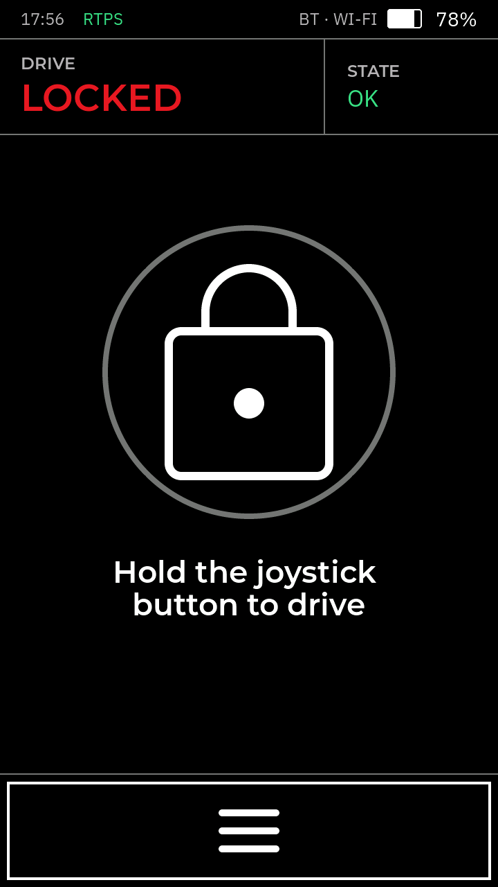
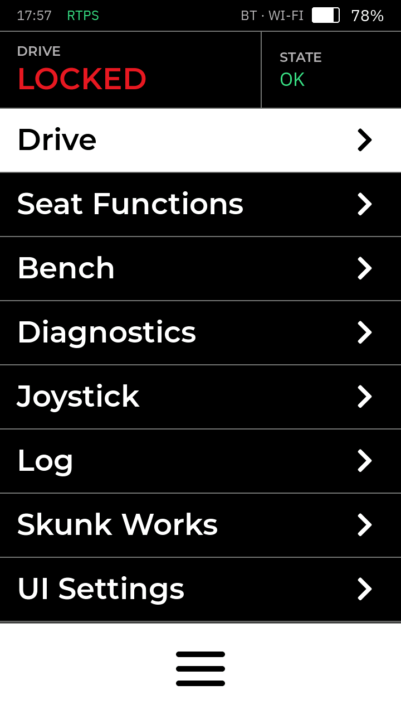
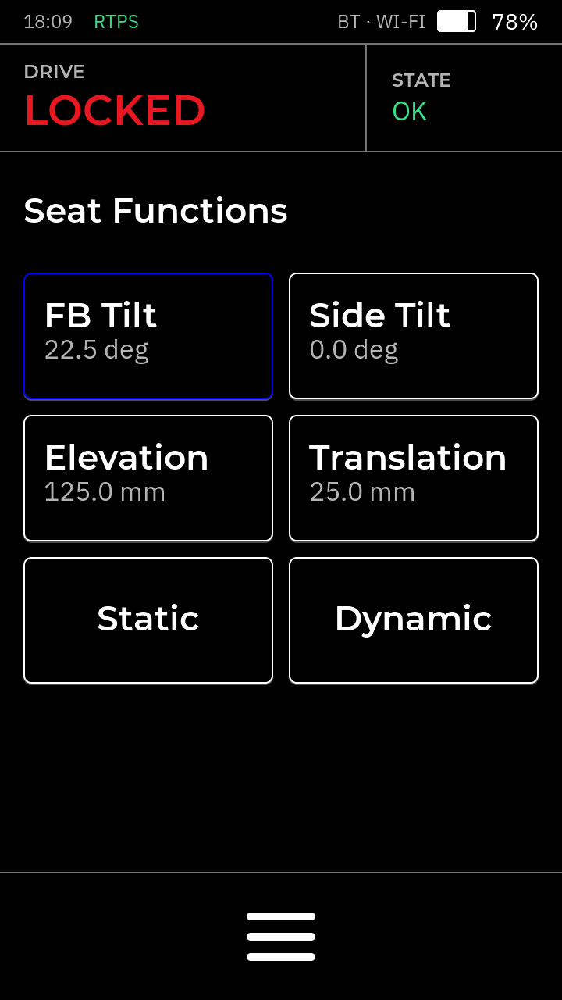
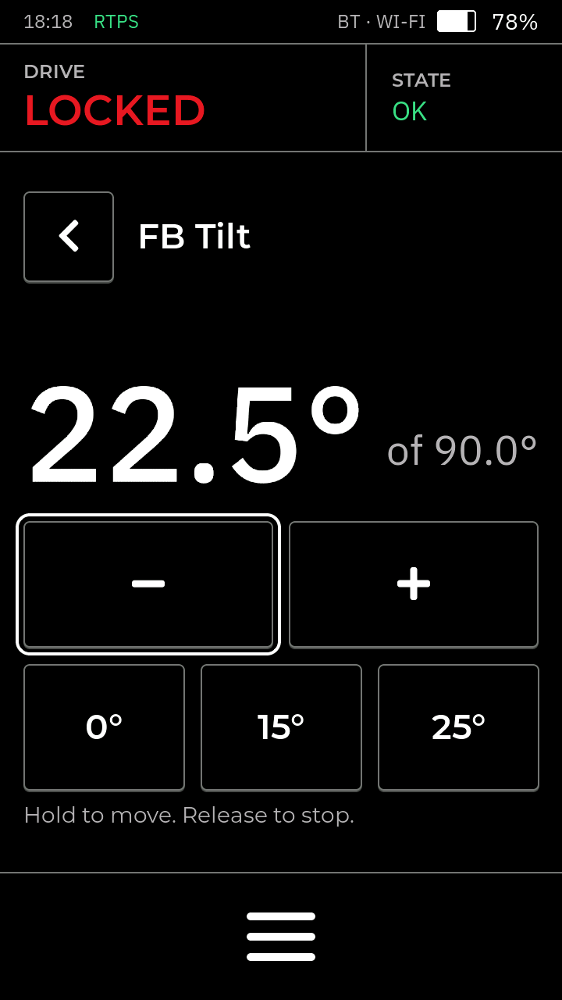
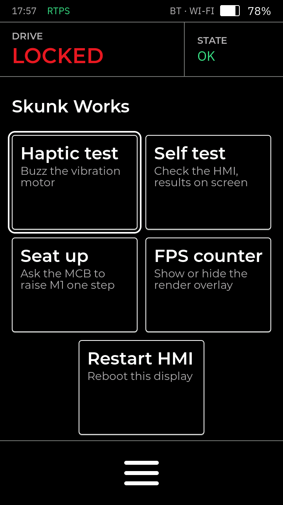
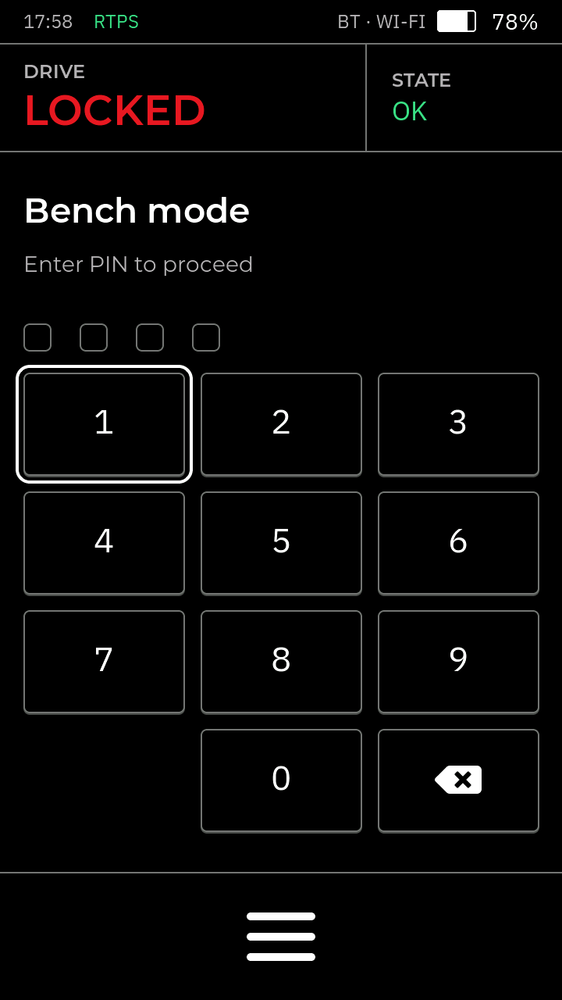
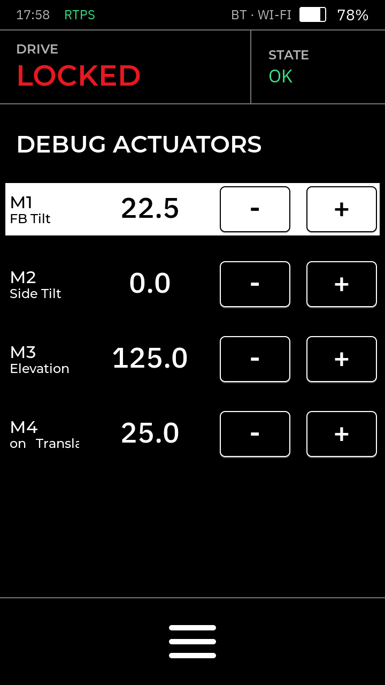
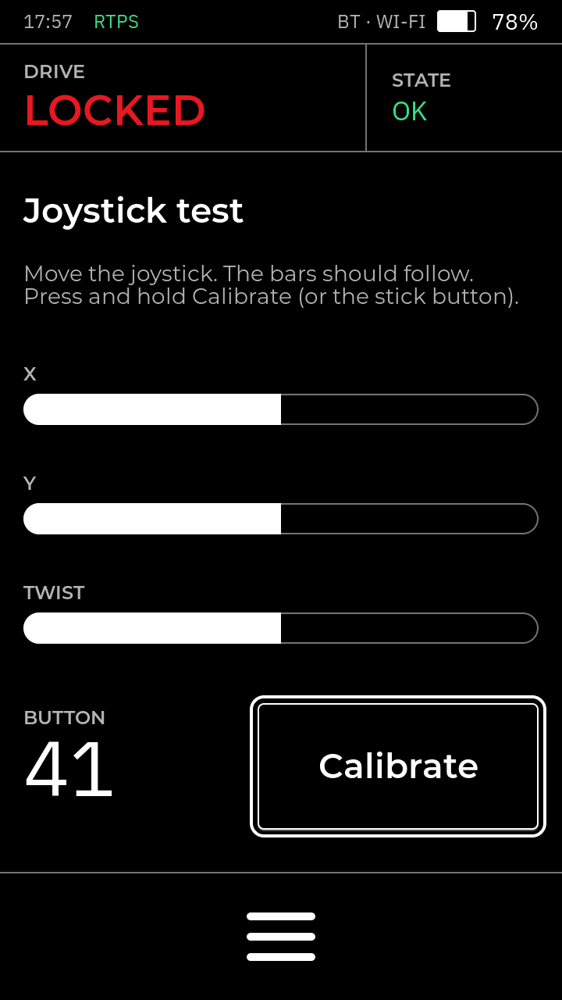

# pace-hmi-fw

  

Firmware for the RAMMP wheelchair HMI: an M5Stack Tab5 (ESP32-P4) on the [RAMMP HMI PCB](https://github.com/rammp-org/pace-hmi-pcb).

## Hardware
- Tab5 (ESP32-P4), 720x1280 portrait touch panel
- 3D hall joystick (X / Y / twist) on the ADCs, up to 4 buttons on GPIO
- W5500 SPI Ethernet for RTPS
- DRV2605 haptic motor over I2C

## Build and flash
- Clone with the shared RTPS spec: `git clone --recursive` (or `git submodule update --init`).
- With ESP-IDF v6.0: `idf.py build flash monitor`
- Without a toolchain: download the programmer from **Actions → Build and Package Main → Artifacts** and run it.
- Or put the [release](https://github.com/rammp-org/pace-hmi-fw/releases) images in `precompiled/` and run `.\flash_precompiled.ps1` (needs esptool v5+).

## Screens

The UI follows RAMMP UI spec V2. Every screen has the same frame: the status bar, the **DRIVE / STATE** band, the screen's own content, and the **burger key** at the bottom, which opens the menu. [docs/ui-architecture.md](docs/ui-architecture.md) explains how it all works: where the screens come from, how the menu is built, how touch and the joystick move around, and how the chair's state reaches the screen.

- **Driving**: on the Locked screen, **hold the joystick button** until the ring closes. The MIB decides: the Drive screen opens only once it says the chair is driving. Hold the button again on the Drive screen to stop. While driving, the burger key asks the MIB to stop first, and the menu opens once it has.
- **Moving around**: touch, or the joystick. Push to move the highlight, press the button to select. Down past the last item reaches the burger key.
- **Refusals**: a greyed row or button refuses with a double click (heard and felt), and a banner says why.
- The UI is designed in [pace-hmi-gui](https://github.com/rammp-org/pace-hmi-gui) (`tools/build_ui.py` + SquareLine Studio); `components/ui/` is its export, brought in with `import_ui.ps1`. Don't edit it here.

| | | |
|:--:|:--:|:--:|
|  |  |  |
| Locked: hold the button to drive | The burger menu | Drive: speed, range, drive mode |
|  |  |  |
| Seat Functions | One motion: jog, presets, "<" back | Skunk Works: one-press actions |
|  |  |  |
| UI Settings | Live MCB diagnostics | System log |
|  |  |  |
| Bench: the PIN | DEBUG ACTUATORS | Joystick test and CALIBRATE |

### The burger menu

| row | opens |
| --- | --- |
| Drive | the Drive screen while driving, else the Locked screen; greyed while the MCB could not drive |
| Seat Functions | the four seat motions; greyed while the MCB could not move the seat |
| Bench | the PIN (1234), then DEBUG ACTUATORS: step each actuator with - / + |
| Diagnostics | live readings from the MCB |
| Joystick | the stick test; press and hold CALIBRATE (or the stick button) to calibrate |
| Log | the last 500 serial log lines |
| Skunk Works | one-press actions from `main/actions_spec.h`: haptic test, self test, seat up, FPS counter, restart |
| UI Settings | the settings below |

**DRIVE** in the band goes home from anywhere.

### UI Settings

| row | what it does |
| --- | --- |
| Brightness | backlight 5-100 %; the side button and RTPS can set it too |
| Theme | Dark or Day |
| Menu slide | animate the menu opening (off = instant) |
| Flip screen | turn the picture and touch 180 degrees, for a unit mounted upside down |
| Stick sensitivity | 1-10: how far the stick moves before the highlight does |
| Stick left/right, Stick fwd/back | mirror an axis |
| Stick axes | swap X and Y |
| Sounds | touch and joystick clicks; warnings sound either way |

Every row is one line in `main/settings_spec.h`, and every value is saved in LittleFS (`/storage`), so it survives a reboot. The stick mapping rows are refused while driving.

## RTPS

- The shared spec is [rammp-rtps](https://github.com/rammp-org/rammp-rtps), the git submodule `external/rammp-rtps`.
- `messages/joystick_message.hpp` there holds the joystick's commands, the shared tables and Diagnostics; `messages/mib_message.hpp` holds `MIB::MibStatus`, the chair's own state. Between them they are everything the MIB and the HMI share, and the first has an espp example at the top.
- `main/hmi_rtps_spec.hpp` adds what only this HMI needs: timing, display limits, the bench self-test topics.
- Messages are plain C++ structs serialized by espp/cdr as **XCDR1** (classic CDR), so any DDS / ROS 2 stack can talk to it.
- Every topic is best-effort; the MCB resends its state periodically.
- The MCB owns the chair's state; the HMI shows it and asks for changes.

| topic | type | direction | carries |
| --- | --- | --- | --- |
| `rammp/mib/status` | `MIB::MibStatus` | MIB → HMI, 2 Hz | system state, active profile, seat position, speed, clock, error text |
| `rammp/mcb/diagnostics` | `Diagnostics` | MIB → HMI, 2 Hz | readings for each `RAMMP_DIAG_TABLE` row |
| `rammp/joystick/xy_twist` | `XYTwist` | HMI → MIB, ~30 Hz | calibrated X / Y / twist (-1..+1), buttons |
| `rammp/joystick/drive_command` | `DriveCommand` | HMI → MIB, per request | enable / disable driving, and the drive profile |
| `rammp/joystick/seat_command` | `SeatCommand` | HMI → MIB, per press | put seat axis N at an absolute target |
| `rammp/hmi/counter`, `command`, `brightness` | `std_msgs/UInt32` | bench PC | heartbeat, self-test run / ping, backlight % |
| `rammp/selftest/report` | `SelfTestReport` | HMI → PC | one per self-test check |

Example: an MCB (same espp / ESP-IDF stack) sending Diagnostics:

```cpp
#include "rtps_pubsub.hpp"
#include "messages.hpp" // rammp-rtps

espp::RtpsParticipant rtps({.interface_address = my_ip});
rtps.start();
const auto &topic = rammp::kMcbDiagnostics; // a Topic<rammp::Diagnostics>
espp::Publisher<rammp::Diagnostics> pub(rtps, {.topic = topic.name, .type_name = topic.type});

pub.publish({.seq = seq++, .items = {{.values = {305, 150, 450}}}}); // T1: 30.5 C, 1.50 A, 45.0 deg
```

Receiving works the same way: `espp::Subscriber<rammp::SeatCommand>` with an `.on_message` callback.

The spec is C++20 and strictly typed:
- Every enum is scoped with a fixed wire width (`enum class MibSystemState : uint8_t`), so a raw number or the wrong enum does not compile.
- Every topic carries its message type (`Topic<MibStatus>`), so the wrong message or handler for a topic does not compile.
- Timings are `std::chrono::milliseconds`; names come from typed `to_string(...)` overloads.

How the messages reach the screens:
- **MibStatus** → the status labels on every screen, the drive speed, the seat numbers, the error banner, and the TopBar clock. One message carries the lot.
- No MibStatus for 2 s → "RTPS LINK LOST"; Drive and Seat are refused.
- `MibSystemState` is the interlock: the chair drives only in `ENABLED`, and the MIB disables manual seat control while it is driving, so the seat screen needs `IDLE`. `INITIALIZING` and `ERROR` bar both.
- The MIB decides whether the chair drives, both ways. The DriveScreen is a view of one fact: it opens whenever the state is `ENABLED` and closes when it stops being `ENABLED`, whoever asked — so the screen can never disagree with the chair.
- Holding the joystick button on the Locked screen sends a **DriveCommand** and waits. Leaving is a request too: the button hold on the Drive screen, or the burger key there, sends `DISABLE`, and the screen closes only when the MIB actually stops, so a refused exit keeps you on the drive screen.
- Picking a drive mode (Manual = `HIGH`, Assist = `NORMAL`, Auto = `LOW`) sends a `DriveCommand` carrying it, and the three buttons highlight `MibStatus.activeProfile` — what the MIB reports, never what was pressed. A profile the chair refuses never lights up.
- Three refusals get the error banner for 3 s, with the MIB's own `error_message` when it sent one: **DRIVE REFUSED: NOT GRANTED** (asked, never got `ENABLED`) and **DRIVING STOPPED** (the MIB disabled driving by itself) on the Locked screen, and **EXIT REFUSED** on the drive screen itself.
- **MibStatus.currentSeatState** → the numbers on the seat screen and the DEBUG ACTUATORS rows. The MIB owns every position: a press asks, and the number moves when the next status says the seat did. A refusal reaches the HMI as an axis that did not move — there is no per-request verdict on the wire.
- Each seat press sends a **SeatCommand** with an **absolute** target, so a step button and a preset are the same message, and a lost or repeated one cannot drift the seat.
- The wire carries the seat in whole units (degrees, millimetres); the screens step and draw raw integers, converted at the wire boundary by `seat_raw()` / `seat_units()`.
- **Diagnostics** → the DIAGNOSTICS rows; the rate label shows the arrival Hz.
- No Diagnostics for 2 s → every row turns red and blinks.
- **XYTwist** goes out continuously once the MCB is found.

### Adding a seat axis or a diagnostics item

One row in `messages/joystick_message.hpp` (rammp-rtps); the HMI screens and the Python tools pick it up.

```c
// RAMMP_SEAT_AXIS_TABLE: X(id, NAME, short, label, min, max, step, decimals, unit)
  X(4, HEADREST, "M5", "Headrest", 0, 900, 25, 1, "deg")

// RAMMP_DIAG_TABLE: D(id, NAME, short, label, unit1, dec1, unit2, dec2, unit3, dec3)
  D(3, TEST_4, "T4", "Test actuator 4", "Temp [C]", 1, "Current [A]", 2, "Pos [deg]", 1)
```

- `id` is the next number, in table order.
- Every row except the last ends with `\`.
- Values are raw integers in units of 10^-decimals `unit` (250 with 1 decimal is 25.0).
- A diagnostics unit of `""` hides that reading.
- A diagnostics item is one row and nothing else: the MIB sends one more `Diagnostics.items` entry, in table order.
- A seat axis is two edits, because the seat is named fields rather than a sequence: the table row, and the matching field in `MIB::seatState` plus its `case` in `rammp::seat_field()`. The table's rows are that struct's fields, in that order.
- A seat axis also takes the next free button on the seat screen, in table order; past the fourth there is no button for it yet, and it appears only on the DEBUG ACTUATORS page.

## Testing

| command | what it does |
| --- | --- |
| `python scripts/rtps_mcb_gui.py` | plays the MIB: system state, drive requests, error banner, seat, diagnostics, drive view |
| `python scripts/rtps_selftest.py` | runs the self test over RTPS (exit 0 = pass) |
| `python scripts/rtps_mcb_sim.py` | CLI version of the GUI (`--cycle` walks every state) |
| `python scripts/rtps_adc_plot.py` | live joystick plot (needs matplotlib) |
| `python scripts/hmi_ui.py shot out.png` | the board's screen, and taps / keys / `walk`, over TCP; needs `CONFIG_HMI_REMOTE_UI` in your local `sdkconfig` (never in `sdkconfig.defaults`) |
| `cd sim; python run.py` | the old screens on a PC, parked since spec V2 ([sim/README.md](sim/README.md)) |


- Nothing arriving? The PC picked the wrong network adapter: set **Via** in the GUI, or `--advertised-address <PC_IP>`.
- The serial log shows the Ethernet link, the IP, and every MCB status change.
