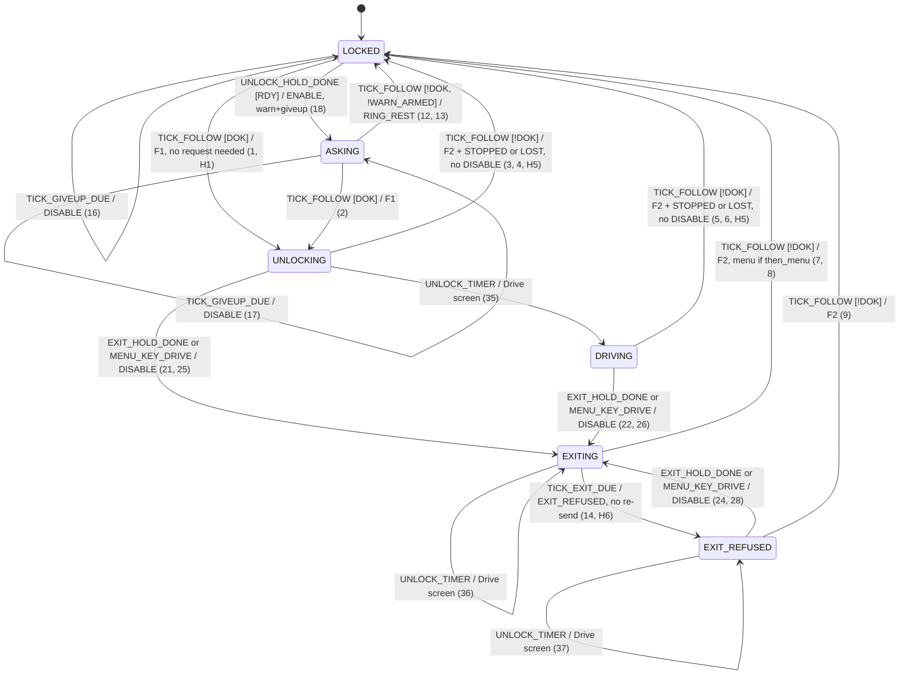

# Drive session: as-is transition table (oracle)

Status: **AI-derived, unreviewed** (2026-10-06, agent O). Characterises the code at e2047a4
(`main.cpp` split into `main/frag_*.inc`, one translation unit, verbatim). It pins today's
behaviour, hazards included. It is not a design. Fixing a row is a behaviour change: it needs two
human approvals (CS-SAF-05) and a new table.

Correction (2026-10-06, agent A2, for the owner's review): rows 3–6, 8 and 9 gain
CLEAR_MENU_ON_ARRIVAL. The code has always written `nav_menu_on_arrival := then_menu` on every
relock (frag_drive.inc:75, orig 1598); the table recorded only the `true` case (row 7). The
firmware's behaviour does not change; the table now says what it does.

The data is `include/drive_session_table.hpp`, namespace `hmi::drive_session`; its enums and row
structs are in `include/drive_session_types.hpp`. Those headers win
over this page. This page is the same table for reading, plus a D4 diagram, the hazards, and the
questions left open. The agent that writes the extraction never edits the header (CORE never-list:
declarations).

`include/drive_session_fingerprint.hpp` pins the data with one number, `TABLE_FINGERPRINT` (FNV-1a
over every field of every row, the invariants, the action effects, the input preconditions, the
sequences and the hold `applies()`). A refactor keeps it; a reviewed row change updates it in the
same commit.

Line references are written `frag_X.inc:L (orig N)`. N is the line in `main.cpp` at e2047a4:
N = (the first original line in the fragment's header) + L − 2, because line 1 of every fragment
is the `split_main.py` header. Example: `frag_lock.inc` covers 1067–1192, so its line 2 is
orig 1067. In today's residual `main.cpp`, every line after the fragment includes is orig = L + 4622.

## 1. Model

| Part | What it is |
| --- | --- |
| **Phase** | `LOCKED`, `ASKING`, `UNLOCKING`, `DRIVING`, `EXITING`, `EXIT_REFUSED`: the plan's six phases, kept because the code supports exactly these. Each is a projection of five code variables (`phase_of`, §1.1). |
| **Hidden** | The session variables that Phase does not hold: `WARN_ARMED`, `GIVEUP_ARMED`, `THEN_MENU`, `REQUEST_ENABLE` (the value of `drive_request`), and `UNLOCK_TIMER_ARMED`. They are guard bits, so rows can test them. Actions set and clear them (`ACTION_EFFECTS`). Each phase has an invariant over them (`PHASE_INVARIANTS`, §1.2). |
| **Env** | Sampled when the input arrives: link `CONNECTED`; the MIB state (→ `DRIVING_OK`, `MCB_READY`); the screen (`ON_LOCKED/DRIVE/SEAT_SCREEN`); `MENU_OPEN`; and `now` against each deadline (`EXIT/WARN/GIVEUP_ELAPSED`). `env_guards(Env)` derives the bits, so impossible combinations never come up. |
| **Input** | There is **no MIB_UPDATE event.** A MibStatus only writes subjects (`main.cpp:1647`, orig 6269, RTPS task, under `lvgl_mutex`). The session looks at those subjects on the 250 ms tick (`rtps_poll_cb`, `frag_rtps_poll.inc:37-45`, orig 674-682), or when a user input arrives. |
| **TICK** | Not a single input. `drive_wait_poll` (`frag_drive.inc:99-122`, orig 1622-1645) runs `drive_screen_follow_state` **first** and then three deadline checks, each one seeing the state the previous step left. So one TICK is `TICK_SEQUENCE` = `TICK_FOLLOW`, `TICK_EXIT_DUE`, `TICK_WARN_DUE`, `TICK_GIVEUP_DUE`, applied in that order with **two Envs**: `TICK_FOLLOW` on the Env sampled when the tick starts; the three deadline checks on one Env sampled after follow-state's actions ran (`now` is read once, after follow-state, as `drive_wait_poll` always did). A deadline that passes between the two samples is acted on in the same tick. The deadline rows read only `*_ELAPSED` and hidden bits, so the second Env differs from the first only in time. Pinned by DRV-022. |
| **Priority** | Within one (from, input), rows are pairwise exclusive. This is checked by `static_assert` (syntactically) and by DSO-002 (by brute force), so order inside a group does not matter. Order matters only between the steps of one tick (`TICK_SEQUENCE`) and between the steps of one hold poll (`HOLD_POLL_SEQUENCE`). Rows are listed in the order the code evaluates them. |
| **Oracle contract** | For every (phase, hidden, input, env) that satisfies `hidden_valid` and `INPUT_PRECONDITIONS`, at most one row matches (`find_row`). If one matches, the phase becomes `to`, hidden becomes `apply(actions, hidden)`, and the actions happen in row order. If none matches, nothing changes, and nothing is sent or shown (TS-UNIT-08). |

### 1.1 Phase from code variables

| Phase | `locked_subject` | `lock_waiting` | `unlock_advance_timer` | `drive_exit_requested` | `drive_exit_until_us` |
| --- | --- | --- | --- | --- | --- |
| LOCKED | 1 | false | – | – | – |
| ASKING | 1 | true | – | – | – |
| UNLOCKING | 0 | – | armed | false | – |
| DRIVING | 0 | – | null | false | – |
| EXITING | 0 | – | any | true | ≠ 0 |
| EXIT_REFUSED | 0 | – | any | true | 0 |

### 1.2 Phase invariants on the hidden variables (from every write site)

| Phase | Always true | Always false |
| --- | --- | --- |
| LOCKED | – | WARN_ARMED, THEN_MENU, UNLOCK_TIMER_ARMED |
| ASKING | – | THEN_MENU, UNLOCK_TIMER_ARMED |
| UNLOCKING | UNLOCK_TIMER_ARMED | WARN_ARMED, GIVEUP_ARMED, THEN_MENU |
| DRIVING | – | WARN_ARMED, GIVEUP_ARMED, THEN_MENU, UNLOCK_TIMER_ARMED |
| EXITING | – | WARN_ARMED, GIVEUP_ARMED, REQUEST_ENABLE |
| EXIT_REFUSED | – | WARN_ARMED, GIVEUP_ARMED, THEN_MENU, REQUEST_ENABLE |

Why each one holds:
- WARN_ARMED ⇒ ASKING. Only `drive_request_enter` arms it, right after `lock_visual_wait`. ASKING
  ends only through F1, which clears it, or F4, which needs it clear.
- GIVEUP_ARMED ⇒ locked, because F1 clears it before any unlock.
- THEN_MENU ⇒ EXITING. It is set only together with a fresh exit deadline, and cleared at that
  deadline (`frag_drive.inc:107`) and on every lock and unlock.
- REQUEST_ENABLE is clear in both exit phases. `drive_exit_ask` sends DISABLE, and nothing sends
  ENABLE while unlocked.
- UNLOCK_TIMER_ARMED is armed only by `set_locked(false)`. It is cleared by any `set_locked` and
  when it fires, and it survives UNLOCKING → EXITING.

## 2. Transition table (41 rows)

Guards are written `+X` (X must be true) and `!X` (X must be false). `—` means always.
Abbreviations: DOK = DRIVING_OK, RDY = MCB_READY, LINK = LINK_CONNECTED.

Action groups, expanded in the header:
- **F1** = CLEAR_WARN, CLEAR_GIVEUP, CLEAR_EXIT_DEADLINE, CLEAR_EXIT_REQUESTED, CLEAR_THEN_MENU,
  LOCK_OPEN_VISUAL, CANCEL_UNLOCK_TIMER, START_UNLOCK_TIMER, SET_UNLOCKED, GATE_UPDATE.
- **F2** = CLEAR_EXIT_DEADLINE, CLEAR_EXIT_REQUESTED, CLEAR_THEN_MENU,
  OPEN_MENU_ON_ARRIVAL or CLEAR_MENU_ON_ARRIVAL, CANCEL_UNLOCK_TIMER, RING_REST, GO_LOCKED_SCREEN,
  SET_LOCKED, GATE_UPDATE, [banner]. It never sends DISABLE. The menu flag is
  `nav_menu_on_arrival := then_menu` (frag_drive.inc:75, orig 1598), written before the load:
  OPEN only in row 7, CLEAR in every other relock (DSO-013).
- **ASK(m)** = SEND_DISABLE, SET_EXIT_REQUESTED, (m ? SET_THEN_MENU : CLEAR_THEN_MENU),
  ARM_EXIT_DEADLINE.
- **ADV** = UNLOCK_TIMER_DONE, GO_DRIVE_SCREEN.

| # | from | input | guard | to | actions | code |
| --- | --- | --- | --- | --- | --- | --- |
| 1 | LOCKED | TICK_FOLLOW | +DOK | UNLOCKING | F1 **(H1: unlocks with no request)** | frag_drive.inc:51-62 (orig 1574-1585) |
| 2 | ASKING | TICK_FOLLOW | +DOK | UNLOCKING | F1 | frag_drive.inc:51-62 (orig 1574-1585) |
| 3 | UNLOCKING | TICK_FOLLOW | +LINK !DOK | LOCKED | F2 with CLEAR_MENU_ON_ARRIVAL + SHOW_DRIVE_STOPPED **(H5)** | frag_drive.inc:64-83 (orig 1587-1606) |
| 4 | UNLOCKING | TICK_FOLLOW | !DOK !LINK | LOCKED | F2 with CLEAR_MENU_ON_ARRIVAL + SHOW_DRIVE_LOST **(H5)** | frag_drive.inc:64-83 (orig 1587-1606) |
| 5 | DRIVING | TICK_FOLLOW | +LINK !DOK | LOCKED | F2 with CLEAR_MENU_ON_ARRIVAL + SHOW_DRIVE_STOPPED **(H5)** | frag_drive.inc:64-83 (orig 1587-1606) |
| 6 | DRIVING | TICK_FOLLOW | !DOK !LINK | LOCKED | F2 with CLEAR_MENU_ON_ARRIVAL + SHOW_DRIVE_LOST **(H5)** | frag_drive.inc:64-83 (orig 1587-1606) |
| 7 | EXITING | TICK_FOLLOW | +THEN_MENU !DOK | LOCKED | F2 with OPEN_MENU_ON_ARRIVAL, no banner | frag_drive.inc:64-83 (orig 1587-1606) |
| 8 | EXITING | TICK_FOLLOW | !DOK !THEN_MENU | LOCKED | F2 with CLEAR_MENU_ON_ARRIVAL, no banner (link loss counts as the user's exit) | frag_drive.inc:64-83 (orig 1587-1606) |
| 9 | EXIT_REFUSED | TICK_FOLLOW | !DOK | LOCKED | F2 with CLEAR_MENU_ON_ARRIVAL, no banner, no menu | frag_drive.inc:64-83 (orig 1587-1606) |
| 10 | LOCKED | TICK_FOLLOW | +ON_SEAT !DOK !RDY | LOCKED | NAV_HOME, SHOW_REFUSED_SEAT | frag_drive.inc:87-90 (orig 1610-1613) |
| 11 | ASKING | TICK_FOLLOW | +ON_SEAT !DOK !RDY | ASKING | NAV_HOME, SHOW_REFUSED_SEAT (returns before F4: ring rest waits a tick) | frag_drive.inc:87-90 (orig 1610-1613) |
| 12 | ASKING | TICK_FOLLOW | !DOK !WARN_ARMED !ON_SEAT | LOCKED | RING_REST | frag_drive.inc:94-96 (orig 1617-1619) |
| 13 | ASKING | TICK_FOLLOW | +ON_SEAT +RDY !DOK !WARN_ARMED | LOCKED | RING_REST | frag_drive.inc:94-96 (orig 1617-1619) |
| 14 | EXITING | TICK_EXIT_DUE | +EXIT_ELAPSED | EXIT_REFUSED | CLEAR_EXIT_DEADLINE, CLEAR_THEN_MENU, SHOW_EXIT_REFUSED **(H6: no re-send)** | frag_drive.inc:102-109 (orig 1625-1632) |
| 15 | ASKING | TICK_WARN_DUE | +WARN_ARMED +WARN_ELAPSED | ASKING | CLEAR_WARN, SHOW_NOT_GRANTED | frag_drive.inc:110-115 (orig 1633-1638) |
| 16 | LOCKED | TICK_GIVEUP_DUE | +GIVEUP_ARMED +GIVEUP_ELAPSED | LOCKED | CLEAR_GIVEUP, SEND_DISABLE | frag_drive.inc:116-121 (orig 1639-1644) |
| 17 | ASKING | TICK_GIVEUP_DUE | +GIVEUP_ARMED +GIVEUP_ELAPSED | ASKING | CLEAR_GIVEUP, SEND_DISABLE | frag_drive.inc:116-121 (orig 1639-1644) |
| 18 | LOCKED | UNLOCK_HOLD_DONE | +RDY | ASKING | RING_WAIT, SEND_ENABLE, ARM_WARN, ARM_GIVEUP | frag_drive.inc:154-155,134-137 (orig 1677-1678,1657-1660) |
| 19 | LOCKED | UNLOCK_HOLD_DONE | !RDY | LOCKED | RING_REST, SHOW_REFUSED_DRIVE, REFUSAL_FEEDBACK | frag_drive.inc:148-152 (orig 1671-1675) |
| 20 | ASKING | UNLOCK_HOLD_DONE | — | ASKING | none ("already asked") | frag_drive.inc:145-146 (orig 1668-1669); frag_lock.inc:96 (orig 1161) |
| 21 | UNLOCKING | EXIT_HOLD_DONE | — | EXITING | ASK(false) | frag_drive.inc:198,177-182 (orig 1721,1700-1705) |
| 22 | DRIVING | EXIT_HOLD_DONE | — | EXITING | ASK(false) | frag_drive.inc:198,177-182 (orig 1721,1700-1705) |
| 23 | EXITING | EXIT_HOLD_DONE | — | EXITING | ASK(false): re-sends DISABLE, resets the deadline, **overwrites then_menu := false** | frag_drive.inc:198,177-182 (orig 1721,1700-1705) |
| 24 | EXIT_REFUSED | EXIT_HOLD_DONE | — | EXITING | ASK(false): re-sends DISABLE, fresh deadline | frag_drive.inc:198,177-182 (orig 1721,1700-1705) |
| 25 | UNLOCKING | MENU_KEY_DRIVE | — | EXITING | ASK(true) | frag_nav.inc:491-495 (orig 3719-3723) |
| 26 | DRIVING | MENU_KEY_DRIVE | — | EXITING | ASK(true) | frag_nav.inc:491-495 (orig 3719-3723) |
| 27 | EXITING | MENU_KEY_DRIVE | — | EXITING | none (deadline ≠ 0: no menu, no re-send) | frag_nav.inc:492,495 (orig 3720,3723) |
| 28 | EXIT_REFUSED | MENU_KEY_DRIVE | — | EXITING | ASK(true): deadline is 0 here, so it re-sends DISABLE | frag_nav.inc:491-495 (orig 3719-3723) |
| 29 | LOCKED | PROFILE_CLICK | — | LOCKED | PUBLISH_DRIVE (drive_request as it is) **(H5)** | frag_drive_band.inc:22-23 (orig 587-588) |
| 30 | ASKING | PROFILE_CLICK | — | ASKING | PUBLISH_DRIVE | frag_drive_band.inc:22-23 (orig 587-588) |
| 31 | UNLOCKING | PROFILE_CLICK | — | UNLOCKING | PUBLISH_DRIVE | frag_drive_band.inc:22-23 (orig 587-588) |
| 32 | DRIVING | PROFILE_CLICK | — | DRIVING | PUBLISH_DRIVE | frag_drive_band.inc:22-23 (orig 587-588) |
| 33 | EXITING | PROFILE_CLICK | — | EXITING | PUBLISH_DRIVE | frag_drive_band.inc:22-23 (orig 587-588) |
| 34 | EXIT_REFUSED | PROFILE_CLICK | — | EXIT_REFUSED | PUBLISH_DRIVE | frag_drive_band.inc:22-23 (orig 587-588) |
| 35 | UNLOCKING | UNLOCK_TIMER | +UNLOCK_TIMER_ARMED | DRIVING | ADV | frag_lock.inc:14-18 (orig 1079-1083) |
| 36 | EXITING | UNLOCK_TIMER | +UNLOCK_TIMER_ARMED | EXITING | ADV | frag_lock.inc:14-18 (orig 1079-1083) |
| 37 | EXIT_REFUSED | UNLOCK_TIMER | +UNLOCK_TIMER_ARMED | EXIT_REFUSED | ADV | frag_lock.inc:14-18 (orig 1079-1083) |
| 38 | LOCKED | ENTRY_PUSH | +ON_LOCKED !MENU_OPEN !RDY | LOCKED | SHOW_REFUSED_DRIVE, REFUSAL_FEEDBACK | frag_refusal.inc:293-304 (orig 1484-1495) |
| 39 | ASKING | ENTRY_PUSH | +ON_LOCKED !MENU_OPEN !RDY | ASKING | SHOW_REFUSED_DRIVE, REFUSAL_FEEDBACK (lock_waiting is not checked) | frag_refusal.inc:293-304 (orig 1484-1495) |
| 40 | LOCKED | MENU_ROW_DRIVE | !RDY | LOCKED | REFUSAL_FEEDBACK, SHOW_REFUSED_DRIVE_MENU | frag_nav.inc:463-467 (orig 3691-3695) |
| 41 | ASKING | MENU_ROW_DRIVE | !RDY | ASKING | REFUSAL_FEEDBACK, SHOW_REFUSED_DRIVE_MENU | frag_nav.inc:463-467 (orig 3691-3695) |

Row # is the index in `TRANSITIONS` plus one.

### 2.1 Inputs and where they come from

| Input | Source | code |
| --- | --- | --- |
| TICK_* | `rtps_poll_cb` → `drive_wait_poll`, every 250 ms (`kRtpsPollMs`) | frag_rtps_poll.inc:45 (orig 682); timer main.cpp:676 (orig 5298) |
| UNLOCK_HOLD_DONE | `unlock_gesture` completed → `activate_drive` | frag_lock.inc:99 (orig 1164) |
| EXIT_HOLD_DONE | `drive_exit_gesture` completed → `drive_exit_ask(false)` | frag_drive.inc:198 (orig 1721) |
| MENU_KEY_DRIVE | `nav_key_cb` with its menu shut, on the Drive screen, unlocked | frag_nav.inc:491 (orig 3719) |
| PROFILE_CLICK | `drive_profile_click_cb` (touch, Drive screen buttons) | frag_drive_band.inc:17-24 (orig 582-589) |
| UNLOCK_TIMER | `unlock_advance_cb`, one-shot `kUnlockAdvanceMs` = 1000 | frag_lock.inc:14-18, 74-75 (orig 1079-1083, 1139-1140) |
| ENTRY_PUSH | `entry_refusal_poll` "pushed": held ≥ `kBarGraceMs` (500), no refusal yet this press. It is a level, not an edge: it repeats every 33 ms poll until a refusal latches `refused_this_press` or the button is let go. So if `mcb_ready` drops in the middle of a hold, the refusal fires on that poll. | frag_refusal.inc:281-291 (orig 1472-1482) |
| MENU_ROW_DRIVE | `nav_row_cb`, DRIVE row, with no row press pending | frag_nav.inc:463 (orig 3691) |

### 2.2 Input preconditions and excluded combinations

The oracle drives only the combinations in `INPUT_PRECONDITIONS`. The excluded ones:

| Input | Excluded | Why |
| --- | --- | --- |
| EXIT_HOLD_DONE | LOCKED, ASKING | Out of the Phase model. See U3. |
| MENU_KEY_DRIVE | locked phases; off the Drive screen; menu open | The input is defined by `frag_nav.inc:491`. In those cases `nav_key_cb` only navigates (GATE_TRIGGERS). |
| UNLOCK_TIMER | `!UNLOCK_TIMER_ARMED` (so LOCKED, ASKING, DRIVING) | Any `set_locked` cancels the timer (`frag_lock.inc:65-68`), and it fires once. |

## 3. Hold gestures (where the HOLD_DONE inputs come from)

`hold_poll_cb` (frag_hold_poll.inc:65-82, orig 1790-1807) runs every 33 ms. If the self-test
overlay is up, it only cancels fills: no ENTRY_PUSH, and no re-arm. Otherwise it runs
`HOLD_POLL_SEQUENCE`: ENTRY_PUSH, then the unlock gesture's poll, then the exit gesture's poll.
The two gestures share the "let go first" latch `joy_button_armed` (frag_hold.inc:9, orig 961), so
whatever one poll does to it, the next poll in the same pass sees.

Per gesture (11 rows, `HOLD_TRANSITIONS`). OVL = `selftest_ui_visible()`, HELD = stick button
level, ARMED = `joy_button_armed`, APPLIES = the gesture's `applies()`:

| # | from | input | guard | to | actions | code |
| --- | --- | --- | --- | --- | --- | --- |
| h1 | IDLE | POLL | +OVL | IDLE | none | frag_hold_poll.inc:69-76 (orig 1794-1801) |
| h2 | FILLING | POLL | +OVL | IDLE | CANCEL_FILL **(H7)** | frag_hold_poll.inc:69-76 (orig 1794-1801) |
| h3 | IDLE | POLL | !OVL !HELD | IDLE | SET_ARMED | frag_hold.inc:60-62 (orig 1012-1014) |
| h4 | FILLING | POLL | !OVL !HELD | IDLE | SET_ARMED, CANCEL_FILL | frag_hold.inc:60-70 (orig 1012-1022) |
| h5 | IDLE | POLL | +HELD +ARMED +APPLIES !OVL | FILLING | START_FILL (500 ms grace + 1000 ms fill) | frag_hold.inc:63-84 (orig 1015-1036) |
| h6 | FILLING | POLL | +HELD +ARMED +APPLIES !OVL | FILLING | none | frag_hold.inc:63-66 (orig 1015-1018) |
| h7 | IDLE | POLL | +HELD !OVL !ARMED | IDLE | none | frag_hold.inc:63-66 (orig 1015-1018) |
| h8 | FILLING | POLL | +HELD !OVL !ARMED | IDLE | CANCEL_FILL | frag_hold.inc:63-70 (orig 1015-1022) |
| h9 | IDLE | POLL | +HELD +ARMED !OVL !APPLIES | IDLE | none | frag_hold.inc:63-66 (orig 1015-1018) |
| h10 | FILLING | POLL | +HELD +ARMED !OVL !APPLIES | IDLE | CANCEL_FILL (e.g. `mcb_ready` drops in the middle of the fill) | frag_hold.inc:63-70 (orig 1015-1022) |
| h11 | FILLING | FILL_DONE | — | IDLE | CLEAR_ARMED, CANCEL_FILL, CONFIRM, COMPLETE | frag_hold.inc:36-53 (orig 988-1005) |

`applies()`:
- **unlock**: locked && !lock_waiting (that is, LOCKED) && Locked screen && no menu && `mcb_ready`.
  frag_lock.inc:96-97 (orig 1161-1162).
- **exit**: Drive screen && no menu. There is no lock or phase condition.
  frag_drive.inc:194 (orig 1717).

FILL_DONE does **not** re-check `applies()`. COMPLETE emits UNLOCK_HOLD_DONE or EXIT_HOLD_DONE.
CLEAR_ARMED runs first, so the unbroken press cannot roll into the other gesture after the screen
changes. The calibrate gesture has its own latch (`calibrate_armed`) and is out of scope.

## 4. Stick gate

`stick_drives(locked, screen, menu_open) = !locked && screen == DRIVE && !menu_open`, from
`nav_update_stick_gate` (frag_nav.inc:190-193, orig 3418-3421). It is stored in an
`std::atomic<bool>` (frag_state.inc:143, orig 249, initially false). The ADC task reads it:
`scale = calibrating || !stick_drives ? 0 : speed` (main.cpp:1605, orig 6227). The gate is a
multiply, so a NaN passes through it. That is pinned, not fixed.

The gate is re-evaluated only at these triggers:

| Trigger | code | Reached from |
| --- | --- | --- |
| `set_locked` | frag_lock.inc:78 (orig 1143) | every lock and unlock: rows 1–9 |
| `nav_close_menu` | frag_nav.inc:267 (orig 3495) | the menu key on its open menu; LEFT/ESC at the top level; `nav_home` (DRIVE band, rows 10–11) |
| `nav_open_menu` | frag_nav.inc:317 (orig 3545) | the menu key anywhere except Drive while unlocked; `nav_arrive` with `nav_menu_on_arrival` (row 7) |
| `nav_go` | frag_nav.inc:428 (orig 3656) | a menu row, `kRowPressMs` after the pick |
| `nav_arrive` | frag_nav.inc:765 (orig 3993) | every SCREEN_LOADED (`screen_loaded_cb`, main.cpp:992 orig 5614, and frag_screens_on_demand.inc:60,89,127); by hand from `nav_go` |

These are **not** triggers:
- The self-test overlay (H7).
- `unlock_advance_cb` itself. The gate opens at the Drive screen's SCREEN_LOADED, after the
  280 ms fade (U1).
- The MibStatus handler and the link poll. They move the gate only through rows 3–9.

## 5. D4: state diagram (drawn by hand from §2)

Self-loops left out of the diagram:
- rows 10–11 (Seat refusal);
- row 20 (no-op);
- row 27 (no-op);
- rows 29–34 (PROFILE_CLICK re-publishes `drive_request`);
- rows 38–41 (refusal banners).

## 6. CS-SAF-02: a way out of every phase

LOCKED is the safe state: the stick gate is shut whenever it is locked. Every other phase has a row
to a different phase whose guard is an error or a timeout. `static_assert` and DSO-006 check this.
`KNOWN_GAPS` is empty: no phase lacks a way out in the code.

| Phase | Way out |
| --- | --- |
| ASKING | rows 12–13, `!DOK` after the warn window. Error alone is not enough: until the warn fires, ASKING stays. |
| UNLOCKING | rows 3–4 (error); row 35 (timer) |
| DRIVING | rows 5–6 (error) |
| EXITING | row 14 (timeout); rows 7–8 (error) |
| EXIT_REFUSED | row 9, on error **only**. It has no timeout, and the stick still drives (H6). |

## 7. Hazards visible in this table

- **H1** (rows 1–2):
  - LOCKED + `DRIVING_OK` unlocks with no request outstanding: after a link blip, after an HMI
    reset, on a late grant, or when the MIB enables by itself. The stick drives about 1.3 s later
    (1000 ms advance + 280 ms fade).
  - Row 1 also fires after row 16 has already sent DISABLE (give-up). A late ENABLED unlocks with
    `drive_request` = DISABLE.
  - Row 1 does not check the screen. Locked on Settings or Seat, a MIB enable plays the unlock,
    and 1 s later row 35 loads the Drive screen from wherever the user was.
- **H5**:
  - Rows 3–9 (every relock) never send DISABLE and leave REQUEST_ENABLE as it was. After rows 3–6
    it is usually still ENABLE.
  - Rows 29–34 re-publish whatever `drive_request` holds, in any phase. A profile click after a
    relock re-sends that stale ENABLE.
  - Row 1 clears GIVEUP_ARMED, so the give-up DISABLE (row 16) never follows a lost drive.
- **H6** (rows 14, 21–28; actions SEND_*):
  - Every DriveCommand is one-shot BEST_EFFORT. Its result is ignored (`drive_publish`,
    frag_drive.inc:16-18, orig 1539-1541).
  - A refused exit (row 14) is not re-sent. EXIT_REFUSED has no timeout, and the gate stays open,
    so the user keeps driving with `drive_exit_requested` latched.
  - Only a new user gesture re-sends DISABLE (rows 23, 24, 28).
- **H7** (rows h1–h2; GATE_TRIGGERS):
  - While the self-test overlay is up, `hold_poll_cb` cancels every fill. So EXIT_HOLD_DONE cannot
    happen.
  - The keypad read discards keys (main.cpp:730-735, orig 5352-5357), so the menu key cannot be
    reached with the stick either.
  - The overlay is not a gate trigger, so `stick_drives` stays true: the chair can be driven but
    not stopped from the HMI while the overlay is up. Any RTPS peer can raise the overlay.
- **Also visible**:
  - ENTRY_PUSH (row 39) and MENU_ROW_DRIVE (row 41) raise "refused" banners while ASKING, with the
    ring still going round.
  - The give-up (row 17) can fire in ASKING when a tick is late by ≥ 1.25 s. A late ENABLED then
    unlocks with the request withdrawn (row 2).

## 8. Comments that the code contradicts

| Where | Comment says | Code does |
| --- | --- | --- |
| frag_drive.inc:41-43 (orig 1564-1566) | "with the link down … the screen stays up and drive_screen_warning_observer says the link is gone" | `driving = connected && ENABLED`. Link down while unlocked takes F2 (rows 4, 6): relock, Locked screen, DRIVE_LOST banner. The screen does not stay up. |
| frag_drive.inc:52-55 (orig 1575-1578) | "The screen stays where it is" | F1 arms `unlock_advance_timer`. Row 35 loads Drive from any screen 1 s later. |
| frag_lock.inc:106-108 (orig 1171-1173) | locking is "the MIB's call too … drive_screen_follow_state brings the Locked screen back" | True, but the relock never tells the MIB anything (no DISABLE, H5). |

## 9. Dead code noticed (not rows)

- `drive_request_enter`'s `!mcb_ready()` branch (frag_drive.inc:130-133, orig 1653-1656) cannot be
  reached. Its only caller, `activate_drive`, checked `mcb_ready()` a few lines earlier, in the
  same LVGL-locked call, and the RTPS writer needs `lvgl_mutex` to change the subjects.

## 10. Uncertain rows (questions for the owner)

- **U1. Gate timing during a fade.**
  - Question: with `LV_SCREEN_LOAD_ANIM_FADE_ON`, when does `lv_screen_active()` become Drive, and
    when does SCREEN_LOADED fire?
  - What the table assumes: the gate opens only at `nav_arrive`, so at the end of the 280 ms fade.
    `stick_drives` is the stored atomic, so the gate cannot open earlier. The question is only
    whether `applies()` of the exit hold, which reads `lv_screen_active()` live, is already true
    during the fade.
- **U2. Exit during UNLOCKING** (rows 21, 25, 36, 37).
  - Reaching them needs the Drive screen within the 1 s advance: the menu → DRIVE row while
    unlocked, with `kRowPressMs` to wait out.
  - Question: does `_ui_screen_change` to the screen that is already active (row 36/37: the advance
    firing on Drive) fire SCREEN_LOADED again, or is it skipped? The table only records
    GO_DRIVE_SCREEN.
- **U3. EXIT_HOLD_DONE while locked** (excluded from the oracle).
  - The exit gesture's `applies()` has no lock check, and FILL_DONE does not re-check `applies()`.
    Two ways in:
    - a relock (rows 3–9 on the 250 ms tick) lands between the last 33 ms hold poll and the fill's
      completion;
    - a `kFpsInstrument` build puts the Drive screen up while locked (main.cpp:504, orig 5126).
  - The code would then send DISABLE and latch `drive_exit_requested` plus a deadline while
    locked. On the next tick row 14's code path raises SHOW_EXIT_REFUSED on the Locked screen,
    where the entry banner hides it, and the latch stays until the next F1.
  - Question: must the extraction reproduce this race exactly, or may it be recorded as a parked
    fix?
- **U4. F1 during boot.**
  - `rtps_poll_cb` is created (main.cpp:676, orig 5298) before the 1.2 s boot hold ends
    (main.cpp:1013-1020, orig 5635-5642).
  - If the MIB reports ENABLED that early, row 1 unlocks behind BootScreen. The boot timer later
    loads LockedScreen while unlocked: DRIVING on the Locked screen with the gate shut.
  - Question: can the link reach CONNECTED within 1.2 s? RTPS starts last in `app_main`. This is
    H2 territory.
- **U5. `nav_menu_on_arrival` left latched.**
  - Row 7 assumes the instant load of the Locked screen runs `nav_arrive` inside `set_locked`, so
    the menu opens at once.
  - If LockedScreen were already active, LVGL might skip the load. The flag would then stay set
    until the next screen arrival, and the menu would open there.
  - The table assumes this cannot happen, because EXITING with THEN_MENU needs the Drive screen.
    Question: is there a path (remote UI, kFpsInstrument) that breaks that assumption?
  - Bounded either way: every other relock (rows 3–6, 8, 9) and the safe state write the flag
    false before their load (CLEAR_MENU_ON_ARRIVAL), so a latched flag lasts at most until the
    next relock.
- **U6. Banner lifetime not modelled.** `entry_refusal_poll`'s clearing branch (frag_refusal.inc:305-315,
  orig 1496-1506) and `entry_refused_timer` decide how long a SHOW_* stays up. The table records
  only the raise and its dwell. Question: should the banner state (`entry_refused_subject`) become
  part of the oracle, or a separate table?
- **U7. Seat gating.** The SEAT menu row refusal (frag_nav.inc:454-460, orig 3682-3688) and seat
  presses are plan table C, not this table. Only the follow-state Seat branch (rows 10–11) is
  here, because its position in follow-state matters: it runs after F1/F2 and before F4.
  Question: is the seat machine wanted as a third table in this header?

## 11. Not in this table, on purpose

- Menu open and close, and screen changes that are not session actions. These are navigation;
  they reach the session only through the guards (screen, MENU_OPEN) and the gate (§4).
- The calibrate gesture.
- The stick pipeline beyond the gate multiply.
- The link state machine (plan table B).
