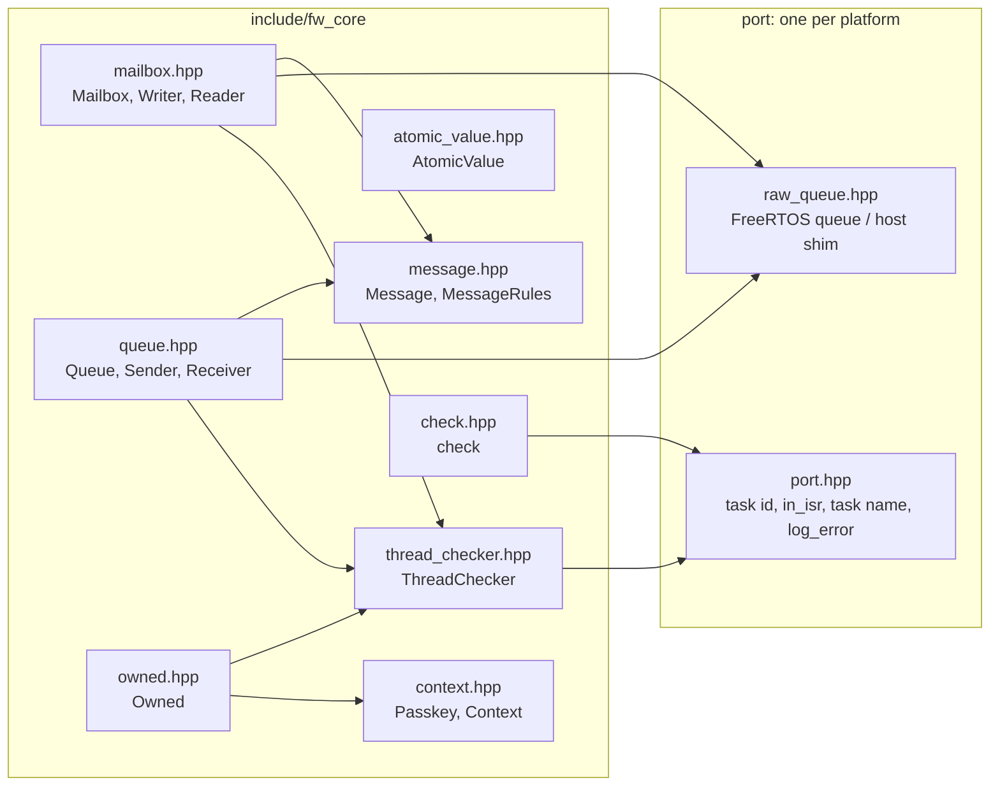

# fw_core

The shared helpers every island and adapter builds on (CS-OWN-10): the `Message` rules, the three
channels (`Mailbox`, `Queue`, `AtomicValue`) with their narrow handles, `ThreadChecker`,
`Owned<T>`, the recovering `check()` and the context-token base. Namespace `hmi::fw`.

Status: in use by the bench stick injection only. `main` and `remote_ui` require it;
`remote_ui`'s `stick_inject.hpp` uses its `Mailbox` and `AtomicValue`. The other channels and the
`Topology` that will own every channel and hand out the handles are a later step.

## Requirements

| ID | Requirement | Tests |
| --- | --- | --- |
| REQ-FWC-01 | A channel accepts only a `Message`: trivially copyable, at most 128 bytes, marked `static constexpr bool IS_MESSAGE = true`. A violation fails the build with a message naming the rule | FWC-024, mnc_message_* |
| REQ-FWC-02 | A mailbox returns the newest value and reports "changed" once per write; its writer never blocks, from a task or an ISR | FWC-001..004 |
| REQ-FWC-03 | A channel's read end only works on the task that owns it; a read from another task or an ISR fails and consumes nothing | FWC-005, FWC-013 |
| REQ-FWC-04 | A queue keeps order, has a declared depth (1..64), and a drain takes at most that depth | FWC-006, FWC-012, mnc_queue_depth_zero |
| REQ-FWC-05 | A full queue acts on its declared policy: DROP_NEWEST_COUNT drops and counts, BLOCK_TIMEOUT waits at most its timeout then fails, RAISE_FAULT fails and sets a fault flag and logs once; from an ISR none of them waits | FWC-007..011 |
| REQ-FWC-06 | The atomic channel accepts only types whose `std::atomic` is always lock-free | FWC-014, mnc_atomic_not_lock_free |
| REQ-FWC-07 | A handle exposes one end of one channel (Writer/Reader, Sender/Receiver) | FWC-004, FWC-011, FWC-012, FWC-014, mnc_writer_cannot_read, mnc_const_channel_no_writer |
| REQ-FWC-08 | A `ThreadChecker` passes on its owner, and fails on any other task and in any ISR, reporting the function, `file:line`, the caller task and the owner task | FWC-015..018 |
| REQ-FWC-09 | A failed ownership check aborts in a test build and logs and returns false in a release build (`OWNERSHIP_CHECKS_ABORT`) | FWC-019, FWC-020 |
| REQ-FWC-10 | `Owned<T>` runs an access only on its owner task, and only with a context token | FWC-021 |
| REQ-FWC-11 | `check(cond)` returns `cond`; on false it logs what failed and where, and never asserts or aborts | FWC-022 |
| REQ-FWC-12 | A context token cannot be copied or moved, and only its island can create one | FWC-024, mnc_context_copy, mnc_context_outside_island |
| REQ-FWC-13 | On the target, channels do not allocate: queue storage is static (`xQueueCreateStatic`) | review; L3 not written yet |

Test IDs `FWC-0nn` are in `test/test_fw_core.cpp`; `mnc_*` are in `test/mnc/`.

## Tasks

None. Every call runs on its caller's task. Logging from a failed check or ownership check runs on
the failing task (never from an ISR for queues: an ISR overflow only sets the flag).

## Dependencies

- `freertos` (public: the channel storage is a FreeRTOS queue).
- `logger` (espp, private: the target port logs through `espp::Logger`, CS-LOG-01).
- Host L1 build: none beyond libstdc++ and pthreads; `src/port_host.cpp` stands in for FreeRTOS
  and the logger.

## Using it

```cpp
#include "fw_core/fw_core.hpp"
namespace fw = hmi::fw;

struct SpeedMsg {
  static constexpr bool IS_MESSAGE = true;
  std::int32_t speed_mm_s;
};

fw::Mailbox<SpeedMsg> speed({.initial = {0}});
fw::Queue<IntentMsg, 8, fw::FullPolicy::RAISE_FAULT> intents({.name = "intents"});

// Producer Config gets fw::writer(speed) / fw::sender(intents); consumer gets fw::reader(speed)
// / fw::receiver(intents). The factories take the channel by non-const reference, so a const
// channel cannot hand out a write end.
SpeedMsg now{};
if (reader.read(now) == fw::ReadStatus::CHANGED) { /* ... */ }
receiver.drain([&](const IntentMsg &m) { handle(m); });
```

| Channel | Use | Full / ISR behaviour |
| --- | --- | --- |
| `Mailbox<T>` | state | overwrite; never blocks; `write_from_isr` |
| `Queue<T, DEPTH, POLICY>` | events | the policy; `send_from_isr` never waits |
| `AtomicValue<T>` | one lock-free value | store/load, ISR-safe |

## Configuration

| Value | Where | Default |
| --- | --- | --- |
| `OWNERSHIP_CHECKS_ABORT` | `config.hpp`, from `CONFIG_HMI_OWNERSHIP_CHECKS_ABORT` | false (release: log and return false). The Kconfig option is not defined yet; the host test build passes `-DCONFIG_HMI_OWNERSHIP_CHECKS_ABORT=1` |
| `MAX_MESSAGE_SIZE` | `config.hpp` | 128 |
| `MAX_QUEUE_DEPTH` | `queue.hpp` | 64 |

## Inside (D4)



## Tests

`test/` is a host L1 app (the overnight L1 contract; deviation from the IDF `linux` target
approved 2026-10-06, TS-UNIT-01, CS-HAL-04):

```
wsl -e bash -lc 'cd /mnt/c/<worktree>/components/fw_core/test && make test'      # L1
wsl -e bash -lc 'cd /mnt/c/<worktree>/components/fw_core/test && make coverage'  # + gcov
wsl -e bash -lc 'cd /mnt/c/<worktree>/components/fw_core/test && make mnc'       # must-not-compile
```

On the host, a thread whose name starts with `isr` counts as an ISR; that is how the tests reach
the ISR rules. The ISR calls on the chip (TS-UNIT-05) need an L3 app; not written yet.

## Known limits

- `check()` and the ownership report log through `espp::Logger`, which formats into a
  `std::string`: a failure path allocates, against CS-SAF-04 for safety islands. The line itself
  is formatted into a stack buffer first.
- Messages must not hold pointers or handles; C++ cannot check that, so review does.
- A local class cannot be a `Message` (it cannot have a static data member).
