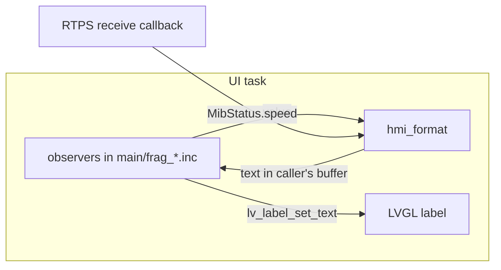

# hmi_format

Pure text formatting for the screens: it turns a value into the text a label shows.

It has no LVGL and no state. The UI task hands the text to its label (CS-UI-03). The code
moved here from `main/` (refactor plan step 7) and still prints the same bytes, as the tests
below show.

## Requirements

| ID | Requirement | Tests |
| --- | --- | --- |
| REQ-FMT-01 | A speed in m/s reads as tenths of a mph: rounded to nearest and clamped to 0..`SPEED_MAX_TENTHS` (9.9 mph). NaN, an infinity or a value <= 0 reads 0. The label shows `N.N`. | FMT-001, FMT-002, FMT-018, FMT-019 |
| REQ-FMT-02 | A stepper row's raw value reads with `decimals` digits after the point and the sign put back by hand (-5 with 1 decimal reads `-0.5`). The unit follows tight against the number. A named row reads its name while the value is in range. | FMT-003..FMT-006, FMT-015, FMT-016 |
| REQ-FMT-03 | Every text is cut like `snprintf` cuts it: at most size - 1 characters, always terminated, and a zero-size buffer is never written. | FMT-007, FMT-008, FMT-017 |
| REQ-FMT-04 | A seat value reads number, space, unit (`12.6 deg`). It reads `--` while unknown (`VALUE_UNKNOWN`). | FMT-009, FMT-015 |
| REQ-FMT-05 | The seat adjustment page has two texts. The reading is the number with `°` on a `deg` axis, or `--`. The footer is `of 90.0°` on a `deg` axis and `of 250.0 mm` otherwise. | FMT-010, FMT-015 |
| REQ-FMT-06 | A clock is plausible from 2025 on (`tm_year >= 125`). It reads `HH:MM`, `%02d:%02d`. | FMT-011, FMT-012, FMT-019, FMT-020 |
| REQ-FMT-07 | The TopBar link reads `BT · WI-FI` on WiFi and `BT · ETH` on anything else. | FMT-013, FMT-020 |
| REQ-FMT-08 | The diagnostics rate reads `N.N Hz - Live` from tenths of a Hz. N and the digit after the point are the integer quotient and remainder by 10, so -15 reads `-1.-5`. | FMT-014, FMT-019 |
| REQ-FMT-09 | Each text is byte for byte what the code drew before the move, when it printed with LVGL's own `lv_snprintf`. | FMT-001..FMT-020 |
| REQ-FMT-10 | About. A version names a release tag when it starts with `v`, has no `-dirty`, and nothing after its last `-g` is lower-case hex (an empty rest is not hex). A SHA-256 line is the four groups of 8 characters from its offset (0 or 32), joined by one space. The device MAC reads six upper-case hex pairs joined by `:`. | FMT-101..FMT-103 |
| REQ-FMT-11 | Firmware update. A date reads `D Mon Y` when `sscanf("%d-%d-%d")` takes three numbers and the month is 1..12, and reads the input unchanged otherwise. A size reads `N.N MB`: bytes / 1e6 as a double, rounded to one decimal, ties to even. The list status reads `N releases. Pick one to install it.`. The install percentage is `done * 100 / total` in `size_t`, 0 while total is 0. The progress reads `<done> of <total>  (P%)`. | FMT-104..FMT-108 |
| REQ-FMT-12 | Internet. The signal reads `N dBm`, or `--` with no RSSI. A network row's signal reads `N dBm`, with `open  ` in front when the network has no password. | FMT-109, FMT-110 |
| REQ-FMT-13 | Each REQ-FMT-10..12 text is byte for byte what the code drew before the move, when it printed with fmt (espp's `format.hpp`). | FMT-101..FMT-110 |

Preconditions, the same as before the move. The old code has undefined behaviour outside them,
and no caller goes there:
- `stepper_format` is never given `VALUE_UNKNOWN` (`INT32_MIN`). Every caller draws `--` for it
  first.
- `decimals` is at most `MAX_DECIMALS` (9). The tables use at most 2.

## Interface

| Header | What |
| --- | --- |
| `hmi_format/speed.hpp` | `speed_display_tenths`, `speed_text`, `MPH_PER_MPS`, `SPEED_MAX_TENTHS` |
| `hmi_format/stepper.hpp` | `StepperSpec`, `stepper_format`, `seat_format`, `seat_reading_text`, `seat_range_text`, `VALUE_UNKNOWN` |
| `hmi_format/topbar.hpp` | `clock_plausible`, `clock_text`, `Link`, `link_text` |
| `hmi_format/diag.hpp` | `diag_rate_text` |

Each formatter writes into a caller's `std::span<char>`. A `char[N]` converts to it, so
`stepper_format(spec, raw, text)` fills `char text[24]`. `src/text_writer.hpp` fills the
buffer the way `snprintf` does. There is no printf, no varargs and no allocation.

## Tasks and dependencies

- Tasks: none. The functions are pure. The UI task calls them, and `speed_display_tenths` also
  runs in the RTPS receive callback.
- Dependencies: the C++ standard library only. `main` requires the component
  (`PRIV_REQUIRES hmi_format`).
- `main` keeps the glue. `link_text(NetLink)` maps NetLink to `Link`. `static_assert`s in
  `frag_drive_band.inc` keep `MPH_PER_MPS` and `SPEED_MAX_TENTHS` equal to the shared spec's
  `rammp::kMphPerMps` and `rammp::kSpeedMaxTenths`.

## Tests

`test/` is the host L1 app, `L1-FMT` in `tests/manifest.d/hmi_format.yaml`. Run
`make test` or `make coverage` in WSL, or `python tests/run.py run L1-FMT`.

- `goldens.hpp` holds the golden tables, recorded from the pre-move code. It is frozen: a
  failing row means the code under test changed behaviour.
- `legacy_format.cpp` holds verbatim copies of the pre-move functions, each with its source
  lines. They are linked against LVGL's real `lv_sprintf_builtin.c`
  (`CONFIG_LV_USE_BUILTIN_SPRINTF=1` in the firmware), so the goldens hold LVGL's bytes, not
  glibc's.
- FMT-015..FMT-020 compare the component with those copies over wide sweeps.
- The About, Firmware update and Internet helpers have the same three parts:
  `goldens_screens.hpp` (frozen), `legacy_screens.cpp` (the verbatim pre-move copies, printing
  with fmt from espp's `format.hpp` as `main/` did), and `test_screens.cpp` (FMT-101..) through
  the seam `subject_screens.hpp`. The goldens keep to the domain where host and target agree:
  `day`'s numbers fit an `int` (an overflowing `sscanf` is the C library's own, and glibc and
  newlib differ), and `done * 100` fits the target's 32-bit `size_t`.

## Hardware findings

None: the component has no hardware.
