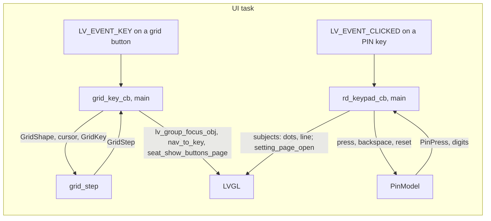

# hmi_models

Screen logic as plain C++ models: the joystick cursor on a grid of buttons, and the bench
gate's PIN entry.

There is no LVGL here. The UI task feeds a model its input and draws what it says (CS-UI-03).
The code moved here from `main/` and behaves as before, as the tests below show.

## Requirements

| ID | Requirement | Tests |
| --- | --- | --- |
| REQ-MOD-01 | UP, DOWN, LEFT and RIGHT step the cursor one cell. It is then clamped into the grid, never wrapped: first the row, then the column against that row's own length. | MOD-002..004, MOD-008 |
| REQ-MOD-02 | A hole is stepped over: first outward to the right while the row goes on, then back to the left. The cursor ends on a button if the row has one, and only then takes focus (`on_button`). | MOD-004, MOD-008 |
| REQ-MOD-03 | DOWN from the bottom row is `OFF_BOTTOM` (main: the burger key). LEFT from the first column of a grid whose `left_edge_is_back` is `OFF_LEFT` (main: the seat adjustment page closes). Either way the cursor stays where it was. | MOD-002, MOD-003, MOD-008 |
| REQ-MOD-04 | The three grids main walks are seat functions (2/2/2), seat adjustment (1/2/3, left edge is back) and the PIN pad (3/3/3/3, with a hole left of 0). | MOD-001 |
| REQ-MOD-05 | A digit adds to the entry and puts the prompt back. `press` reports how many digits are typed, this one included. | MOD-005, MOD-011 |
| REQ-MOD-06 | The fourth digit is judged against the PIN in `Config`, and the entry is emptied either way. A match is `ACCEPTED`, with the prompt. Anything else is `REJECTED`, with the WRONG line. A PIN of any other length is never accepted. | MOD-005, MOD-010, MOD-011 |
| REQ-MOD-07 | Backspace takes the last digit back and leaves the line as it is. On an empty entry it returns false and changes nothing, so the WRONG line survives it. | MOD-005, MOD-012 |
| REQ-MOD-08 | `reset` empties the entry and puts the prompt back. main calls it on every visit to the screen. | MOD-005 |
| REQ-MOD-09 | Every step is what the code did before the move. | MOD-001..MOD-009 |

Preconditions. They are the same as before the move, and every caller keeps them:
- `grid_step`: `shape.rows` and each used row length are 1 or more and at most the maximum
  (`GRID_MAX_ROWS` 4, `GRID_MAX_COLS` 3). `from` is any cell of that 4 x 3 array.
- `PinModel::press`: `digit` is 0..9.

## Interface

| Header | What |
| --- | --- |
| `hmi_models/grid.hpp` | `GridShape`, `GridCursor`, `GridKey`, `GridMove`, `GridStep`, `grid_step`, `GRID_MAX_ROWS`, `GRID_MAX_COLS` |
| `hmi_models/pin.hpp` | `PinModel` (`Config{pin}`, `reset`, `press`, `backspace`, `digits`, `message`), `PinPress`, `PinVerdict`, `PinMessage` |

`grid_step` is a pure function. `PinModel` holds the digits typed and which line to show. The
PIN is the caller's build constant, passed in through `Config`. There is no allocation and no
logging.

## Tasks and dependencies

- Tasks: none of its own. Both models run on the UI task, from LVGL event callbacks.
- Dependencies: the C++ standard library only. `main` requires the component
  (`PRIV_REQUIRES hmi_models`).
- `main` keeps the view:
  - `ButtonGrid` holds the `lv_obj_t` cells and the cursor. `grid_shape_of` turns it into a
    `GridShape`. `grid_key_cb` maps the LVGL key and moves focus. It also runs the two edge
    handlers.
  - The focus sync stays in main: "the cursor is whichever cell holds focus" compares
    `lv_obj_t` pointers. So does `grid_sync_cursor`.
  - The bench gate's subjects (the dots and the line) are written in the same order as before
    the move.
- Not safety-relevant: no motion command passes through here. The seat command path
  (`seat_step`, `seat_request`, `grid_click_cb`, `seat_click_cb`) stays in `main` unchanged.

## Tests

`test/` is the host L1 app (`make test`, `make coverage`; manifest entry `L1-MOD`):
- `legacy_ui.cpp` holds verbatim copies of the code before the move, with recording LVGL
  stand-ins. It is the oracle.
- `goldens.hpp` holds what that code did, frozen.
- `subject.hpp` is the one seam the move changed.
