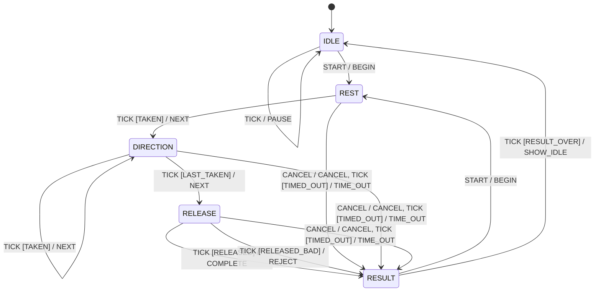

# joystick_cal

The joystick calibration: the record (three raw-mV numbers per axis), its text file, the
plausibility check a record must pass, and the calibration run as a plain C++ model.
No LVGL, no storage, no logging. `main/joystick_cal.cpp` is the view (LVGL subjects, the
timer, the button), the file I/O and the log lines.

| Header | What |
| --- | --- |
| `cal_record.hpp` | `Record`, `encode`/`decode` (file format version 1), `describe`, `plausible` |
| `cal_run.hpp` | `CalibrationRun` (the run model), `kTransitions` (its table), `decide()` |

**Safety-relevant** (CS-SAF-01): the record sets the stick's travel. Status: draft (plan step
10), behaviour as it was at `dev_refactor` fa3f13a, pinned by the L1 app in `test/`.

## Requirements (as-is; each covered by L1 cases)

| ID | Requirement | Tests |
| --- | --- | --- |
| REQ-CAL-01 | The file is `version 1` then `horizontal`, `vertical`, `twist` lines of `min center max` mV; anything else falls back to the defaults and is logged once with its reason | CAL-004..010, CAL-101..105, CAL-110 |
| REQ-CAL-02 | A record is used only if every axis has at least 1000 mV each way from rest (inclusive) | CAL-011, CAL-012, CAL-106 |
| REQ-CAL-03 | Boot logs `loaded <path>: <describe>` for a used file, unchanged (the bench greps it) | CAL-002 |
| REQ-CAL-04 | A run takes rest after 45 + 30 steady periods, each end after 30 periods at least 1000 mV out, and the release after 30 periods within 150 mV of rest | CAL-021..026, CAL-303 |
| REQ-CAL-05 | Each step times out after 600 periods; cancel, time-out and rejection change nothing | CAL-029, CAL-030, CAL-036, CAL-304, CAL-305 |
| REQ-CAL-06 | A finished run is used at once, handed to the ADC task exactly once, and saved; a failed save is shown | CAL-001, CAL-027, CAL-028 |
| REQ-CAL-07 | `decide()` is the transition table | CAL-301, CAL-302 |
| REQ-CAL-08 | `joystick_cal_measured()` is true when the calibration in use was loaded valid from flash or completed in this boot (saved or not), false while the compiled-in defaults are in use; it reads one atomic, no lock (the ADC task asks it every cycle: hazard-c1-spec.md §3.1 condition 4, G5) | CAL-401 |

Known hazards, pinned as they are (behaviour changes, parked for two approvals):
- H3: `plausible()` has no upper bound; a record far outside the ADC range is used
  (CAL-013, CAL-107).
- A word in the file has no length limit (CAL-017).
- A NaN sample passes every hold check; a NaN rest ends in "travel too short" (CAL-036,
  CAL-306).
- A period with no fresh ADC sample reuses the last one (CAL-035).

## The run (from `kTransitions`)

Time is counted in periods of the view's 33 ms timer, as it always has been, not read from
a clock.

## Tests

`make -C test test` (WSL; see `tests/host/common.mk`), or `python tests/run.py run L1-CAL`.
