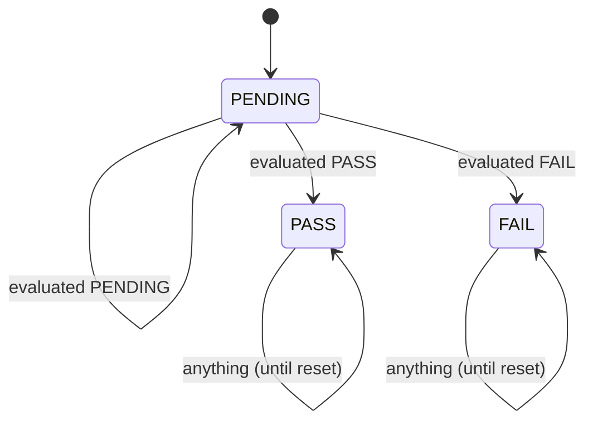

# post

The quick POST evaluator: facts gathered at boot go in, a verdict per check and an overall
POST state come out (TS-POST-01, hazard-fixes §3 B2).

It is pure C++: no ESP-IDF, FreeRTOS or LVGL includes, no allocation, no logging. It builds
for the host and the target (`fw_component_options`, `-Wswitch-enum`, a `.clang-tidy` with
60-line functions). Safety-relevant (CS-SAF-01): once wired, a POST that is not PASS keeps
the chair from moving.

## Wired (hazard-c3-spec.md, approved 2026-10-08)

- `Read ADC` feeds `RestWindow` every cycle with the reads the stick pipeline gets and writes
  each window to a one-slot mailbox (main's `AdcStickIo::feed_rest_window`); it stops once the
  POST gate is PASS or FAIL.
- `PostRunner` runs on the UI task, in the 250 ms poll before the drive adapter's tick
  (hmi_ui `PostStage`; decision C6, a CS-SAF-04 deviation until the islands work). It is the
  POST gate's only writer (`stick/permit_hooks.hpp`); the stick's output permit and the drive
  table read the gate.
- main's `kPostPort` gathers the IDF facts (reset reason, OTA state, calibration, heap, stacks)
  with the enum `static_assert`s of POST-050; the boot I2C scan is handed over at start-up.
- `post_indicator` drives the TopBar's persistent indicator; its words are in hmi_rtps_spec.

The extended self test (`main/selftest*`) is not touched and stays separate.

## The concern

C3 splits the checks in two (`Kind` in `post/checks.hpp`):

| Kind | Checks | A FAIL... |
| --- | --- | --- |
| `LATCHED` (hardware) | ADC valid, calibration saved, calibration span, expected I2C devices, reset reason, image, heap headroom (4), stack headroom (2) | holds until the next reset: the POST fails |
| `LIVE` (stick at rest) | X/Y/twist offset from the calibrated centre, X/Y/twist stillness (peak-to-peak), stick button released | only delays: it is judged again on every window, so a stick bumped at power-on never locks the user out |

## Interface

| Header | What |
| --- | --- |
| `post/facts.hpp` | `Facts`, built from `StickWindow`, `AxisRest`, `Calibration`, `AxisCal`, `I2cSet`, `ImageFacts`, `MemoryFacts` and `StackFacts`, plus `ResetReason` and `OtaImageState` (these two mirror the IDF enums value for value). Every group is a `std::optional`: a group not gathered yet is `nullopt` |
| `post/checks.hpp` | `CHECKS`, the table (TS-POST-03): `Id`, name, unit, `lo`/`hi` (inclusive), `Kind`, `Need`, why. Also the limit constants, `EXPECTED_I2C`, and the `static_assert`ed invariants |
| `post/post.hpp` | `evaluate`, `evaluate_check`, `overall_of`, `merge`, `next_overall`, `blocking_check`, `to_string`. Also `Verdict`, `Reason`, `Overall`, `Result`, `Report` and `OVERALL_TRANSITIONS` |

How a caller is meant to use it (C3 decides the details):

```cpp
hmi::post::Report latched = hmi::post::evaluate({});            // all PENDING
// on each new fact or rest window:
latched = hmi::post::merge(latched, hmi::post::evaluate(facts));
// latched.overall: PENDING (wait, show blocking_check), PASS, or FAIL (latched)
```



D4 of the overall state, hand-drawn from `OVERALL_TRANSITIONS`. `tools/gen_diagrams` draws
only D2 and D3 today.

## Requirements

| ID | Requirement | Tests |
| --- | --- | --- |
| REQ-POST-01 | The facts are a plain struct of optional groups. `ResetReason` and `OtaImageState` carry ESP-IDF v6.0's `esp_reset_reason_t` and `esp_ota_img_states_t` values, value for value. `StickWindow` is trivially copyable and at most 128 B, so it can cross tasks as a message. | POST-030, POST-031 (and `static_assert`s in `facts.hpp`) |
| REQ-POST-02 | `CHECKS` has one row per `Id`, in `Id` order, with unique names and `lo <= hi`. A check is `LIVE` exactly when it is part of the stick-at-rest guard, and every `LIVE` row is `REQUIRED`. `LATCHED` rows come first. The X/Y rest limit sits inside the stick's 0.10 dead zone of the shortest accepted travel, and the twist rest limit inside the 60 mV twist dead band. | POST-001 (and `static_assert`s in `checks.hpp`) |
| REQ-POST-03 | A check whose facts are missing is PENDING (`NOT_MEASURED`). A window shorter than `WINDOW_MIN_SAMPLES` is PENDING (`TOO_FEW_SAMPLES`). Neither is ever a FAIL. | POST-002, POST-005, POST-006 |
| REQ-POST-04 | A measured value inside `[lo, hi]` is PASS. Outside it is FAIL with the value and a reason: `BELOW_MIN`/`ABOVE_MAX`, or the row's own (`NOT_SAVED`, `DEVICE_MISSING`, `UNCLEAN_RESET`, `IMAGE_STATE`, `BUTTON_PRESSED`). The measurements: `adc.valid` = valid × 1000 / cycles, rounded down; `joy.cal_span` = the least of centre − min and max − centre over the three axes; `joy.*_cal_off` = abs(mean − calibrated centre); `joy.*_noise` = max − min. | POST-003, POST-004, POST-007, POST-011, POST-012, POST-018 |
| REQ-POST-05 | Reset reasons: POWERON, EXT, SW, DEEPSLEEP, SDIO, USB and JTAG pass. PANIC, INT_WDT, TASK_WDT, WDT, BROWNOUT, EFUSE, PWR_GLITCH and CPU_LOCKUP fail (`UNCLEAN_RESET`). UNKNOWN, or any value ESP-IDF v6.0 does not name, fails (`UNKNOWN_RESET`). | POST-013, POST-014 |
| REQ-POST-06 | An image that is not verified fails (`IMAGE_NOT_VERIFIED`). A verified image passes in VALID, UNDEFINED or PENDING_VERIFY. NEW, INVALID, ABORTED or an unnamed state fail (`IMAGE_STATE`). | POST-015, POST-027 |
| REQ-POST-07 | `i2c.missing` counts the `EXPECTED_I2C` addresses the scan did not find. Extra devices do not count. `I2cSet` holds exactly the 7-bit addresses added. | POST-016, POST-017 |
| REQ-POST-08 | These facts fail with `BAD_FACTS`: more valid cycles than cycles, a mean outside its min..max, and an `Id` that is not a check. Extreme `int32` facts saturate and never overflow (run under UBSan). | POST-008, POST-009, POST-010, POST-029 |
| REQ-POST-09 | Overall: FAIL when a REQUIRED LATCHED check fails. Otherwise PENDING when any REQUIRED check is not PASS, so a LIVE FAIL only delays. Otherwise PASS. OPTIONAL rows never count. An empty table, results that don't line up with the table, or a verdict outside the enum give FAIL. | POST-004, POST-018, POST-020, POST-021, POST-025 |
| REQ-POST-10 | The overall state follows `OVERALL_TRANSITIONS`. From PENDING it follows the evaluation. PASS and FAIL hold until reset. A state outside the enum gives FAIL. | POST-022, POST-024, POST-026 |
| REQ-POST-11 | `merge` keeps a LATCHED check's first PASS or FAIL. A LATCHED PENDING check, and every LIVE check, take the newest result. A kept result whose id doesn't match its row is judged again. | POST-023, POST-024, POST-025, POST-027, POST-033 |
| REQ-POST-12 | `blocking_check` returns the first REQUIRED FAIL in table order (hardware first), else the first REQUIRED PENDING, else none. | POST-004, POST-018, POST-024, POST-025, POST-027, POST-028 |
| REQ-POST-13 | Each verdict, overall state and reason has its own name. A value outside the enum reads `?`. | POST-032 |
| REQ-POST-14 | The rest-window accumulator starts at the first cycle with all three reads valid, counts every cycle after it, and emits one `StickWindow` per `WINDOW_MIN_SAMPLES` cycles, then starts a new one. Axis mean, min and max are over the valid cycles, rounded to whole mV; `button_idle` is true only if the button read released on every cycle of the window. A NaN read counts as a failed read (hazard-c3-spec.md §5.2). | POST-034..038 |
| REQ-POST-15 | The runner stores PENDING at its first tick. It gathers the boot facts once, at the first window; merges every new window into the latched report; and stores the gate PASS or FAIL as the latched overall state. The gate never moves back. It is the gate's only writer. | POST-039..041, POST-044, POST-047, POST-049, POST-052 |
| REQ-POST-16 | A LATCHED check still PENDING `POST_BUDGET_MS` after the first tick makes the gate FAIL ("timed out", that check blocking). A LIVE check has no budget. | POST-042, POST-043, POST-053 |
| REQ-POST-17 | At PASS or FAIL the runner prints the TS-POST-05 lines once, in table order (hazard-c3-spec.md §2.7). A LATCHED check without a measurement prints FAIL, a LIVE one SKIP. The reset reason line is printed at every boot. | POST-045, POST-051 |
| REQ-POST-18 | `post_indicator` gives NONE, CHECKING, WAITING, FAILED or NOT_RUN per hazard-c3-spec.md §2.8. | POST-040, POST-042, POST-046 |
| REQ-POST-19 | The IDF adapter converts `esp_reset_reason()` and the OTA state with `static_assert`ed enum values; `verified` is true only when the build has no bootloader skip-validate option; memory and stack values saturate to `int32`. | POST-050 (main's static_asserts, the firmware build) |
| REQ-POST-20 | The ADC task feeds the accumulator on every cycle, valid or not, with the reads passed to the stick pipeline; it writes the window mailbox once per window and never waits; it stops once the gate is PASS or FAIL; it allocates nothing. | POST-048, POST-054; SU (frames), review |

The safe state for every requirement is "overall not PASS": no motion once C3 wires this in.

## Limits (hazard-fixes §9 D4, approved by the owner 2026-10-08)

Each limit is a named constant in `post/checks.hpp`, marked `D4 approved 2026-10-08` there
(post-limits-proposal.md; hazard-c3-spec.md §3).

| Constant | Value | Source |
| --- | --- | --- |
| `WINDOW_MIN_SAMPLES` | 30 cycles (1.05 s at the measured 35 ms cycle) | B2 asks for about 1 s of rest statistics |
| `ADC_VALID_MIN_PERMILLE` | 990 (99.0 %) | self test `joy.valid`; this means no failed read in a window under 100 cycles |
| `EXPECTED_I2C` | 0x10 0x28 0x32 0x36 0x40 0x41 0x43 0x44 0x55 0x5a 0x68 | board 2's boot scan, every bench boot on 2026-10-06; board 1 has no 0x5a (decision C5: measure boards 1 and 3 first) |
| `MEM_INT_MIN_B`, `MEM_INT_BLOCK_B` | 12 KiB each | self test `mem.int_min`, `mem.int_block` |
| `MEM_DMA_MIN_B` | 1536 B | self test `mem.dma_min` |
| `MEM_PSRAM_FREE_B` | 8 MiB | self test `mem.psram_free` |
| `STK_ADC_MIN_B`, `STK_UI_MIN_B` | 1024 B, 2048 B | self test `mem.stk_adc`, `mem.stk_lvgl` |
| `REST_XY_MAX_MV`, `REST_TWIST_MAX_MV` | 40 mV, 50 mV | self test `joy.*_cal_off` |
| `STILL_XY_MAX_MV`, `STILL_TWIST_MAX_MV` | 30 mV, 120 mV | self test `joy.*_noise` |

Decided here, for the owner to confirm:

- A panic, watchdog or brownout reset fails the POST until the next reset. The alternative is
  to show it only.
- An image in PENDING_VERIFY (first boot of an update) passes.
- No check is OPTIONAL. A `static_assert` makes adding one an explicit decision.

Fixed values, not D4: `CAL_MIN_HALF_SPAN_MV` = 1000 is `joystick_cal.cpp`'s `kFullTravelMv`.
`STICK_DEAD_ZONE_PERMILLE` = 100 and `TWIST_DEAD_BAND_MV` = 60 mirror `main`'s stick
constants and are used only in `static_assert`s.

## Open points for C3

- **The wait has no timeout.** A stick held off centre, or a noisy pot, keeps the POST PENDING
  for as long as it lasts. That is safe (no motion), but C3 must decide when the UI escalates
  it to the persistent fault indicator.
- **Gathering the facts:**
  - `ImageFacts::verified`: the bootloader already validates the image on every boot under
    `CONFIG_BOOTLOADER_APP_ROLLBACK_ENABLE`, unless a skip option is set. Choose
    `esp_image_verify` or the bootloader's result.
  - The memory and stack numbers depend on when they are taken.
- **IDF parity at the call site.** The adapter that converts `esp_reset_reason()` and
  `esp_ota_get_state_partition()` should `static_assert` the enum values next to the IDF
  headers. POST-030 and POST-031 already compare the text of those headers.

## Tasks and dependencies

- Tasks: none of its own. `RestWindow` runs on `Read ADC`, `PostRunner` and `post_indicator`
  on the UI task (C3 §2.3).
- Dependencies: the C++ standard library, and `stick` for the POST gate's type
  (`stick/permit_types.hpp`). Required by hmi_ui and main.

## Tests

`test/` is the host L1 app (`make test`, `make coverage`; manifest entry `L1-POST`, run with
`python tests/run.py run L1-POST`):

| File | What it holds |
| --- | --- |
| `fixtures.hpp` | a healthy boot (`good_facts`) and `set_measured`, which makes one check measure a chosen value and leaves the others alone |
| `test_post.cpp` | POST-001..POST-029, POST-032, POST-033 |
| `test_idf_parity.cpp` | POST-030 and POST-031. They read `esp_system.h` and `esp_flash_partitions.h` from the IDF tree that `UNITY_DIR` is in |

Coverage of `src/post.cpp` on 2026-10-06 (gcov, host): 98.9 % of lines, 94.4 % of branches.
What is not reached: the `default` of `measure()` (`evaluate_check` turns away an unknown id
first) and the OPTIONAL skip in `blocking_check` (no row is OPTIONAL).
