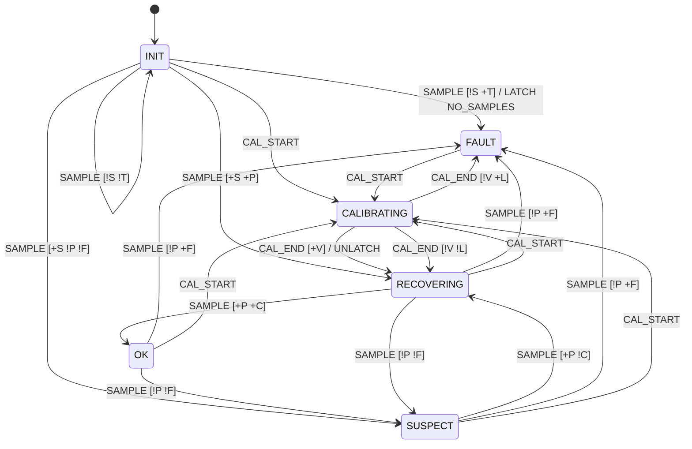

# stick

`hmi::stick::StickPipeline`: the three pots' raw millivolts in, the keypad key and the motion
command (XYTwist) out. Safety-relevant (CS-SAF-01): it turns the joystick into the motion
command. Extracted, refactor only, from `adc_task_fn` in `main/main.cpp` (dev_refactor
7ea7592); the ADC task still owns it and still does the reads, the twist filter and the
timing.

## Requirements (as-is, characterised 2026-10-06)

These state what the code does today, pinned by golden vectors taken from the code before the
extraction (`test/golden_stick.inc`, frozen). They are not a reviewed specification.

| ID | Requirement | Tests |
| --- | --- | --- |
| REQ-STK-01 | Raw mV maps to a position in [-1, 1] per axis through `espp::Joystick`: X/Y with a circular dead zone and a range dead zone, the vertical pot inverted (+y up), twist on its own range mapper with its own mV dead bands. | STK-001, STK-002 |
| REQ-STK-02 | The mounted stick is swapped first, then mirrored per axis; twist is untouched. | STK-002, STK-034 |
| REQ-STK-03 | The key is a Schmitt trigger on the larger axis, with thresholds set by the sensitivity (1..10, clamped); a calibration run releases it; the remote key overrides it; a new key is latched as a flick. | STK-019, STK-022, STK-023, STK-030..032, STK-036 |
| REQ-STK-04 | The command is the mounted position times a scale: 0 while calibrating or while the gate (`stick_drives`) is closed, else drive speed / 10 (1..10, clamped). The 0 is a multiply. | STK-016..018, STK-033, STK-035 |
| REQ-STK-05 | A cycle with any of the three reads missing publishes nothing and calls nothing else. | STK-005, STK-015 |
| REQ-STK-06 | A cycle calls its `Io` in the order of the original code. | STK-003, STK-004 |
| REQ-STK-08 | `pipeline_config` gives the HMI's mounting: center dead zone radius 0.10, range dead zone 0.05, twist dead bands 60 mV (center) and 40 mV (range), with the caller's calibration and key codes (the values main passed before they moved here). | STK-037 |
| REQ-STK-09 | A stick-button release within SELECT_MAX_US (500 ms) of its press selects; every press more than COUNT_DEBOUNCE_US (30 ms) after the last counted press counts (only the counter is debounced). | STK-050..052 |

## Bench stick injection (`stick/bench_inject.hpp`, hazard-fixes.md §3 B1)

Bench only: the firmware uses it only behind `CONFIG_HMI_BENCH_STICK_INJECT` (which depends on
`CONFIG_HMI_REMOTE_UI`), selected at compile time (`StickSlot`), so a release build compiles none of it. The
remote UI's `STICK` verb parses a `StickInjectMsg` and writes it to an `fw_core` mailbox; the ADC
task drains it and swaps its three raw reads for the injected ones before `StickPipeline::cycle`
(`components/remote_ui/include/stick_inject.hpp`). Everything after the reads is the real code.

| ID | Requirement | Tests |
| --- | --- | --- |
| REQ-STK-07 | `STICK <h_mv> <v_mv> <twist_mv> <fail_mask> <seq>` is accepted only as five unsigned decimals, mV 0..3300, mask 0..7, seq 0..2^32-1; anything else is rejected. An injection replaces all three raw reads, failed real reads included, until 300 ms after its last message (a refresh restarts the 300 ms; a clock earlier than the message ends it); then the real reads pass unchanged. Each `fail_mask` bit (1 horizontal, 2 vertical, 4 twist) makes that read fail. Injected reads go through the real pipeline, gate and H9 behaviour included. | STK-040..049 |

## Stick monitor (`stick/stick_monitor.hpp`, hazard fix C2)

[hazard-c2-spec.md](../../docs/plans/hazard-c2-spec.md) §2-§4: the plausibility check of the
three raw reads (P1..P6: missing, NaN/inf, negative, above the rail limit, X/Y stale, twist
partial) and the stick fault state machine. Constants: `HIGH_RAIL_MV` 3150, `CAL_OVERSHOOT_MV`
100, `FAULT_COUNT` 3 of `FAULT_WINDOW_CYCLES` 30, `RECOVER_CLEAN_CYCLES` 3, `XY_STALE_MS` 300,
`START_MAX_MS` 1000, `TWIST_OVERSAMPLE` 8 (owner answers D3-D7, all as proposed).
`STICK_MONITOR_TRANSITIONS` is the spec's table (26 rows); `decide()` is the code, one switch per
state; STK-070 checks the two agree on every state, input and guard set, and STK-071 checks the
table against an independent transcription of the spec. A state, input or action outside its
enum gives FAULT, latched, reason `INTERNAL`.

**Status (2026-10-08).** C2's commit 3: tested on the host (STK-070..083, 085..091, 099, 100,
102; 100 % lines and branches of the header without sanitizers), not used by the firmware. The
island gathering `RawSample`, the wiring into C1's output permit (stick health, keys, H9
neutral), the bench injection bits and the requirement rows REQ-STK-16..27 come with C2's later
commits, after C1 and C3 (whose REQ-STK-10..15 the new rows follow) and C4 merge.

Choices where the spec leaves one: a failed X/Y read (no mean) tells nothing about that
channel's sequence, so its age keeps growing; the reference sequence before the first cycle is
the vendored ADC's start value 0, so a window delivered before the monitor's first cycle counts
as delivered (REQ-STK-21's "delivered a window"); `NAN` is spelt `NAN_VALUE` (`<cmath>` defines
`NAN`); row 2's `LATCH (NO_SAMPLES)` is the action `LATCH_NO_SAMPLES`.

TABLE note (CS-SAF-02): FAULT has no timeout on purpose. It is the safe state; its way out is
the user's calibration (row 24) or a reboot. CALIBRATING ends by the run's own step timeouts
(600 periods each, REQ-CAL-05) and its cancel.

## Known hazards, pinned as they are (refactor.md §1; fixes parked in §3.3)

- H3: a pot outside its calibration is clamped to full deflection, so an open-circuit pot
  (0 mV) commands full left, full **forward** or full counter-clockwise, and a short to
  3300 mV full right, reverse or clockwise (STK-010..014).
- H9: an invalid ADC cycle publishes nothing rather than neutral (STK-015).
- The gate is `x * 0.0f`: a negative deflection goes out as -0.0 and a NaN as NaN (STK-016,
  STK-035). The stick button reaches the MCB with the gate closed (STK-017).

## Tests

`test/` is a host L1 app (`make test`, `make coverage`; `tests/manifest.d/stick.yaml`).
`legacy_adc_cycle.cpp` is a verbatim copy of the original code and the oracle the golden table
came from; `make golden` regenerates the table into the build folder, and copying it over the
committed one is a reviewed change, never a way to make a test pass.
