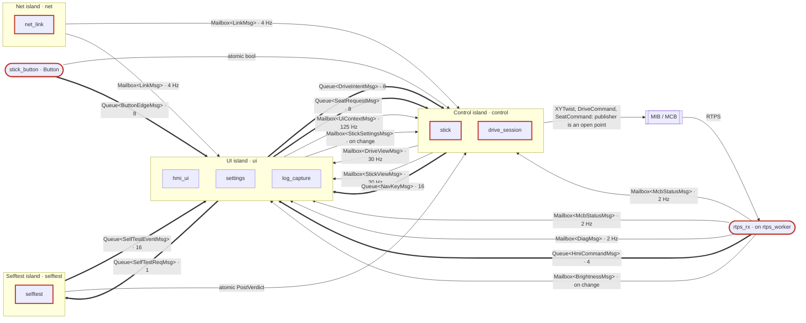
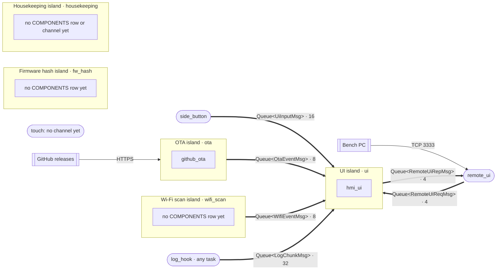

# topology

The tables of every task, component and channel in the HMI firmware, the compile-time check
`validate()`, and the `Topology` that creates every channel and hands out its ends
(CS-OWN-12, CS-CON-02). Namespace `hmi::topo`.

Status: **DRAFT for human review** (plan `docs/plans/refactor.md` step 6). Not wired into the
firmware: no `CMakeLists.txt`, nothing includes it. People own `topology.hpp` and
`topology_types.hpp` (CS-OWN-13); a PR that changes a row states the change in words, and an AI
never edits a row to make a check pass.

## Requirements

| ID | Requirement | Tests |
| --- | --- | --- |
| REQ-TOP-01 | The topology is plain `constexpr` tables (`TASKS`, `FOREIGN_TASKS`, `COMPONENTS`, `CHANNELS`) in headers with no FreeRTOS, ESP-IDF or espp include; rates and depths are UPPER_CASE constants from `rates_constants.hpp` | TOP-001..007, review |
| REQ-TOP-02 | `static_assert(validate(...))` rejects every broken rule below at compile time, and the error names the rule (`broken_rule::<rule>`) | mnc_* (14 rule cases), TOP-008, TOP-009 |
| REQ-TOP-03 | Every `Task` and `Ch` id has exactly one row, and there is one `using XCh = Channel<Ch::X, M>` per channel, in row order | TOP-002, TOP-004, static_asserts in `topology.hpp` |
| REQ-TOP-04 | A channel's message type matches its row's `message` column, and satisfies fw_core's `Message` concept (an atomic's type: lock-free) | mnc_channel_message_mismatch, static_assert in `test_topology.cpp` |
| REQ-TOP-05 | Channel storage is created only by the `Topology`, from the row: kind, depth, full policy, name, send timeout | TOP-010, TOP-011, TOP-012 |
| REQ-TOP-06 | `topo.writer<XCh>(ctx)` compiles only for the row's producer, `topo.reader<XCh>(ctx)` only for its consumer (CS-OWN-06) | mnc_writer_not_producer, mnc_reader_not_consumer, TOP-010..012 |
| REQ-TOP-07 | `topo.task_config(Task::X)` returns the TASKS row's settings; a task with no TASKS row does not compile (CS-CON-02) | TOP-013, mnc_task_config_without_row |

Test IDs `TOP-0nn` are in `test/test_topology.cpp`; `mnc_*` are in `test/mnc/`.

## What the tables mean

| Table | One row is | Columns |
| --- | --- | --- |
| `TASKS` | a task this firmware creates | id, name (the FreeRTOS name the census matches), role (island or adapter), stack (B), priority, core (-1: any), safety, start (boot or on demand) |
| `FOREIGN_TASKS` | a task ESP-IDF, espp or a driver creates (TS-DET-09) | name, start; `hosts`: the adapter that runs on it, if any, and whether that adapter is safety-relevant |
| `COMPONENTS` | a component | name, the task that runs it |
| `CHANNELS` | the one way data crosses two tasks | id, name, kind, message, producer, consumer, rate (Hz, mailbox/atomic) or depth (queue), full policy |

- **Island**: a task that owns state; everything it owns is single-threaded (CS-OWN-01).
- **Adapter**: a task with no application state that turns input into messages (CS-OWN-02).
  `rtps_rx` and `log_hook` are adapters that run on a foreign task, so `FOREIGN_TASKS` names them
  in `hosts`; `log_hook` runs on whichever task logs (`ANY_TASK`, skipped by the census).
- **Kinds** (CS-OWN-03): `MAILBOX` for state (overwrite, newest wins), `QUEUE` for events
  (bounded FIFO, a declared full policy), `ATOMIC` for one lock-free value, `CONST` for data
  fixed after start-up.
- **Rate** is the most a producer writes, in Hz; `ON_CHANGE` (0) means no fixed rate.

## The rules `validate()` checks

Each broken rule is a compile error naming `hmi::topo::broken_rule::<rule>()`
(`topology_validate.hpp` explains how: a deliberately non-`constexpr` function per rule).

| Rule | Rejects | Must-not-compile case |
| --- | --- | --- |
| `task_duplicate_id` | a Task id with two rows (TASKS, or TASKS and a `hosts`) | `mnc_task_duplicate_id` |
| `task_duplicate_name` | two task names alike across TASKS and FOREIGN_TASKS | `mnc_task_duplicate_name` |
| `task_name_length` | a name that is empty or over 15 characters (FreeRTOS truncates it) | `mnc_task_name_length` |
| `task_without_role` | a TASKS row that is neither island nor adapter (`Role::NONE`) | `mnc_task_without_role` |
| `channel_duplicate_id` | two CHANNELS rows with one id or one name | `mnc_channel_duplicate_id` |
| `channel_unknown_task` | a producer or consumer in neither TASKS nor a `hosts` | `mnc_channel_unknown_task` |
| `channel_same_task` | producer == consumer | `mnc_channel_same_task` |
| `channel_drop_into_safety` | a `DROP_NEWEST_COUNT` queue into a safety task (CS-OWN-04) | `mnc_channel_drop_into_safety` |
| `channel_block_on_safety_path` | a `BLOCK_TIMEOUT` queue with a safety task at either end (CS-OWN-04) | `mnc_channel_block_on_safety_path` |
| `mailbox_not_overwrite` | a mailbox or atomic whose policy is not `OVERWRITE` | `mnc_mailbox_not_overwrite` |
| `queue_overwrite` | a queue whose policy is `OVERWRITE` (queues never merge) | `mnc_queue_overwrite` |
| `queue_depth_out_of_range` | a queue depth of 0 or above `MAX_QUEUE_DEPTH` (64) | `mnc_queue_depth_zero` |
| `component_unknown_task` | a component on a task in neither TASKS nor a `hosts` | `mnc_component_unknown_task` |
| `component_duplicate_name` | two COMPONENTS rows with one name | `mnc_component_duplicate_name` |

`topology.hpp` adds three static_asserts of its own: every `Task` id and every `Ch` id has a row,
and the `using` lines (`AllChannels`) name the rows in order, which also instantiates each
`Channel<>` and so checks its message type against its row.

*Limit* (CS-OWN-12): this proves what is declared, not what runs. The task census (TS-DET-09) and
the ThreadCheckers on every read end (CS-OWN-11) cover what runs.

## Using it (once wired)

```cpp
#include "topology_espp.hpp"
namespace topo = hmi::topo;
namespace fw = hmi::fw;

topo::Topology channels;  // once, at start-up, before any task

class ControlIsland {
public:
  static constexpr topo::Task TASK = topo::Task::CONTROL;
  void cycle() {
    const fw::Context<ControlIsland> ctx{fw::Passkey<ControlIsland>{}};
    auto view = channels_.writer<topo::DriveViewCh>(ctx);   // producer: compiles
    // channels_.reader<topo::DriveViewCh>(ctx);            // consumer is UI: does not compile
  }
};

espp::Task task({.callback = ..., .task_config = topo::Topology::task_config(topo::Task::CONTROL)});
```

## D2: islands and channels

Hand-written from the tables for now; `tools/gen_diagrams` will generate it (CS-ARC-01/02).
Split in two to stay near 25 nodes (CS-ARC-01). Legend: `fw-standards/templates/architecture.md`.

Motion path and the islands that gate it:



Tools, workers and logs into the UI:



## Differences from today's firmware

Today there are **no islands and no channels**. About 470 statics in `main/main.cpp` (and its
`frag_*.inc` fragments) are shared between tasks directly, and one global
`static std::recursive_mutex lvgl_mutex` (`main/main.cpp:74`, 42 uses) is taken by 7+ tasks:
`lv_task`, the Data Display Task, `Read ADC` (`try_lock`, `main.cpp:1571`), `Button`
(`frag_stick_button.inc`), `remote_ui`, the self-test task, the `internet_ui` and `update_ui`
workers, and `main` itself (audit G1, H14, H15). In the target only `ui` calls `lv_*`; every other
task posts to a channel.

| Today: task (where; stack, priority, core) | Target row | Notes |
| --- | --- | --- |
| `lv_task` (`main.cpp:1187`; 16 KB, 20, core 1) | `ui` island | same settings |
| `Read ADC` (`main.cpp:1618`; espp default, 0, any) | `control` island (6 KB, 22, core 0) | today below the UI and unwatched (H11); target above it (H4) |
| `Button` (espp::Button GPIO48, `main.cpp:709`; 4 KB, 5) | `stick_button` adapter | name kept, so the census matches |
| `Data Display Task` (`main.cpp:1398`; 6 KB, 10, core 1) | `housekeeping` island | 17 characters: FreeRTOS truncates it, so renamed |
| `rtps_pub`, `rtps_start` (`rtps_comms.cpp:978`, `982`; 8 KB, 5) | `net` island | the motion publishers' home is an open point |
| espp `rtps_worker` (foreign) | `rtps_rx` adapter, hosted | today it takes `lvgl_mutex` for a frame (G1) |
| `selftest` (`xTaskCreatePinnedToCoreWithCaps`, `selftest.cpp:1233`; 12 KB PSRAM, 3, core 0) | `selftest` island (8 KB, 4, any) | the draft's 8 KB is below today's 12 KB: to measure |
| `remote_ui` (detached `std::thread`, `remote_ui.cpp:399`; 16 KB) | `remote_ui` adapter | test builds only |
| `fw_hash` (detached `std::thread`, `fw_info.cpp:126`; prio 2) | `fw_hash` island (prio 1) | |
| OTA worker (detached `std::thread`, `github_ota.cpp:493`; prio 3) | `ota` island | |
| `update_ui` worker (detached `std::thread`, `update_ui.cpp:192`) | `ota` island | assumed: it fetches the release list |
| `internet_ui` worker (detached `std::thread`, `internet_ui.cpp:67`) | `wifi_scan` island | |
| `tab5 interrupts` (BSP, `m5stack-tab5.hpp:868`) | `side_button`, `touch` adapters | today one BSP task; touch is polled by LVGL on `lv_task` |
| `tab5_audio` (BSP audio task) | none | open point: the audio stream buffer has three writers (H16) |
| vprintf log hook (any task) | `log_hook`, hosted on `ANY_TASK` | |

## Open points (for review)

- **Changed from plan §2.2** (validate() rejects the draft as written): `SEAT_REQUEST` and
  `SELFTEST_REQ` were `DROP_NEWEST_COUNT` into `control` and `selftest`, both safety tasks. They
  are `RAISE_FAULT` here. The alternative is to narrow the rule.
- **Added from plan §2.1**: the `housekeeping` island (today's Data Display Task), which the §2.2
  table left out. It has no channels yet: battery, IMU and RTC to the UI need a mailbox.
- `touch` has a TASKS row but no channel: `UI_INPUT` has one producer (`side_button`). Either
  touch stays an LVGL indev on `ui` (drop the row) or it gets its own queue.
- `log_hook` runs on any task, the UI task included, so its queue can have the UI as producer and
  consumer at run time; `validate()` cannot see that.
- Stacks and priorities are today's values or placeholders (CS-MEM-04); most rates and depths
  are estimates (`rates_constants.hpp` says which).
- Message fields in `messages.hpp` are a sketch; each adapter defines them for real.
- fw_core's channel constructors are public, so the `Topology`'s passkey guards only its own
  `Slot`s. A passkey on fw_core's constructors would close that.
- The motion publishers (`control` calls an injected writer vs a queue to `net`).

## Files

| File | Holds |
| --- | --- |
| `include/topology.hpp` | the four tables, the `Channel<>` type and one `using` per channel |
| `include/topology_types.hpp` | the `Task` and `Ch` ids, the enums and the row types |
| `include/topology_validate.hpp` | `check()`, `validate()` and the `broken_rule` functions |
| `include/rates_constants.hpp` | rates, depths and timeouts, each with its source |
| `include/messages.hpp` | every message type (marked for fw_core's `Message`) |
| `include/topology_espp.hpp` | `Topology`: storage, `writer`/`reader`, `task_config` (fw_core + espp) |

## Dependencies

- `topology.hpp` and the headers it includes: none (pure C++23).
- `topology_espp.hpp`: `fw_core` (channels, `Passkey`, `Context`) and espp `task` (for
  `espp::Task::BaseConfig`; its header builds on the host too).

## Tests

```
wsl -e bash -lc 'cd /mnt/c/<worktree>/components/topology/test && make test'      # L1
wsl -e bash -lc 'cd /mnt/c/<worktree>/components/topology/test && make coverage'  # + gcov
wsl -e bash -lc 'cd /mnt/c/<worktree>/components/topology/test && make mnc'       # must-not-compile
```

L1 runs as host-native g++ in WSL, not on the IDF `linux` target (deviation approved
2026-10-06, TS-UNIT-01, CS-HAL-04). The must-not-compile runner is fw_core's
(`components/fw_core/test/mnc/run_mnc.sh`): each case builds once without `MNC_FAULT` (its twin
must compile) and once with it (it must fail with the text on its `// expect-error:` line).
