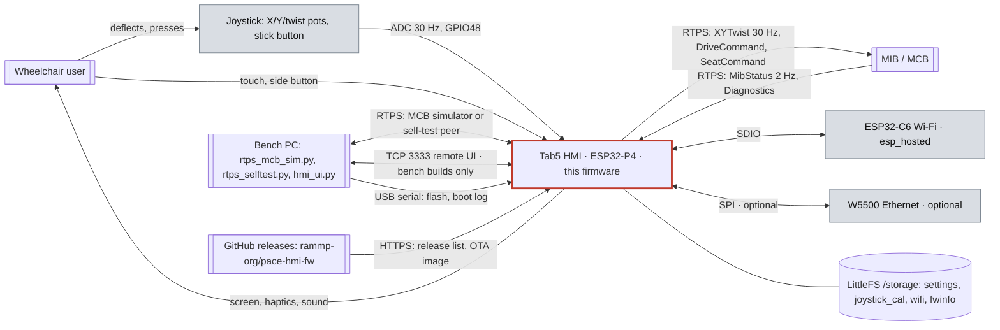
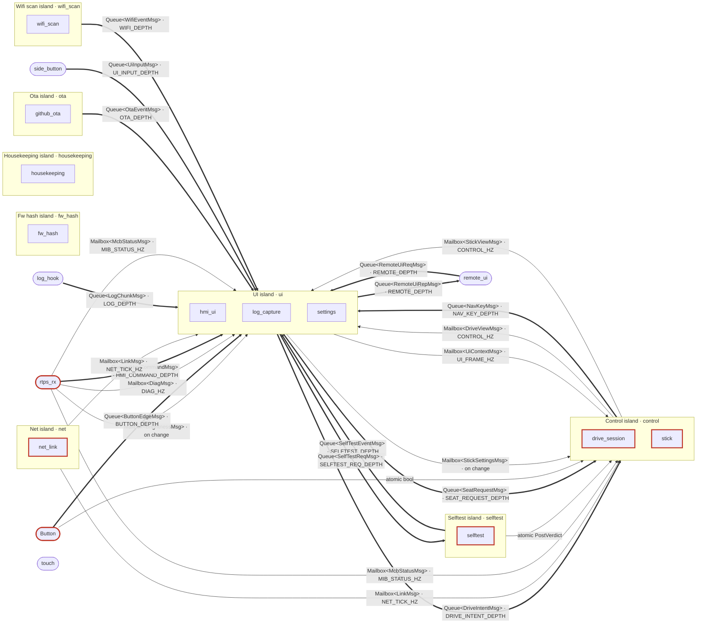
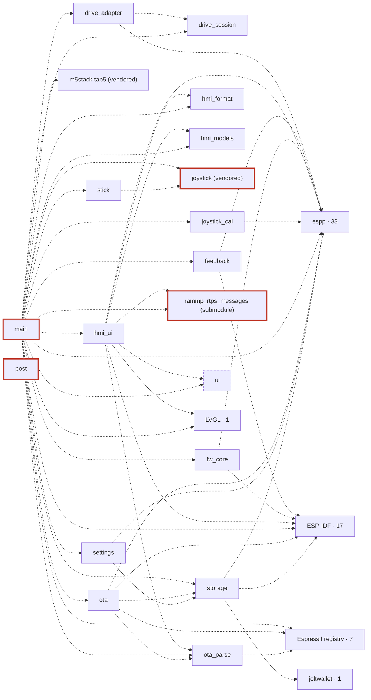

# Architecture: pace-hmi-fw

Generated sections are rewritten by `tools/gen_diagrams` and checked by its `check` mode, meant
for L0 in CI (CS-ARC-02; not yet a step in `.github/workflows/l0.yml`).
Do not edit between the markers. Regenerate with `python tools/gen_diagrams/gen_diagrams.py write`;
see [tools/gen_diagrams/README.md](../tools/gen_diagrams/README.md).

## Today vs target

For a file-by-file walk through the code as it is today (boot, tasks, the motion path, the drive
state machine, every fragment), read [how-the-firmware-works.md](how-the-firmware-works.md).

- **Today:** almost everything is one component, `main` (a `main.cpp` split into one-TU
  `frag_*.inc` fragments, plus the screen, network, OTA and self-test files). Tasks share state
  through statics and a global recursive `lvgl_mutex`. There are no islands, no channels and no
  `topology.hpp` yet. The first components have moved out: `fw_core` (channel and ownership
  helpers) and `hmi_format` (screen text formatting).
- **Target:** the islands, adapters and channels of
  [docs/plans/refactor.md §2.1–2.3](plans/refactor.md#2-target-design), wired by
  `components/topology/include/topology.hpp`. D2 below appears when that file lands; D3 grows as
  components move out of `main`. The target sketches of D2 and D3 are in
  [§2.5](plans/refactor.md#25-diagrams).
- D4 (state machines inside a component) does not exist yet: the drive session, link and seat
  tables are drafts in [§2.4](plans/refactor.md#24-safety-state-machines-transition-tables).

## Legend (CS-ARC-03)

| Element | Mermaid |
| --- | --- |
| island | `subgraph` titled `<Name> island · <task>` |
| adapter | stadium `A([name])` |
| component | rectangle `C[name]` |
| peer or external system | subroutine `P[[name]]` |
| storage | cylinder `S[(name)]` |
| hardware / safety-relevant / generated | `:::hw` / `:::safety` / `:::gen` |
| mailbox (state) | solid arrow, label `Mailbox#lt;T#gt; · rate` |
| queue (event) | thick arrow `==>`, label `Queue#lt;T#gt; · depth` |
| dependency (D3) | dotted arrow `-.->` |

Every diagram ends with these lines:
```
classDef hw fill:#d9dde3,stroke:#7a8590,color:#111
classDef safety stroke:#c0392b,stroke-width:3px
classDef gen stroke-dasharray:5 4
```

## D1 Context (hand-written)

The HMI is the joystick and touch screen of a powered wheelchair. It sends motion and seat
commands to the MIB/MCB over RTPS and shows the chair's state. The network is either Wi-Fi
(the Tab5's ESP32-C6 over SDIO) or Ethernet (an optional W5500 on the M5-Bus SPI lines), one at a
time, chosen on the Internet Settings screen. The bench PC tools stand in for the MCB and drive the
screen in test builds.



Sources for D1: `main/rtps_comms.cpp` (Wi-Fi or W5500, one link), `main/hmi_rtps_spec.hpp`
(`kMibStatusPeriod` 500 ms, bench topics), the stick task's 33 ms ADC period, `components/ota/src/github_ota.cpp`,
`main/remote_ui.cpp` (`CONFIG_HMI_REMOTE_UI`), `components/storage`, and the Bench section of
[project-profile.md](project-profile.md).

## D2 Islands
<!-- BEGIN GENERATED D2 (tools/gen_diagrams): do not edit -->
Islands (subgraphs), adapters (stadiums) and channels from `components/topology/include/topology.hpp`. Components inside an island are those its COMPONENTS rows assign to the island's task.


<!-- END GENERATED D2 -->

## D3 Components
<!-- BEGIN GENERATED D3 (tools/gen_diagrams): do not edit -->
First-party components (`main` and `components/*` except `joystick`, `m5stack-tab5`, `ui`) and their direct `REQUIRES`/`PRIV_REQUIRES`. Vendored, generated and submodule components appear only as targets. Third-party dependencies are folded into one node per source; the number is how many of its components are used directly.



<details><summary>Folded dependencies</summary>

- **ESP-IDF**: `app_update`, `bootloader_support`, `esp_app_format`, `esp_driver_ppa`, `esp_eth`, `esp_event`, `esp_http_client`, `esp_mm`, `esp_netif`, `esp_partition`, `esp_timer`, `esp_wifi`, `freertos`, `lwip`, `mbedtls`, `pthread`, `spi_flash`
- **espp**: `espp__adc`, `espp__base_component`, `espp__base_peripheral`, `espp__bmi270`, `espp__button`, `espp__cdr`, `espp__cli`, `espp__codec`, `espp__display`, `espp__display_drivers`, `espp__drv2605`, `espp__file_system`, `espp__filters`, `espp__format`, `espp__gt911`, `espp__i2c`, `espp__ina226`, `espp__input_drivers`, `espp__interrupt`, `espp__led`, `espp__logger`, `espp__math`, `espp__pi4ioe5v`, `espp__reflect_cpp`, `espp__rtps`, `espp__rx8130ce`, `espp__socket`, `espp__spi`, `espp__st7123touch`, `espp__task`, `espp__thread_pool`, `espp__timer`, `espp__touch`
- **Espressif registry**: `espressif__cjson`, `espressif__esp-dsp`, `espressif__esp_hosted`, `espressif__esp_sccb_intf`, `espressif__esp_wifi_remote`, `espressif__usb`, `espressif__w5500`
- **joltwallet**: `joltwallet__littlefs`
- **LVGL**: `lvgl__lvgl`

</details>

Source: `docs/diagrams/project_components.json`, a path-free snapshot of an ESP-IDF build's `project_description.json`. Regenerate after a build with `python tools/gen_diagrams/gen_diagrams.py write --build-dir <idf build dir>`.
<!-- END GENERATED D3 -->
