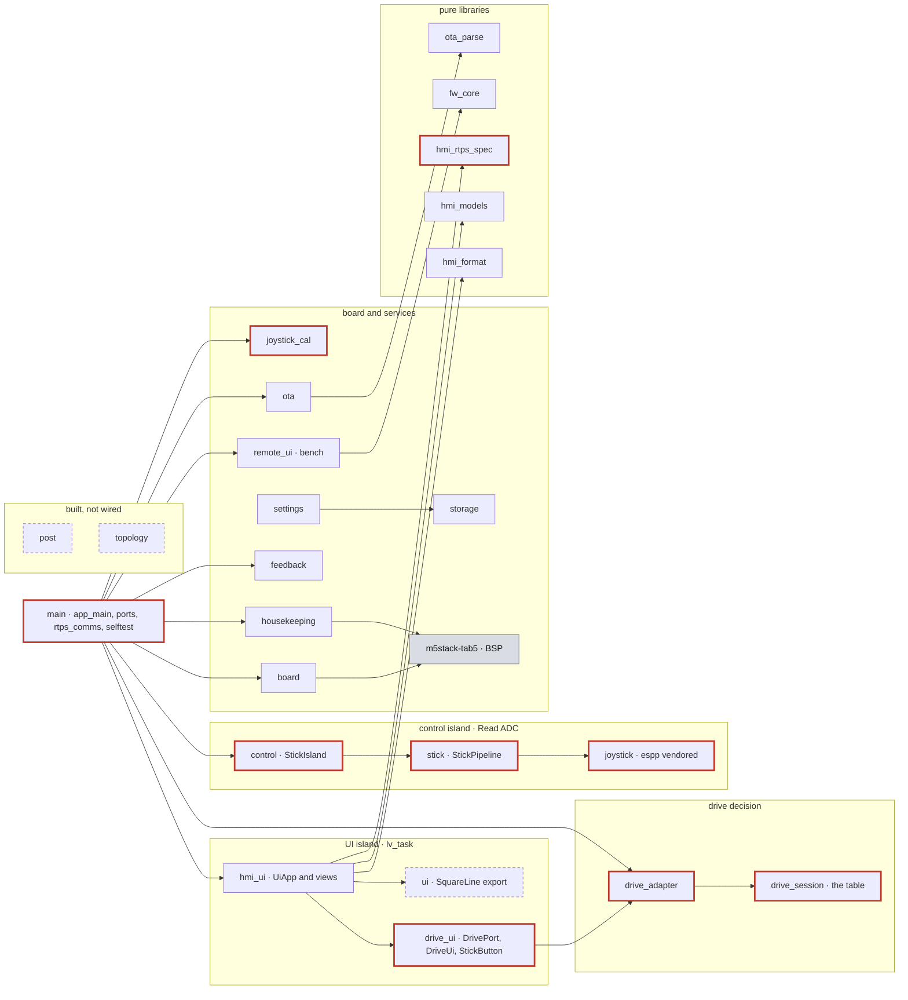
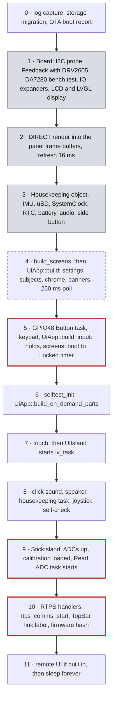
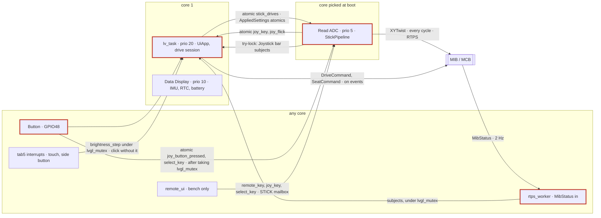
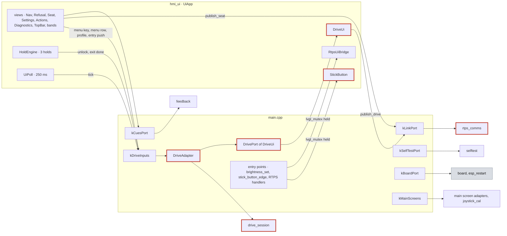
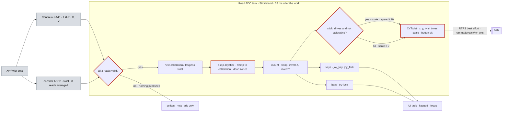
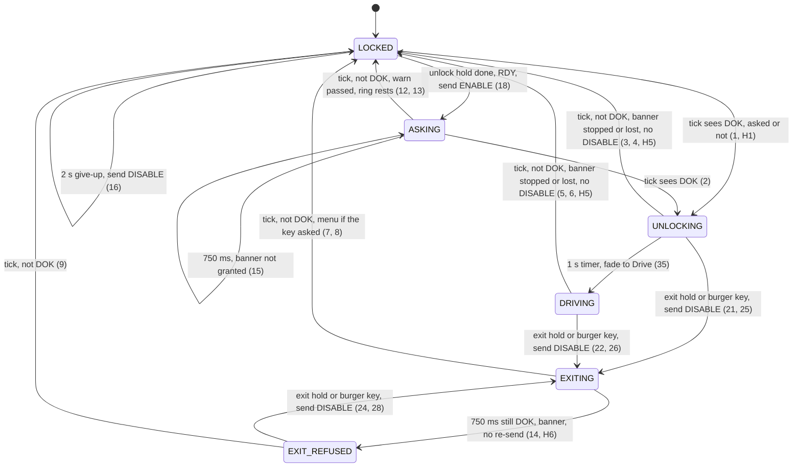
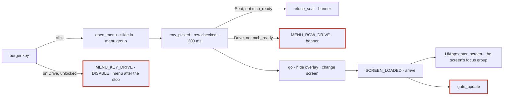
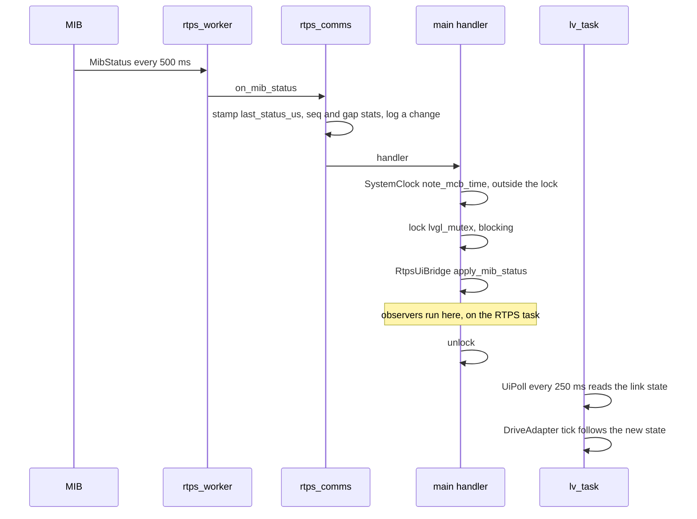

# How the firmware works

A walk through the code as it is on `dev_refactor` at `a31cea2` (2026-10-08): what runs, in
which order, on which task, and how the pieces talk. It is a map for reading the code, not a
design. The target design is in [plans/refactor.md](plans/refactor.md), the user's view of the
screens is in [ui-architecture.md](ui-architecture.md), and the generated diagrams (D2 islands,
D3 component dependencies) are in [architecture.md](architecture.md). Line numbers are for
`a31cea2`. They drift, but the function names don't, so search for the name if a line has moved.

Where the code does not say something clearly, this page says "unclear from the code" rather
than guess.

Diagram legend: the same as [architecture.md](architecture.md#legend-cs-arc-03). Grey is
hardware, a red outline is safety-relevant, and a dashed outline is generated code or code that
is built but not wired.

## Contents

1. [The short version](#1-the-short-version)
2. [How the source is laid out](#2-how-the-source-is-laid-out)
3. [Boot: `app_main` step by step](#3-boot-app_main-step-by-step)
4. [Tasks, cores and how they share data](#4-tasks-cores-and-how-they-share-data)
5. [Inside the UI task](#5-inside-the-ui-task)
6. [From stick deflection to motion](#6-from-stick-deflection-to-motion)
7. [The drive session](#7-the-drive-session)
8. [Holds, refusals and actions](#8-holds-refusals-and-actions)
9. [The seat](#9-the-seat)
10. [Screens, navigation and data binding](#10-screens-navigation-and-data-binding)
11. [RTPS and the network](#11-rtps-and-the-network)
12. [Settings, storage, OTA, self test, remote UI, log, cues](#12-settings-storage-ota-self-test-remote-ui-log-cues)
13. [Where the old fragments went](#13-where-the-old-fragments-went)
14. [Tools and tests](#14-tools-and-tests)
15. [Where the hazards live](#15-where-the-hazards-live)
16. [What changes next (hazard fixes)](#16-what-changes-next-hazard-fixes)
17. [Known oddities](#17-known-oddities)
18. [Where to start reading](#18-where-to-start-reading)

## 1. The short version

- **`main` wires, components do the work.** The `frag_*.inc` fragments are gone.
  `main/main.cpp` (900 lines, `app_main` about 165 code lines) builds each component from a
  `Config`, fills the UI's ports, and starts the tasks. The logic lives in `components/*`.
- **Three tasks matter for the user:**
  - **UI task** (`lv_task`, priority 20, core 1, every 8 ms): `hmi_ui`'s `UiIsland` runs
    `lv_task_handler()` under the one global `lvgl_mutex`. Every screen, timer, button press
    and the drive session run here.
  - **Read ADC** (`control`'s `StickIsland`, priority 5, core picked at boot, every 33 ms
    after the work): reads the stick, runs `stick`'s `StickPipeline`, and publishes `XYTwist`.
  - **RTPS receive** (espp's `rtps_worker_0/1`, priority 5): takes `MibStatus` from the MIB
    and writes it into LVGL subjects under `lvgl_mutex`.
- **Motion is gated by one atomic.** `stick_drives` (in `hmi_ui/app_state.hpp`) is true only
  when unlocked, on the Drive screen, with no menu open. Only the UI task writes it, through
  `DriveUi::update_stick_gate`. The ADC task multiplies the stick by 0 when it is false.
- **The drive session is a table.** `drive_session` decides (a 41-row table, pure C++).
  `drive_adapter` samples the inputs, keeps the deadlines and performs the actions.
  `drive_ui`'s `DrivePort` turns each action into its LVGL or RTPS call.
- **The MIB decides driving; the HMI follows.** The Drive screen opens whenever MibStatus
  says ENABLED and the link is up, whether or not this HMI asked (table rows 1–2). It closes
  when the MIB stops (rows 3–9). The HMI only *asks*, with a one-shot `DriveCommand`. This
  is the root of hazards H1, H5 and H6. The owner has now accepted the "MCB decides" part by
  design, under guards that are not in the code yet (see [§16](#16-what-changes-next-hazard-fixes)).
- **The UI reaches the rest through ports.** `hmi_ui`'s `UiApp` owns every view and gets
  everything else through six tables of plain functions (`hmi_ui/app_ports.hpp`) that `main`
  fills once: `LinkPort`, `DriveInputs`, `CuesPort`, `SelfTestPort`, `BoardPort`,
  `MainScreens`.
- **Tasks share data through atomics and LVGL subjects.** One `fw_core` channel exists, and
  only in bench builds: the stick-injection mailbox. `topology` (the target task and channel
  map) and `post` (the boot self-test evaluator) are built and tested but not wired.

## 2. How the source is laid out

### 2.1 Components

"Safety" follows the red outlines in [architecture.md D3](architecture.md#d3-components).
"Host" means a host L1 test app in `tests/manifest.d`.

| Path | What it is | Safety | Tests |
| --- | --- | --- | --- |
| `main/` | `app_main` and the wiring; the network and RTPS (`rtps_comms`); the self test; the log capture; main's side of four screens; the calibration adapter (see [§2.3](#23-what-stays-in-main)) | yes | bench B0–B5 |
| `components/drive_session` | The drive session: the 41-row table (`drive_session_table.hpp`, read as `TABLE.md`) and `DriveSession`, the hand-written transition function checked against it | yes | host: oracle, oracle by input, table self-check |
| `components/drive_adapter` | `DriveAdapter<Port>`: samples link, MIB state, screen and menu; keeps the deadlines; performs the session's actions through a port | yes | host: DAD-001..006; `tests/host/drive_golden` |
| `components/drive_ui` | `DrivePort<DriveUi>` (the LVGL and DriveCommand calls), `DriveUi` (padlock, unlock advance, the stick gate's writer), `StickButton` (GPIO48 edges); also the vocabulary hmi_ui shares (`Fn`, `LinkState`, `Refused`, `SharedSubjects`) | yes | drive goldens; bench B4, B5 |
| `components/stick` | `StickPipeline`: raw mV in, the keypad key and the `XYTwist` command out; `ButtonEdges`; the bench injection's parser (`bench_inject.hpp`) | yes | host: golden vectors |
| `components/control` | `StickIsland`: the "Read ADC" task, the continuous ADC (X/Y) and the twist's oneshot ADC; runs one `StickPipeline` cycle per period | yes | none of its own |
| `components/joystick_cal` | The calibration record, its file format and check, and the calibration run as a pure model | yes | host |
| `components/joystick` | espp's joystick, vendored, plus a twist (Z) axis | yes | host |
| `components/hmi_rtps_spec` | What only this HMI adds to the RTPS spec: HMI topics, timeouts, seat unit helpers, banner texts, self-test tags | in part | host (`rtps_spec`) |
| `components/hmi_ui` | The UI island: `UiApp` and every view, `UiIsland` (the UI task), `UiPoll` (the 250 ms tick), `NavView`, `RefusalView`, `HoldEngine`, `DisplayFlip`, `app_state` (the shared atomics) | no | bench B4 |
| `components/board` | `Board`: the Tab5 bring-up on the BSP in `app_main`'s order; the touch and side-button adapters; `backlight`, `present` | no | bench |
| `components/m5stack-tab5` | espp's Tab5 BSP, vendored and changed (two frame buffers, vsync present) | no | none |
| `components/housekeeping` | `Housekeeping` (the "Data Display Task": IMU, battery, RTC every 20 ms) and `SystemClock` (keeps the clock and RTC to the MIB's time) | no | bench |
| `components/feedback` | `Feedback`: the DRV2605 haptics and the click sound; the DA7280 bench test | no | bench |
| `components/settings` | User settings from one typed table, `/storage/settings.txt`; `AppliedSettings` (the atomics other tasks read) | feeds the stick | host (`tests/host/settings`) |
| `components/storage` | LittleFS at `/storage`, atomic write, one-time legacy migration | no | bench B2 |
| `components/ota` | `fw_info` (SHA-256 of the running image, matched to a release) and `github_ota` (release list, install, boot confirm) | no | bench B2, B4 |
| `components/ota_parse` | Pure OTA parsing: release JSON, image header, fwinfo lines, the boot-confirm marker | no | host |
| `components/remote_ui` | Bench-only TCP 3333 debug server; the stick injection slot (`stick_inject.hpp`) | bench only | bench |
| `components/hmi_format` | Pure text formatting (speed, steppers, clock, diagnostics, about, update, network) | no | host |
| `components/hmi_models` | Pure UI models: the grid cursor walk, the bench PIN | no | host |
| `components/fw_core` | Channels (`Mailbox`, `Queue`, `AtomicValue`), `ThreadChecker`, `Owned<T>`, `check()` | no | host |
| `components/post` | The boot POST evaluator. **Built for the target, not linked or called** | yes, once wired | host |
| `components/topology` | The target task and channel map (feeds D2). **Not wired** | n/a | host |
| `components/ui` | The SquareLine Studio export. **Generated**; never edit it | no | `scripts/ui_contract.py` |
| `external/rammp-rtps` | Submodule: the RTPS topics and messages shared with the MIB/MCB | yes (wire format) | header-only |

### 2.2 Component map

Who uses whom, simplified. The exact `REQUIRES` graph is D3 in
[architecture.md](architecture.md#d3-components).



What this means in practice:

- **Each component sees only what it requires.** Unlike the old fragments, a component sees
  only what its `REQUIRES` gives it, and its private `src/` is closed to others (an L0 check).
- **Templates keep the hot paths in one unit.** `StickIsland`, `StickPipeline::cycle`,
  `DriveAdapter` and `DrivePort` are templates or header-only, instantiated in `main.cpp`. So
  the ADC path and the drive path are direct calls, as they were before the split, and the
  ADC task's stack use did not grow (B3 `mem.stk_adc`).
- **Shared state is still global for now.** `hmi_ui/app_state.cpp` holds the atomics and
  subjects the old `frag_state.inc` held, moved verbatim, waiting for their owners
  (app-main-shrink S7, T-H4a).

### 2.3 What stays in `main/`

These are approved deviations from "main only wires" (CS-LAY-01).

| File | Job |
| --- | --- |
| `main.cpp` | `app_main`; the port tables (`kLinkPort`, `kDriveInputs`, `kCuesPort`, `kSelfTestPort`, `kBoardPort`, `kMainScreens`); the one `UiApp`, `DrivePort` and `DriveAdapter`; `AdcStickIo` (what one stick cycle reads and writes); the entry points other tasks call under `lvgl_mutex` (`brightness_set`, `brightness_step`, `stick_button_edge`, `lvgl_cycle`) |
| `rtps_comms.cpp/.hpp` | The network link (W5500 Ethernet, or Wi-Fi via the C6) and the one RTPS participant: every publisher and subscriber, the link state |
| `selftest.cpp/.hpp`, `selftest_spec.hpp`, `selftest_platform.cpp/.hpp` | The self test: 54 checks, an overlay, a report over RTPS and serial; the board probes it reads |
| `joystick_cal.cpp/.hpp` | The calibration's adapter: the file I/O, the LVGL view of the run, the hand-off to the ADC task |
| `about_ui`, `internet_ui`, `update_ui`, `log_view` | Main's side of four screens whose views are in `hmi_ui`: worker threads, network and OTA calls, the hand-back to the UI task, the restarts |
| `log_capture.cpp/.hpp` | Tees stdout and stderr into a 500-line PSRAM ring for the Log screen |
| `lv_mem_psram.c` | LVGL's allocator: every LVGL allocation goes to PSRAM, leaving internal DMA RAM for the W5500 |
| `boot_logo.c/.h`, `click.wav` | The boot logo mask and the click sound, embedded |
| `Kconfig.projbuild` | Build options: `HMI_REMOTE_UI`, `HMI_BENCH_STICK_INJECT`, `HMI_WIFI_SSID/PASSWORD`, `HMI_OTA_TEST_URL`, `HMI_BENCH_DA7280_TEST`, `HMI_DEBUG_FPS(_STRESS)` |

## 3. Boot: `app_main` step by step

`app_main` (`main.cpp:604-908`) runs on IDF's `main` task (priority 1, core 0). The board
steps are `hmi::board::Board` methods; the UI steps are `UiApp` methods.



| Phase | Lines | What happens | Notes |
| --- | --- | --- | --- |
| 0 | `main.cpp:607-613` | `log_capture_start` first, so the Log screen sees everything. `storage_migrate_legacy`, `github_ota_boot_report` | |
| 1 | `:615-643` | `Board` built. `probe_internal_i2c` (0x08..0x77). `Feedback` built: its constructor brings up the DRV2605; `feedback` points at it. `run_da7280_bench` (no-op unless `HMI_BENCH_DA7280_TEST`). `start_io_expanders`, `start_display` (LCD, full-screen PSRAM draw buffers) | either failure stops the boot (`park_main_task`): no UI ever |
| 2 | `:645-663` | `start_direct_render`: LVGL renders straight into the two DSI frame buffers (`DisplayFlip::use_panel_buffers`); a flush is a vsync swap. Refresh timer 16 ms. FPS meter only with `HMI_DEBUG_FPS` | if the buffers are missing, the BSP's flush stays; the self test reports it |
| 3 | `:665-692` | `Housekeeping` built (the Kalman filter the IMU needs). `start_imu`, `start_sdcard` (only warns), `SystemClock` built, `start_rtc` (sets the clock if the RTC time is plausible), `start_battery`, `start_audio`, `start_side_button` | IMU, RTC, battery or audio failure stops the boot (`park_main_task`). **The side-button task is live from here** and its press takes `lvgl_mutex` |
| 4 | `:694-703` | `build_screens`: rotation 0, `ui_init()` builds all 14 screens, BenchMotors, Settings, SkunkWorks and Diagnostics are destroyed again, the boot logo is swapped for an A8 mask. `UiApp::build`: settings load and theme, brightness, every Settings subject, the Joystick bars, the MCB/link/band subjects, every resident screen's chrome, the banners, the diagnostics subjects, **the 250 ms poll timer**, the calibration view | subjects are initialised before anything binds to them |
| 5 | `:705-731` | **GPIO48 `Button` task starts** (its callback takes `lvgl_mutex`). `KeypadInput` for the stick. `UiApp::build_input`: nav groups and the 500 ms backstop, the padlock and the three holds (**33 ms hold poll**), Log/Seat/Internet/About, Update (its **30 s OTA confirm** one-shot), seat values and screen-loaded hooks, `finish_build` (perf overlay hidden, overdraw pass, **1.2 s boot→Locked** one-shot) | the Button task is live while `app_main` keeps building the UI without the lock (H15) |
| 6 | `:733-742` | `selftest_platform` + `selftest_init` (registers the self test's RTPS handlers, so before RTPS starts). `build_on_demand_parts` (PIN pad, Settings, Skunk Works, Diagnostics parts that outlive their screens) | |
| 7 | `:744-775` | `start_touch` (BSP touch task; each press clicks). The touch input is wrapped for the flip, under the lock. **`UiIsland::start`: `lv_task` runs** | from here every LVGL call must hold `lvgl_mutex` |
| 8 | `:777-802` | `load_audio` (click.wav), `start_speaker` (60 %). `housekeeping.start()` (the 20 ms task). `espp::joystick_selftest()` (asserts; nothing under `NDEBUG`) | a failed audio load stops the UI task (`UiIsland::stop`) and the boot (see below). A housekeeping task that fails to start is logged (error) and the boot goes on |
| 9 | `:804-866` | `StickIsland` built: the continuous ADC (ADC1 CH0/CH1, 1 kHz) starts with its own task, then the twist's oneshot ADC (ADC2 CH3). `joystick_cal_load` (ideal 0/1650/3300 mV if no valid file). `stick_island.start`: the `StickPipeline` on that calibration, **the `Read ADC` task** | a failed start is logged (error) and the boot goes on with no `XYTwist` (no motion); `stick_task_running()` reads whether the task exists |
| 10 | `:868-899` | RTPS handlers: brightness, MibStatus (sets the clock outside the lock, then the subjects under it), diagnostics. `rtps_comms_start` with the network setting. TopBar link label, under the lock. `fw_info_start` (hashes the image on a low-priority thread, after the W5500 is up) | a network failure only warns |
| 11 | `:901-907` | `remote_ui_start` (no-op unless `HMI_REMOTE_UI`), then `park_main_task()`: `sleep(1s)` for good | `app_main` never returns, so every local stays alive |

Things to keep in mind:

- **A failed step stops the boot, and `app_main` never returns.** A failure in phases 1–3,
  at touch or at the UI task's start ends in `park_main_task()`, which sleeps for good, so no
  UI ever starts. After phase 7 the only stop is a failed audio load: it stops the UI task
  (`UiIsland::stop`, what the old `return` did by destroying the `UiIsland`), then parks.
- **Why it parks instead of returning.** From phase 3 on, the BSP's side-button task holds a
  `SideButton` that refers to `app_main`'s logger; from phase 7 the touch task calls the
  `Board`'s `TouchClick` and, through it, `feedback`. The BSP has no call that stops either
  task, so a `return` would leave them calling destroyed locals. Parked, every local lives.
- **Every task start is checked.** A `housekeeping.start()` or `stick_island.start()` that
  fails logs an error on `main` and the boot goes on, as before. A Read ADC task that failed to
  start means no `XYTwist` at all, so no motion (the MCB's `XYTwist` timeout holds the chair).
  `stick_task_running()` (main.cpp) says whether the task exists, from FreeRTOS's task list,
  for POST to read.
- **Timers count from creation.** The 250 ms poll, the 1.2 s boot→Locked and the 30 s OTA
  confirm are created in phases 4–5, before `lv_task` runs them. If phases 5–7 took more than
  1.2 s, the boot screen would leave on the first handler pass. Unclear from the code how long
  they take; the bench boot log has the times.

## 4. Tasks, cores and how they share data

### 4.1 The tasks

The values are what the source creates, checked against `tools/guards/baselines/tasks.json`
(G10). "fpu" means the task asked for no core: IDF's RISC-V port pins it to the core it was on
at its first FPU use, so it can differ from boot to boot. Priority 0 given to an espp task or
`std::thread` means IDF's pthread default, 5.

| Task | Prio | Core | Stack | Created | Runs |
| --- | --- | --- | --- | --- | --- |
| `lv_task` | 20 | 1 | 16384 | `main.cpp:755-775` (`hmi::ui::UiIsland`) | `lvgl_cycle`: `lv_task_handler()` under `lvgl_mutex`, then sleep to 8 ms after the start (at least 1 ms). All UI, all LVGL timers, the drive session |
| `Read ADC` | 5 (asked 0) | fpu (0 on the board) | 4096 | `main.cpp:826-866` (`hmi::control::StickIsland`) | three pot reads, one `StickPipeline` cycle, `XYTwist`; then waits 33 ms |
| `ContinuousAdc T` | 5 | fpu | 4096 | espp, built by `StickIsland` | ADC1 DMA at 1 kHz, X and Y |
| `Button` | 5 | any | 4096 | `main.cpp:710-721` (`espp::Button`) | GPIO48 edges → `stick_button_edge` |
| `tab5 interrupts` | 5 | any | 4096 | BSP | touch reports (`TouchClick`) and the side button (`SideButton`) |
| `Data Display Task` | 10 | 1 | 6144 | `main.cpp:667-678` (`hmi::housekeeping::Housekeeping`) | RTC, battery and IMU every 20 ms; no LVGL any more |
| `tab5_audio`, `… microphone` | 20 | 1 | 8192 | BSP | I2S speaker and microphone |
| `rtps_start` | 5 | fpu | 8192 | `rtps_comms.cpp:948-982` | one-shot: Wi-Fi up if chosen, wait for an IP, ping the gateway, start the participant |
| `rtps_pub` | 5 | any | 8192 | `rtps_comms.cpp:976-978` | heartbeat every 2 s; rebinds RTPS when the IP changes |
| `rtps_reactor`, `rtps_worker_0/1`, `rtps_protocol` | 5 | workers fpu | 4–6 K | espp RTPS | socket reactor; the workers run the subscriber callbacks |
| `remote_ui` | 5 | any | 16384 | `components/remote_ui/src/remote_ui.cpp:619` | TCP 3333 server, bench builds only |
| `selftest` | 3 | 0 | 12288 (PSRAM) | `main/selftest.cpp:1220` | on demand: one self-test run |
| `fw_hash` | 2 | any | 6144 | `components/ota/src/fw_info.cpp:107-117` | once at boot: SHA-256 of the image |
| `github_ota` | 3 | any | 12288 | `components/ota/src/github_ota.cpp:531` | on demand: download and install |
| `internet_ui`, `update_ui` | 5 | any | 8192, 12288 | `main/internet_ui.cpp:72`, `main/update_ui.cpp:121` | on demand: Wi-Fi scan/join, release list |
| `main` | 1 | 0 | 33280 | IDF | `app_main`, then sleeps |

The rest are IDF's own (`IDLE0/1`, `ipc0/1`, `esp_timer`, `sys_evt`, `tcpip`) and esp_hosted's
`sdio_*` and `rpc_*` tasks (priority 23), which carry Wi-Fi from the C6. No free-stack figures
here: the last measured dump is from `cb9226e`, before the moves.

What this table shows:

- **The stick reader runs below the UI.** `Read ADC` (priority 5) sits below `lv_task`
  (priority 20) and has no watchdog. H11 is about exactly that; `control`'s README says its
  `Config::task` is a literal copy of the old task until C4 changes it.
- **The UI and housekeeping share core 1.** So do the audio tasks.

### 4.2 How they talk



**Atomics** (declared in `hmi_ui/app_state.hpp`, except where named):

| Atomic | Written by | Read by | Meaning |
| --- | --- | --- | --- |
| `stick_drives` | UI task (`DriveUi::update_stick_gate`) | Read ADC (`AdcStickIo::stick_drives`) | the motion gate |
| `applied_settings` (`settings_applied.hpp`): sensitivity, drive speed, invert X/Y, swap, sounds | UI task (`UiApp::store_setting` → `AppliedSettings::apply`) | Read ADC, the click sound | settings other tasks need without the lock |
| `joy_key`, `joy_flick` | Read ADC; remote UI (`joy_key`) | UI keypad read (`UiApp::keypad_read`) | the stick as arrow keys |
| `select_key` | `StickButton::edge`, remote UI | UI keypad read | a short button tap = ENTER |
| `remote_key` | remote UI | Read ADC | overrides the stick's key |
| `joy_button_pressed` | `StickButton::edge` (Button task, remote UI) | Read ADC (the `XYTwist` button bit), the holds | raw button level |
| `drive_profile_published` | UI task (profile tap) and the profile subject's observer (so also the RTPS task) | `DrivePort::publish` | profile sent with each DriveCommand |
| `clock_valid` (`main.cpp:303`) | `SystemClock` (boot, RTPS task) | TopBar | the clock holds a real time |

**`lvgl_mutex`** (`main.cpp:69`) is one `std::recursive_mutex`. It exists because
`lv_subject_set_*` runs every observer at once, on the caller's task, and observers touch
widgets. No view takes it: `hmi_ui`'s rule is that main's entry points take it for them
(CS-OWN-08). Who takes it:

- **UI task:** around every `lv_task_handler()` (`lvgl_cycle`). That covers every timer,
  event, observer, input read and flush. A flush can wait for vsync, about 17 ms.
- **RTPS receive:** the MibStatus and diagnostics handlers (`main.cpp:879-887`) and
  `brightness_set`, blocking.
- **Read ADC:** `AdcStickIo::show` uses **try-lock** for the three bar subjects. It skips the
  update when the lock is busy and never blocks.
- **Button task, side button, remote UI, self test, the Internet and Update workers (for
  `lv_async_call`):** blocking.
- **`app_main`:** only around `wrap_touch` and the TopBar link label. It builds the UI without
  the lock. That was safe only while no other task touched LVGL, but the side-button and
  GPIO48 tasks already run by then (H15).

## 5. Inside the UI task

### 5.1 The loop and its timers

`UiIsland` (`components/hmi_ui/src/ui_island.cpp`) loops: run `lvgl_cycle`, then wait until
`start + 8 ms`, but at least 1 ms, so a slow cycle still yields to `IDLE1`. It uses
`steady_clock`, because the MIB sets the wall clock. Everything below runs inside
`lv_task_handler()`, on this task, with the lock held.

| What | Period | Created in | Does |
| --- | --- | --- | --- |
| Display refresh + flush | 16 ms | `main.cpp:658` | renders dirty areas; `DisplayFlip`'s flush presents on vsync (or turns the frame 180° with the PPA when flipped) |
| Hold poll | 33 ms | `UiApp::init_lock_screen` | `RefusalView::poll` (the ENTRY_PUSH check), then the three holds |
| `UiPoll::poll` | 250 ms | `UiApp::bind_banners` | link state → `rtps_link` subject, blink, `DiagnosticsView::poll`, **the drive tick** (`DriveAdapter::tick`), theme check |
| Nav backstop | 500 ms | `NavView::start_input` | re-enters the screen if the stick's group lost focus twice in a row |
| TopBar clock | 1 s | `TopBarView::start_clock` | the clock text |
| Brightness save | 1 s after the last change | `BrightnessView` | writes the setting once it settles |
| Refusal dwell | 2–3 s, set per raise | `RefusalView::start_timer` | takes a banner down |
| Unlock advance | one-shot 1 s | `DriveUi::unlock_timer_start` | hands the session UNLOCK_TIMER (fade to Drive) |
| Row press | one-shot 300 ms | `NavView::row_picked` | the picked row's flash, then `NavView::go` |
| OTA confirm | one-shot 30 s | `main.cpp:470` | `github_ota_boot_confirm` |
| Boot → Locked | one-shot 1.2 s | `hmi_ui/src/ui_build.cpp:78` | fades from the boot logo to Locked |
| Calibration run | 33 ms, paused when idle | `main/joystick_cal.cpp:242` | steps the calibration model |
| Log, About, Internet, Update pollers | 250 ms, 1 s, 500 ms, 250 ms | their views or adapters | refresh while their screen is up |
| Input reads | each handler pass | | keypad (`UiApp::keypad_read`), touch (flip-aware), remote UI pointer |

**The drive session ticks every 250 ms.** Every drive deadline (750 ms answer, 2 s give-up,
750 ms exit) is therefore rounded up to the next tick. `ui_app.cpp` `static_assert`s that the
poll period is the table's `kTickPeriod`.

### 5.2 How the UI is wired: `UiApp` and its ports

`UiApp` (`hmi_ui/ui_app.hpp`) is one `constinit` object at `main.cpp:387`. Its members are
every view, in dependency order, each with a `Config` of pointers and `Fn` callables
(`drive_ui/fn.hpp`: a function pointer or a member function bound to its object, with no
allocation). What the UI needs from outside comes through six ports that `main` fills once as
`constexpr` tables.



| Port | Filled in `main.cpp` with | Used for |
| --- | --- | --- |
| `LinkPort` `:324` | `rtps_comms_link_state`, `log_link_change`, `rtps_comms_net_link`, the network setting's text, `rtps_comms_diag_stats`, `rtps_comms_publish_drive`, `rtps_comms_publish_seat` | the link subject, the TopBar, diagnostics staleness, both commands |
| `DriveInputs` `:342` | `drive_adapter.input`, `.tick`, `.unlock_hold_done`, `.exit_hold_done` | every drive session input |
| `CuesPort` `:349` | `play_click`, `play_refusal`, `refusal_feedback`, two DRV2605 waveforms | clicks, refusals, the haptic test |
| `SelfTestPort` `:358` | `selftest_ui_visible`, `selftest_ui_dismiss`, `selftest_request(LOCAL)` | the overlay owning the stick; the tile |
| `BoardPort` `:364` | `hmi::board::backlight`, `hmi::board::present`, `action_restart_hmi` | backlight, the flush's swap, the Restart tile |
| `MainScreens` `:370` | `log_*`, `internet_*`, `about_*`, `update_*`, `calibration_*` | the screens whose adapters stay in `main` |

There is one loop in this wiring, on purpose: `UiApp` owns the `DriveUi`; `main` makes the
`DrivePort` and the `DriveAdapter` over `ui_app.drive_ui()`; and `UiApp` calls the adapter
back through `DriveInputs`. The adapter drops (and logs) an input that arrives while another is
being performed (REQ-DAD-03), so a port method cannot re-enter it.

## 6. From stick deflection to motion



Three files carry this path: `components/control/include/control/stick_island.hpp` (the task
and the reads), `components/stick/include/stick/stick_pipeline.hpp` (one cycle, `cycle<Io>`),
and `main.cpp:195-260` (`AdcStickIo`, everything the cycle reads and writes outside itself, in
a fixed order).

| Step | Code | Detail |
| --- | --- | --- |
| Read | `StickIsland` task lambda | X = ADC1 CH1 (GPIO17) and Y = ADC1 CH0 (GPIO16) from ContinuousAdc; twist = ADC2 CH3 (GPIO52), 8 oneshot reads averaged over those that succeed (`read_twist_mv`) |
| Valid? | `StickPipeline::cycle`, `stick_pipeline.hpp:187` | if any read failed, **nothing** is published that cycle, not even a neutral (H9). `note_cycle` still tells the self test |
| New calibration | `AdcStickIo::take_new_calibration` → `joystick_cal_take_new` | a finished calibration run is applied here, between two samples |
| Twist filter | `AdcStickIo::smooth_twist_mv` | lowpass, τ = 80 ms |
| Map | `StickPipeline::map` (espp `Joystick`) | each axis is clamped to its calibrated min/max, so an out-of-range raw reads as full deflection (H3). Circular dead zone 0.10, range dead zone 0.05; twist dead bands 60 mV (centre) and 40 mV (ends). Y is inverted so +Y is forward |
| Mount | `hmi::stick::mount` | swap first, then invert X, invert Y, from `applied_settings` |
| Keys | `StickPipeline::update_keys` | Schmitt trigger on the larger axis; engage threshold 0.30 (sensitivity 1) down to 0.01 (10), release half of it. `remote_key` overrides. A new key also goes to `joy_flick`. Forced off while calibrating |
| Bars | `AdcStickIo::show` | try-lock, then the three Joystick-screen subjects ×100 |
| Gate | `stick_pipeline.hpp:210` | `scale = (calibrating or !stick_drives) ? 0 : drive_speed / 10`. A multiply, so -0.0 and NaN pass through |
| Publish | `AdcStickIo::publish` → `rtps_comms_publish_adc` | `XYTwist{x·s, y·s, twist·s, buttons}`. The button bit is **not** gated. Returns false until the endpoints exist and a peer has matched |

**The gate** is written in one place, `DriveUi::update_stick_gate` (`drive_ui.cpp:124`):

```cpp
stick_drives = drive_session::stick_drives(locked, drive_screen_of(lv_screen_active()), menu_open);
// = !locked && screen == DRIVE && !menu_open   (drive_session_table.hpp:888)
```

It is recomputed only at the session's GATE_UPDATE action (every lock and unlock) and at
`NavView`'s four triggers: `close_menu`, `open_menu`, `go`, and `arrive` (every
SCREEN_LOADED). The ADC task trusts it as it is: it has no age, and it does not check the
link, the MIB state or that the UI is alive (H4). The self-test overlay is not a trigger (H7).

**The same deflection does two jobs.** Every cycle it is both a motion command (`XYTwist`,
gated) and a navigation key (`joy_key`, never gated). On the Drive screen the focus group
holds only the burger key, so the arrows do nothing there.

**The stick button** (`main.cpp:507-517` → `StickButton::edge`, on the `Button` task):

1. `stick_button_edge` takes `lvgl_mutex`, blocking. So the `XYTwist` button bit waits up to
   one render (H14).
2. Sets the Joystick screen's pressed subject, then stores `joy_button_pressed`.
3. `hmi::stick::ButtonEdges` decides the rest: a release within 500 ms of the press sets
   `select_key` (a tap = ENTER); a press more than 30 ms after the last counted one adds to
   the counter.

The holds read the raw level. Their 500 ms grace equals the tap limit (`static_assert` in
`ui_app.cpp`), so a tap never starts a hold fill and a hold never selects.

**Calibration** (`components/joystick_cal` + `main/joystick_cal.cpp`):

- **File:** `/storage/joystick_cal.txt`, `version 1`, then min, centre and max in mV per axis.
- **Load:** once at boot (`main.cpp:857`). A record is used only if every axis has at least
  1000 mV each way from rest. Otherwise the ideal 0/1650/3300 is used. Nothing blocks driving
  without a saved calibration; only the self test reports it.
- **Run:** a 1.5 s hold of the stick button (or a finger on CALIBRATE) on the Joystick screen
  toggles it. The model steps on a 33 ms LVGL timer: rest, each direction, release; each step
  times out after 600 periods. While it runs, `XYTwist` is scaled to 0 and the keys are off.
  The result is handed to the ADC task once, through a mutex-guarded `pending` copy, and saved.

## 7. The drive session

### 7.1 Three layers

| Layer | Where | Job |
| --- | --- | --- |
| Decide | `components/drive_session` (`DriveSession::step`) | phase + 5 hidden bits; one input and a sampled `Env` in, the table's actions out, in order. Pure C++, no clock, no allocation |
| Sample and act | `components/drive_adapter` (`DriveAdapter<Port>`) | reads the clock and the port's `sample()` into an `Env`; keeps the deadlines (`wait_warn`, `wait_until`, `exit_until`), the exit latches and the DriveCommand request; performs each action |
| Draw and send | `components/drive_ui` (`DrivePort<DriveUi>`, `DriveUi`) | each action as its LVGL call or `rtps_comms_publish_drive` |

All of it runs on the UI task with `lvgl_mutex` held. Inputs reach the adapter through
`kDriveInputs`:

| Input | From |
| --- | --- |
| TICK (four steps) | `UiPoll::poll` every 250 ms → `DriveAdapter::tick` |
| UNLOCK_HOLD_DONE | the unlock hold completing (`HoldGesture::completed`) |
| EXIT_HOLD_DONE | the drive exit hold completing |
| MENU_KEY_DRIVE | the burger key on Drive while unlocked (`NavView::key_cb` → `UiApp::nav_drive_key`) |
| PROFILE_CLICK | a drive profile button (touch only) |
| UNLOCK_TIMER | `DriveUi::unlock_advance_cb`, 1 s after an unlock |
| ENTRY_PUSH | `RefusalView::poll`: the button held ≥ 500 ms on Locked, until a refusal latches for this press |
| MENU_ROW_DRIVE | the menu's Drive row (`NavView::row_picked`) |

**One tick is two samples.** `DriveAdapter::tick` steps TICK_FOLLOW on an `Env` sampled at the
start, performs its actions, then samples once more and runs TICK_EXIT_DUE, the locked-exit
case U3, TICK_WARN_DUE and TICK_GIVEUP_DUE on that second `Env` (DRV-022).

### 7.2 States

Guards used below:

- **`driving` (DOK):** link CONNECTED and MibStatus ENABLED. CONNECTED means a MibStatus
  arrived in the last 2 s.
- **`mcb_ready` (RDY):** CONNECTED, and the MIB is IDLE or ENABLED.



The numbers are the rows of [TABLE.md §2](../components/drive_session/TABLE.md), the readable
copy of `drive_session_table.hpp` (the header wins if they differ). Self-loops left out: 10–11
(seat refusal), 17 (give-up while asking), 20, 23, 27, 29–34 (profile re-publish), 36–37,
38–41 (refusal banners).

| Phase | What it means in the code |
| --- | --- |
| LOCKED | `locked` = 1, ring at rest. The gate is shut |
| ASKING | locked, `lock_waiting`: ENABLE sent, a quarter of the ring spins |
| UNLOCKING | `locked` = 0, the 1 s advance timer armed. The gate stays shut until Drive's SCREEN_LOADED |
| DRIVING | unlocked, advance done (normally on Drive). The gate is open while the menu is shut |
| EXITING | DISABLE sent, exit deadline armed (750 ms). The gate stays open |
| EXIT_REFUSED | deadline passed, still ENABLED. **No timeout; the stick still drives** (H6) |

What reaches the MIB:

- **DriveCommand** goes out only on SEND_ENABLE (row 18), SEND_DISABLE (rows 16–17, 21–24,
  25–26, 28, the safe state, and U3) and PUBLISH_DRIVE (rows 29–34: the request as it stands,
  with the new profile). Each is sent once, best effort, and the result is ignored
  (`DrivePort::publish`, `drive_port.hpp:103`).
- **Nothing is sent at boot** (H2).
- **XYTwist** goes out every ADC cycle, neutral unless the gate is open.

Times: hold = 500 ms grace + 1000 ms fill; unlock advance 1000 ms, then a 280 ms fade; answer
window 750 ms (one MibStatus period of 500 ms + 250 ms); give-up 2000 ms; tick 250 ms. The
constants are at `drive_session_table.hpp:84-102`, pinned to the RTPS spec by `static_assert`s
in `hmi_ui/src/ui_app.cpp`.

**A corrupted state goes safe.** A phase or input outside its enum makes `step` return false
with `SAFE_STATE_ACTIONS` (DISABLE, everything cleared, ring at rest, Locked screen, gate
updated); the adapter performs them and logs it.

**One case sits outside the table.** An exit hold completing while locked (TABLE.md U3) is
handled by the adapter as the old code did: DISABLE, the exit latched, a deadline, and one
EXIT_REFUSED banner later. The owner has it parked.

## 8. Holds, refusals and actions

**Holds** (`hmi_ui/hold_gesture.hpp`, `HoldEngine`):

- **The type.** A `HoldGesture` is `{progress subject, armed flag, is_held(), applies(),
  completed(), grace_ms}`. The 33 ms poll starts a 1000 ms LVGL animation after the 500 ms
  grace and cancels it on release. When it completes, the engine clears `armed`, plays the
  STRONG_CLICK and the click, then calls `completed()`.
- **The three holds** (members of `UiApp`):
  - **unlock:** locked, not asking, on Locked, menu shut, `mcb_ready`. Fills the padlock ring.
    Completes into UNLOCK_HOLD_DONE.
  - **drive exit:** on Drive, menu shut. No lock check. No widget. Completes into
    EXIT_HOLD_DONE.
  - **calibrate:** on Joystick, menu shut; the stick button or a finger on CALIBRATE. Fills
    `ui_CalibrateFill`, completes into `joystick_cal_toggle`.
- **Let go first.** Unlock and exit share `DriveUi::button_armed`, so the hold that unlocks
  cannot roll into the exit hold on Drive. Calibrate has its own flag.
- **The self-test overlay stops all holds.** While it is up, `poll_all` only cancels fills
  (H7).

**Refusals** (`hmi_ui/refusal_view.*`):

- **Which and why.** The `refused` subject says *which* request was refused (`Refused` in
  `drive_ui/refused.hpp`: drive, seat, not granted, stopped, exit, lost, menu). The banner
  works out *why* live from the link state, the MIB state and the MIB's error text.
- **Two kinds of banner.**
  - `refused_panel_observer`: Locked and six other screens (Log, Joystick, BenchGate, Update,
    Internet, About). On Locked, the padlock hides while its banner is up.
  - `lost_panel_observer`: Drive and Seat. Up while `!mcb_ready`, or for a refused exit.
- **One timer clears them.** A single dwell timer, re-armed per raise (3 s, or 2 s for an
  exit). `RefusalView::poll` clears some kinds early once the MCB is ready again.
- **They can sound on the receive task.** `RefusalView::show` plays the refusal sound on a
  banner's rise. The cause subjects are written by the RTPS handler, so that sound can start
  on the RTPS task, under the lock (H16).

**Actions** (Skunk Works; `hmi_ui/actions_spec.h`, `ActionsView`):

- **One table.** The X-macro `ACTIONS_TABLE` gives each tile a title, a subtitle and a
  `needs_mcb` flag: haptic test, self test, seat up, FPS counter, restart HMI.
- **A parallel function table.** `UiApp::action_run_` holds the five functions, and a
  `static_assert` checks the count.
- **Tiles that need the MCB grey out** while `!mcb_ready`; pressing a greyed tile only plays
  the refusal cue.

## 9. The seat

- **Getting there.** The menu "Seat Functions" row is refused while `!mcb_ready`
  (`NavView::row_picked` → `UiApp::refuse_seat`). On the Seat screen, losing the MCB sends
  you home with a banner on the next tick (table rows 10–11).
- **The function page.** A 3×2 grid picks an axis from `RAMMP_SEAT_AXIS_TABLE`. A click shows
  the adjustment page (`SeatView`).
- **The adjustment page.** "−"/"+" call `UiApp::seat_step(row, ∓1)` from the last known
  value, or from the axis minimum if unknown. Presets call `UiApp::seat_request(axis, value)`.
  Both clamp and send one `SeatCommand{axis, absolute target}` through `LinkPort`, best
  effort, once per press (`ui_app.cpp:170-183`).
- **Feedback.** MibStatus `currentSeatState` → `RtpsUiBridge` → `UiApp::seat_apply_state` →
  the `seat_axis_value_[]` subjects, on the RTPS task under the lock.
- **The bench Actuators page** (Settings, behind PIN 1234) steps the same axes through
  `seat_step`; it refuses only a press at a limit or with an unknown value.
- **What the code does not check:**
  - Presses on the Seat screen check neither `mcb_ready` nor `seat_ready` (H10).
  - A NaN or huge seat value from the MIB is undefined behaviour in `rammp::seat_raw`
    (`hmi_rtps_spec.hpp:90-95`, H8).

## 10. Screens, navigation and data binding

### 10.1 Screens

- **Built from the export.** `ui_init()` (generated) builds all 14 screens.
- **Built on demand.** `build_screens` destroys Settings, SkunkWorks and Diagnostics again (and
  BenchMotors for good). `OnDemandScreens` rebuilds each when opened and destroys it once left,
  so their widgets don't hold internal RAM while RTPS starts.
- **No generated events.** The firmware attaches every behaviour with `lv_obj_add_event_cb`.

| Screen | Lives | Driven by |
| --- | --- | --- |
| Boot | until the 1.2 s timer | `hmi_ui/src/ui_build.cpp` |
| Locked | resident | `DriveUi` (padlock), unlock hold, `RefusalView` |
| Drive | resident | `DriveBandView` (speed, profiles), exit hold, burger key |
| Joystick | resident | `JoystickView` (bars, button count), calibrate hold, `main/joystick_cal.cpp` |
| Seat | resident | `SeatView`; the command path in `UiApp` |
| BenchGate | resident | `BenchPinView` (PIN 1234 → Settings' Actuators page) |
| Log, Internet, About, Update | resident | `LogView`, `InternetView`, `AboutView`, `UpdateView`; main's side in `log_view.cpp`, `internet_ui.cpp`, `about_ui.cpp`, `update_ui.cpp` |
| Settings, SkunkWorks, Diagnostics | on demand | `SettingsView`, `ActionsView`, `DiagnosticsView` |

### 10.2 Navigation

`NavView` (`hmi_ui/nav_view.*`) owns the burger menu. Every resident screen gets the same
TopBar, DriveBand, MenuKey and MenuOverlay through `for_each_resident_chrome` →
`UiApp::bind_resident_chrome`; on-demand screens bind theirs when built.



- **The menu tables.** `enum NavDest` (13 destinations: 8 top rows, then Settings' level of 5)
  and `kNavRowIds[]` are positional in the menu's row order. Reordering rows in SquareLine
  opens the wrong screens; `scripts/ui_contract.py` checks the row labels to catch it.
- **Focus groups.** `UiApp::enter_screen` picks each screen's group. The stick's arrows reach
  the focused widget as `LV_EVENT_KEY`, and each screen's key handler walks its own group.
  Grids use `hmi_models::grid_step`.
- **Back and home.** LEFT in the menu goes back a level or closes it. Touching the DRIVE cell
  goes home: Locked, or Drive if unlocked (`NavView::home`).

### 10.3 LVGL subjects (the data binding)

A subject is LVGL's observable value. Setting it runs every observer at once, on the setter's
task, which is why every writer holds `lvgl_mutex`. **Initialise before binding:**
`lv_subject_init_*` wipes the observers, so the build initialises every subject before
anything binds to it.

| Subject (owner) | Written by (task) | Drives |
| --- | --- | --- |
| `mib_state_`, `locked_`, `rtps_link_`, `refused_`, `seat_axis_value_[]` (`UiApp`) | RTPS handler (`mib_state`, seat); `UiPoll` (`rtps_link`); `DrivePort::set_locked`; `DrivePort::show_refused` | the bands, banners, `mcb_ready`, the drive session's samples, seat numbers |
| `rtps_blink_subject` (`app_state`) | `UiPoll` | TopBar RTPS label, calibration prompts, diagnostics |
| state/error texts (`StatusBandView`, `RefusalView`) | RTPS handler | the STATE cell, banner reasons |
| speed and profile (`DriveBandView`) | RTPS handler | speed label, profile buttons, `drive_profile_published` |
| bars, pressed, count (`JoystickView`) | Read ADC (try-lock); Button task | Joystick screen |
| one per setting (`SettingSubjects`) | Settings rows; brightness also RTPS and the side button | `UiApp::store_setting` → `settings_set`, `AppliedSettings`, the flip |
| diagnostics values, stale, rate (`DiagnosticsView`) | RTPS handler; `UiPoll` | Diagnostics rows |
| TopBar clock and link (`TopBarView`) | UI task; `app_main` (link, under the lock) | TopBar |
| hold `progress` ×3 | UI task | padlock ring, calibrate bar |

### 10.4 The SquareLine contract

- **How the firmware names widgets.** Screen widgets are `ui_<Name>` globals. Component
  children come from `ui_comp_get_child(instance, UI_COMP_<COMP>_<CHILD>)`.
- **What a rename does:** a rename or delete is a compile error; re-numbering an instance
  (`ErrorBanner4`) still compiles but binds the wrong widget; reordering menu rows opens the
  wrong screen.
- **What guards it.** `scripts/ui_contract.py` (L0 and the import script) asserts facts about
  parents, labels and fonts.

## 11. RTPS and the network

**Topics** (best effort, espp's `Publisher` default; no durability):

| Dir | Topic | Message | When | Task |
| --- | --- | --- | --- | --- |
| out | `rammp/joystick/xy_twist` | `XYTwist{x, y, twist, buttons}` | every ~33 ms ADC cycle | Read ADC |
| out | `rammp/joystick/drive_command` | `DriveCommand{request, profile}` | on the session's send actions | UI |
| out | `rammp/joystick/seat_command` | `SeatCommand{axis, target}` | per press | UI |
| out | `rammp/hmi/counter` | `UInt32` | heartbeat every 2 s; self-test pings | `rtps_pub`, selftest |
| out | `rammp/selftest/report` | `SelfTestReport` | during a self test | selftest |
| in | `rammp/mib/status` | `MibStatus` | MIB sends every 500 ms | `rtps_worker` |
| in | `rammp/mcb/diagnostics` | `Diagnostics` | every 500 ms, stale after 2 s | `rtps_worker` |
| in | `rammp/hmi/command` | `UInt32` tagged RUN/PING/PONG | self-test control | `rtps_worker` |
| in | `rammp/hmi/brightness` | `UInt32` percent | on demand | `rtps_worker` |

Endpoints: 5 writers and 4 readers (`start_participant`, `rtps_comms.cpp:550-591`).

**How a MibStatus reaches the screen:**



**Link state** (`rtps_comms_link_state`, `rtps_comms.cpp:869-882`), worked out when asked, in
this order: NET_FAILED → LINK_DOWN → NO_IP → CONNECTED if a MibStatus arrived in the last
2000 ms, otherwise NO_PEER. Only CONNECTED lets anything drive.

**Network:**

- **One link per boot.** It is chosen at boot from the `network` setting: Ethernet (W5500 on
  SPI) by default, or Wi-Fi (the ESP32-C6 over SDIO, through esp_hosted). Wi-Fi is used only
  if an SSID is known (`/storage/wifi.txt` or `CONFIG_HMI_WIFI_SSID`).
- **Start-up waits in the background.** `rtps_start` waits for an IP with no timeout, pings
  the gateway and 8.8.8.8 (only logged), then starts the participant.
- **Recovery.** Wi-Fi reconnects on every disconnect. RTPS rebinds when the IP changes. There
  is no retry after a failed participant start or a failed network init.

**Threading:**

- **Handlers block.** Subscriber callbacks run on espp's `rtps_worker` threads, which espp asks
  to return quickly. The MibStatus and diagnostics handlers block on `lvgl_mutex`, which can
  mean a whole render.
- **Publishing before a match.** Every publish takes `endpoints_mutex` and returns false until
  the endpoints exist and a peer has matched.

## 12. Settings, storage, OTA, self test, remote UI, log, cues

| Area | How it works | Code |
| --- | --- | --- |
| Storage | LittleFS `storage` partition at `/storage`. `storage_write` writes `<name>.tmp`, then renames. A one-time migration copies files from the old layout on the first two-slot boot | `components/storage` |
| Settings | `SETTINGS_PARAMS`: 11 values with min, max, default (brightness, theme, flip, menu slide, sounds, stick sensitivity, drive speed, invert X/Y, swap, network). Loaded once in `UiApp::init_settings`. A row change sets its subject; `UiApp::store_setting` saves it and updates `AppliedSettings`. Invert, swap and drive speed are refused while unlocked | `components/settings`, `SettingsView` |
| Files | `settings.txt`, `joystick_cal.txt` (versioned), `wifi.txt` (password in plain text), `fwinfo.txt` | |
| OTA | Update screen → GitHub release list (`update_ui` worker) → `github_ota_start` thread: streams 64 KB blocks to the other slot, checks the first block (project, chip) before writing, lets IDF check the image, compares the SHA-256 with GitHub's digest **only if one exists**, then sets the boot partition. Restarts 3 s after "Installed", and only when the MIB is not ENABLED (`may_restart`). Rollback is on: an image with the confirm marker keeps itself 30 s after the UI build (`github_ota_boot_confirm`) | `components/ota`, `components/ota_parse`, `main/update_ui.cpp` |
| Self test | 54 checks in `selftest_spec.hpp` (system, network, RTPS, memory, I2C, IMU, RTC, power, haptics, display, timing, joystick, log). Started from the Skunk Works tile or by a RUN on `rammp/hmi/command` from any peer (H7). Runs on its own task; draws an overlay that takes over the stick's keys and holds. Reports over RTPS and as a `[SELFTEST]` table on serial | `main/selftest*.cpp` |
| Remote UI | Bench builds only (`CONFIG_HMI_REMOTE_UI`), TCP 3333, one client, no authentication (H13). Verbs: PING, TASKS, SHOT, FOCUS, SCREEN, TAP, PRESS, RELEASE, SWIPE, KEY, BTN, THEME, STICK. Input goes through the same latches as the real stick and button (`remote_ui_config`, `main.cpp:547`). With `CONFIG_HMI_BENCH_STICK_INJECT`, STICK writes an `fw_core` mailbox the ADC task drains (`StickInjectBench`): the three raw reads are replaced (or failed) until 300 ms after the last STICK, and a red "STICK INJECTED" label shows. This one reaches `XYTwist` | `components/remote_ui`, `components/stick/include/stick/bench_inject.hpp`, `scripts/hmi_ui.py` |
| Log | stdout and stderr are teed into a 500-line PSRAM ring; the Log screen rebuilds from it every 250 ms while up | `main/log_capture.cpp`, `main/log_view.cpp`, `LogView` |
| Cues | `Feedback`: DRV2605 waveforms (`Haptics::play`, no lock of its own) and the click through `M5StackTab5::play_audio`. A refusal is a double click, the second from a one-shot LVGL timer. Callers: the UI task, the touch task (each press clicks, no lock), RTPS handlers via banner sounds (H16) | `components/feedback`, `main.cpp:912-928` |
| Clock | `SystemClock`: the RTC seeds it at boot if plausible; each MibStatus sets it (and the RTC) when ours is unset or more than 2 s off | `components/housekeeping` |
| Brightness | One level, 5–100 %, from the Settings row, the side button (`brightness_step`: next of 25/50/75/100) and RTPS (`brightness_set`). Saved 1 s after it settles | `BrightnessView`, `main.cpp:494-503` |

## 13. Where the old fragments went

For readers who knew the fragment layout (`cb9226e`). Each move was meant as refactor-only;
the one visible change is that the hidden demo screen the IMU task used to update is gone.

| Old fragment | Now |
| --- | --- |
| `frag_state` | `hmi_ui/app_state.*` (atomics, shared subjects); the lock and MIB subjects are `UiApp` members |
| `frag_fps` | `hmi_ui/fps_meter.*` |
| `frag_haptics`, `frag_da7280`, `frag_audio` | `components/feedback`; `main.cpp` keeps thin `play_click`, `play_refusal`, `refusal_feedback`, `load_audio` |
| `frag_status_band`, `frag_rtps_label`, `frag_drive_band`, `frag_brightness`, `frag_clock` | `StatusBandView`, `RtpsLabelView`, `DriveBandView`, `BrightnessView`, `TopBarView`; the MIB time sync → `housekeeping::SystemClock` |
| `frag_stick_config` | `components/stick` (`pipeline_config`, axis configs) |
| `frag_rtps_poll` | `hmi_ui/ui_poll.*` |
| `frag_stick_button` | `drive_ui/stick_button.*` + `stick/button_edges.hpp`; the lock stays in `main.cpp`'s `stick_button_edge` |
| `frag_hold`, `frag_hold_poll` | `hmi_ui/hold_gesture.*`; the gestures are `UiApp` members |
| `frag_lock` | `drive_ui/drive_ui.*` (`DriveUi`) |
| `frag_refusal` | `hmi_ui/refusal_view.*`; `mcb_ready`, `seat_ready` → `drive_ui` |
| `frag_drive` | `drive_session` (decide), `drive_adapter` (sample, act), `drive_ui/drive_port.hpp` (the calls) |
| `frag_seat`, `frag_bench_pin`, `frag_settings_ui`, `frag_actions`, `frag_diag` | `SeatView`, `BenchPinView`, `SettingsView`, `ActionsView`, `DiagnosticsView`; the glue in `UiApp` |
| `frag_nav` | `hmi_ui/nav_view.*`; the gate's write → `DriveUi::update_stick_gate` |
| `frag_overdraw`, `frag_screens_on_demand`, `frag_display_flip` | `hmi_ui/overdraw.*`, `on_demand_screens.*`, `display_flip.*` |
| `app_main`'s Read ADC lambda | `control::StickIsland` + `stick::StickPipeline` + `main.cpp`'s `AdcStickIo` |
| `app_main`'s IMU task | `housekeeping::Housekeeping` |
| `app_main`'s board bring-up | `board::Board` |
| `main/storage`, `settings`, `fw_info`, `github_ota`, `remote_ui` | `components/storage`, `settings`, `ota`, `remote_ui` |

## 14. Tools and tests

| Path | Job | Where it runs |
| --- | --- | --- |
| `tools/l0/ratchet.py` | per-file debt counts that may only fall; transfer grants for moved debt | CI L0 |
| `tools/gen_diagrams` | generates D2/D3 in `architecture.md` | CI L0 |
| `tools/guards` | static-init order, exports, the task table (G10, `baselines/tasks.json`), the observer census | CI L0 / builds / bench |
| `tools/bench` | board runner B0–B5e: preflight, flash, boot markers, self test, screen walk, PIN and seat walk, drive and hazard scenarios | bench PC, board 2 |
| `tests/run.py` + `tests/manifest.d` | one entry point for the host L1 apps (18 manifests) | CI L0 + WSL |
| `tests/host/drive_golden` | the drive code before the move vs after, at the port and at the lv_/rtps boundary | CI L0 |
| `scripts/` | MCB simulator (`rtps_mcb_sim.py`), self-test peer (`rtps_selftest.py`), remote UI client (`hmi_ui.py`), UI contract check | bench PC |

## 15. Where the hazards live

The hazard IDs come from [plans/refactor.md §1](plans/refactor.md). Locations are for `a31cea2`.

| ID | What | Where |
| --- | --- | --- |
| H1 | An ENABLED the HMI never asked for unlocks it; the stick drives about 1.3 s later | table rows 1–2 (`drive_session_table.hpp` `TRANSITIONS`, from line 252) → `DriveUi::unlock_advance_cb` → `NavView::arrive` → gate |
| H2 | No boot POST; nothing gates motion on it or the reset reason; no DISABLE at boot | `components/post` not wired; `main.cpp:604-908` |
| H3 | An out-of-calibration raw value is clamped to ±1: an open or shorted pot reads as full deflection | espp range mapper via `StickPipeline::map`; `joystick_cal`'s `plausible()` has no upper bound |
| H4 | The gate is written only by the UI task; the ADC task checks no link age, MIB state or UI liveness | `DriveUi::update_stick_gate` (`drive_ui.cpp:124`); `stick_pipeline.hpp:210` |
| H5 | A relock on an unrequested stop or link loss sends no DISABLE; the request stays ENABLE and a profile tap re-sends it | rows 3–9 and 29–34; `DriveAdapter::perform_request` |
| H6 | DriveCommand and SeatCommand are one-shot, best effort, result ignored; a refused exit is not re-sent | `DrivePort::publish` (`drive_port.hpp:103`); `UiApp::seat_request`; row 14; `rtps_comms.cpp:149` |
| H7 | Any RTPS peer can start a self test; its overlay blocks the exit hold and the keys while `XYTwist` keeps flowing | `rtps_comms.cpp:160` (`on_command`); `HoldEngine::poll_all`; `UiApp::keypad_read` |
| H8 | A NaN or huge seat value is UB in `seat_raw`; an unknown value steps from the axis minimum | `hmi_rtps_spec.hpp:90-95`; `UiApp::seat_step` |
| H9 | A failed ADC read publishes nothing instead of neutral | `stick_pipeline.hpp:187` |
| H10 | No neutral-stick check before ENABLE or the gate; seat presses not gated on `seat_ready` | row 18; `SeatView` (`seat_view.cpp:58, 70`) |
| H11 | No task watchdog on the app tasks; the ADC task is below the UI (5 vs 20), with a boot-dependent core and a 4 KB stack | `main.cpp:826-836`; [§4.1](#41-the-tasks) |
| H12 | A reset or panic is never shown (only the self test reads `esp_reset_reason`); the battery and range on the TopBar are placeholders | `main/selftest.cpp:414`; the export's TopBar |
| H13 | The remote UI has no authentication and can press the stick button (bench builds only) | `components/remote_ui` |
| H14 | The button bit reaches `XYTwist` only after the Button task gets `lvgl_mutex` | `main.cpp:507-512` |
| H15 | `app_main` builds the UI without the lock while the side-button and GPIO48 tasks are live | `main.cpp:692, 710` vs `699-742` |
| H16 | The audio path has several callers (touch task, UI task, RTPS task via banner sounds) and no lock of its own | `board::TouchClick`, `RefusalView::show`, `feedback::ClickSound` |

## 16. What changes next (hazard fixes)

The fixes are specified and approved, and are being implemented now. This page describes
today's code; when a fix lands, the sections it names change. For what the code will do, read
the specs, not this page:

- [plans/hazard-fixes.md](plans/hazard-fixes.md) §9: the owner's decisions (2026-10-08). The
  MCB decides whether the chair drives (H1 accepted by design) under guards G1–G5.
- [hazard-c1-spec.md](plans/hazard-c1-spec.md) (H1, H5, H6, H10): the drive table grows (rows
  42–49), one output permit on the stick task, DISABLE re-sent, neutral first.
- [hazard-c3-spec.md](plans/hazard-c3-spec.md) (H2): `components/post` wired in; merges with
  C1.
- [hazard-c4-spec.md](plans/hazard-c4-spec.md) (H4, H11): freshness and a UI heartbeat in the
  permit; the ADC task's priority, core and stack; watchdogs.
- [hazard-c2-spec.md](plans/hazard-c2-spec.md) (H3, H9): stick plausibility and a stick fault
  state machine.
- [hazard-decisions.md](plans/hazard-decisions.md): the open questions for the owner.

## 17. Known oddities

Found while writing this; none is a hazard on its own.

**Comments and docs that no longer match the code:**

- `docs/plans/hazard-c1-spec.md` points at `components/hmi_ui/include/hmi_ui/drive_port.hpp`;
  it moved to `components/drive_ui/include/drive_ui/drive_port.hpp`.

(The other stale comments found while writing this were fixed in `dev_ai_stale_text`.)

**Dead or unused:**

- The actuator "rejected" flash can never fire: `SettingsView`'s `reject_subject_` is only
  ever set to `REJECT_NONE`.
- The DRIVE cell's `drive_text` subject is never written, on purpose.
- `components/ui/ui_events.cpp`'s `theme_toggle` is unreferenced by the firmware.
- The TopBar battery is never bound.

**Behaviour worth knowing:**

- **Two unguarded restarts.** The Internet screen's Restart and the Skunk Works "Restart HMI"
  have no "not while driving" check; the Update screen's restart does.
- **A forced screen change can leave a pending row pick.** `NavView::arrive` clears the open
  menu, but a row press already in its 300 ms wait still runs `go` on the new screen. This is
  from reading the code, not seen on hardware.
- **RTPS callbacks block** on `lvgl_mutex`, on threads espp asks to return quickly.
- **The ADC period drifts.** It is 33 ms *after* the work, not a fixed rate.

## 18. Where to start reading

1. `main/main.cpp` from line 308 to the end: the ports, the one `UiApp`, the drive adapter and
   `app_main`. That is the whole wiring.
2. `components/hmi_ui/include/hmi_ui/app_ports.hpp` and `ui_app.hpp`: what the UI needs, and
   how its views are tied together.
3. The stick path: `control/stick_island.hpp`, then `stick/stick_pipeline.hpp` (`cycle`), then
   `main.cpp`'s `AdcStickIo`.
4. The safety core: `drive_session/TABLE.md`, then `drive_adapter.hpp` (`tick`, `input`), then
   `drive_ui/drive_port.hpp` and `drive_ui.cpp` (`update_stick_gate`).
5. `main/rtps_comms.cpp` `on_mib_status` and `rtps_comms_link_state`: what the MIB tells us.
6. `hmi_ui/src/nav_view.cpp` `go` / `arrive`, and `UiApp::enter_screen`: how screens change.
7. [plans/hazard-fixes.md](plans/hazard-fixes.md) §9 and the four specs: what is about to change.
