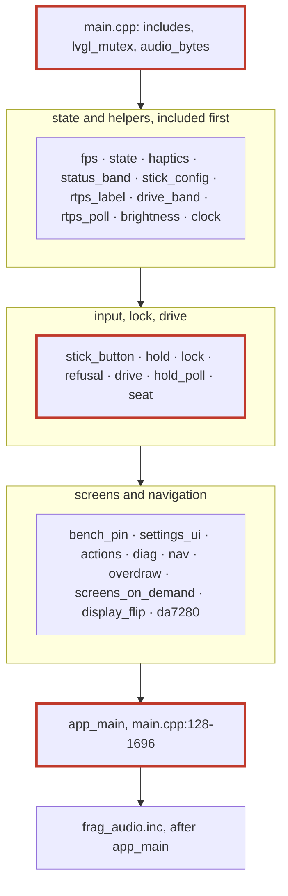
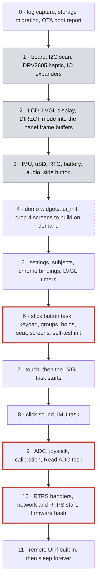
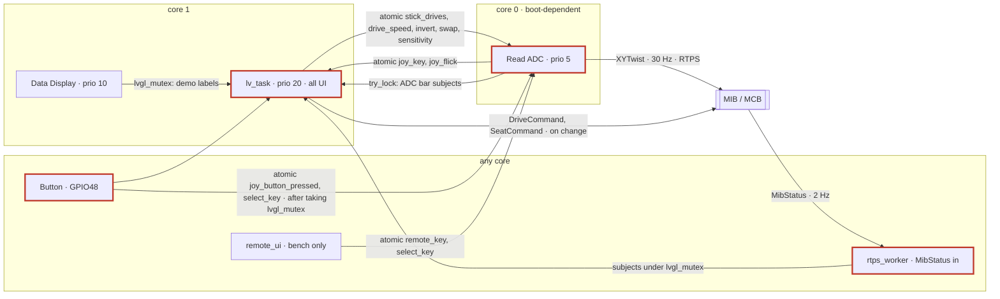
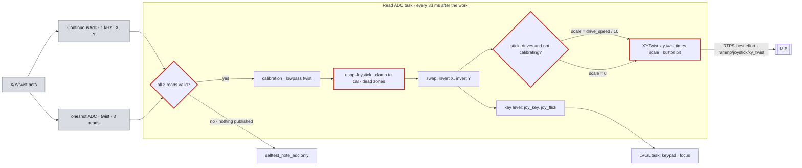
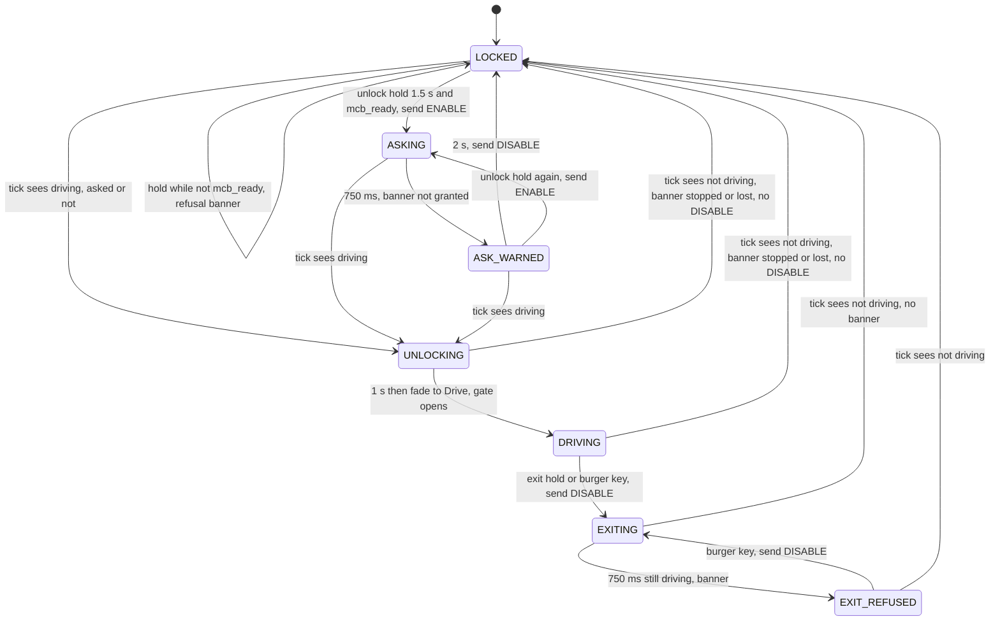
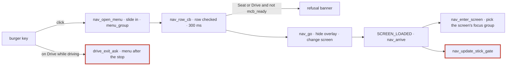
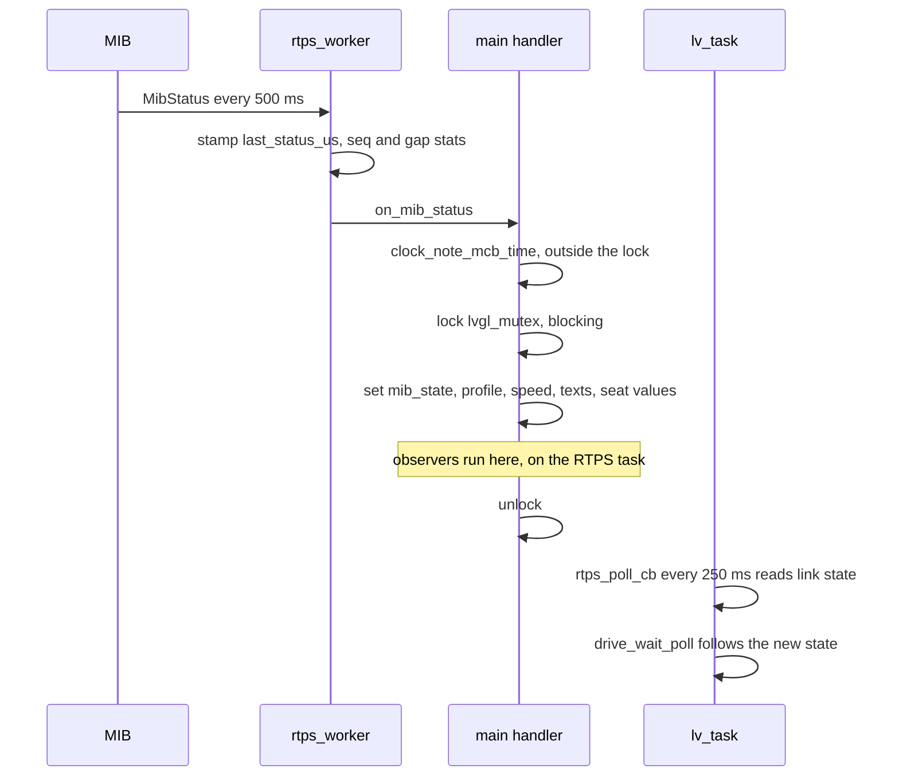

# How the firmware works

A walk through the code as it is on `dev_refactor` at `cb9226e` (2026-10-06): what runs, in
which order, on which task, and how the pieces talk. It is a map for reading the code, not a
design: the target design is in [plans/refactor.md](plans/refactor.md), the user's view of the
screens is in [ui-architecture.md](ui-architecture.md), and the generated diagrams are in
[architecture.md](architecture.md). Line numbers are for `cb9226e`. They drift, but the
function names don't, so search for the name if a line has moved.

Diagram legend: the same as [architecture.md](architecture.md#legend-cs-arc-03). Grey is
hardware, a red outline is safety-relevant, and a dashed outline is generated code.

## Contents

1. [The short version](#1-the-short-version)
2. [How the source is laid out](#2-how-the-source-is-laid-out)
3. [Boot: `app_main` step by step](#3-boot-app_main-step-by-step)
4. [Tasks, cores and how they share data](#4-tasks-cores-and-how-they-share-data)
5. [Inside the LVGL task](#5-inside-the-lvgl-task)
6. [From stick deflection to motion](#6-from-stick-deflection-to-motion)
7. [The drive and lock state machine](#7-the-drive-and-lock-state-machine)
8. [Holds, refusals and actions](#8-holds-refusals-and-actions)
9. [The seat](#9-the-seat)
10. [Screens, navigation and data binding](#10-screens-navigation-and-data-binding)
11. [RTPS and the network](#11-rtps-and-the-network)
12. [Settings, storage, OTA, self-test, remote UI, log](#12-settings-storage-ota-self-test-remote-ui-log)
13. [Fragment index](#13-fragment-index)
14. [Other files and components](#14-other-files-and-components)
15. [Where the hazards live](#15-where-the-hazards-live)
16. [Known oddities](#16-known-oddities)
17. [Where to start reading](#17-where-to-start-reading)

## 1. The short version

- **One big program, cut into pieces.** `main/main.cpp` is a single C++ translation unit.
  It `#include`s 27 `frag_*.inc` files in a fixed order. They were cut out of one 6,400-line
  file by `tools/split_main.py` without changing a byte of the compiled result. A fragment
  is a chapter of `main.cpp`, not a module: it sees every `static` declared before it.
- **`app_main` does almost everything.** It is about 1,570 lines (`main.cpp:128-1696`). It
  brings up the board, display, UI, settings, input, tasks and network, then sleeps forever.
  Its locals (the LVGL, IMU and ADC tasks) live as long as that final loop.
- **Three tasks matter for the user:**
  - **LVGL task** (`lv_task`, priority 20, core 1): every screen, timer, button press and
    the drive state machine, under one global `lvgl_mutex`.
  - **Read ADC** (priority 5, core picked at boot): reads the stick every 33 ms and
    publishes `XYTwist`.
  - **RTPS receive** (espp's `rtps_worker` threads, priority 5): takes `MibStatus` from the
    MIB and writes it into LVGL subjects under the same mutex.
- **Motion is gated by one atomic.** `stick_drives` is true only when unlocked, on the
  Drive screen, with no menu open. Only the LVGL task writes it
  (`frag_nav.inc:190-193`). The ADC task multiplies the stick by 0 when it is false.
- **The MIB decides driving; the HMI follows.** The Drive screen opens whenever MibStatus
  says ENABLED and the link is up, whether or not this HMI asked. It closes when the MIB
  stops (`frag_drive.inc:44-97`). The HMI only *asks*, with a one-shot `DriveCommand`.
  That is the root of hazards H1, H5 and H6.
- **Tasks share data through atomics and LVGL subjects.** No queues or mailboxes are used
  yet. `components/fw_core` provides them but nothing calls it so far.

## 2. How the source is laid out

### 2.1 Components

| Path | What it is | Safety | Tests |
| --- | --- | --- | --- |
| `main/` | The application: `main.cpp` + 27 fragments (one TU), plus separate `.cpp` files for screens, network, OTA, self-test, storage | yes | none on target; bench B0–B5 |
| `components/fw_core` | Channels (`Mailbox`, `Queue`, `AtomicValue`), `ThreadChecker`, `Owned<T>`, `check()`, context tokens. **Linked but unused** | for later | host L1 (FWC-L1) |
| `components/hmi_format` | Pure text formatting: speed, steppers, clock, diagnostics, about, update, network | no | host L1 (L1-FMT) |
| `components/hmi_models` | Pure UI models: the button-grid cursor walk and the bench PIN | no | host L1 (L1-MOD) |
| `components/hmi_ui` | The UI island's views: TopBar clock, link and RTPS label, DriveBand status cells, backlight, bench PIN, seat, settings rows, Skunk Works tiles, diagnostics (more move in, app-main-shrink S4-S6) | no | bench B4 |
| `components/ota_parse` | Pure OTA parsing: release list, image header check, fwinfo, boot-confirm marker search | no | host L1 (L1-OTA) |
| `components/joystick` | espp's joystick, vendored, plus a twist (Z) axis | yes | host L1 (L1-JOY) |
| `components/m5stack-tab5` | espp's Tab5 board support, vendored and modified (two frame buffers, vsync present) | no | none |
| `components/ui` | The SquareLine Studio export. **Generated** by `tools/build_ui.py`; never edit it | no | `scripts/ui_contract.py` |
| `external/rammp-rtps` | Submodule: the RTPS topics and messages shared with the MIB/MCB | yes (wire format) | header-only |

The dependency graph is generated in [architecture.md D3](architecture.md#d3-components).

### 2.2 The one-TU fragment structure



What this means in practice:

- **Order is meaning.** A fragment can use anything declared in an earlier fragment, and
  nothing from a later one without a forward declaration. `frag_audio.inc` comes after
  `app_main`; `frag_stick_button.inc:36-55` forward-declares its functions and the
  haptic init so `app_main` can call them.
- **Everything is `static`.** There is one TU, so every global in a fragment is visible
  to all later fragments. "Fragment X owns Y" is a convention, not something the compiler
  enforces.
- **Comments sometimes sit in the wrong fragment.** A cut lands on a line boundary, and
  some doc blocks ended up one fragment away from their code. See
  [§16](#16-known-oddities).
- **Each fragment's first line is generated.** It records the original line range, and
  `split_main.py verify` rebuilds the original file byte for byte from them. Don't edit
  that line. The rule is to re-split from the original rather than patch by hand
  (`tools/split_main.py:12-13`).
- **The binary did not change.** `tools/split_guard.py` compared the firmware before and
  after the split; only an assert's `__LINE__` moved.
- **It is temporary.** The fragments are being dissolved into components grouped by concern,
  not one component each: the UI views into `hmi_ui`, haptics and sound into `feedback`, the stick
  parts into `stick`, the drive logic into `drive_session`/`drive_adapter`
  ([plans/app-main-shrink.md](plans/app-main-shrink.md), revision V15).

### 2.3 The other files in `main/`

| File | Job |
| --- | --- |
| `rtps_comms.cpp/.hpp` | Network link (W5500 Ethernet or Wi-Fi via the C6) and the one RTPS participant: all publishers and subscribers |
| `hmi_rtps_spec.hpp` | What only this HMI adds to the shared spec: timeouts, seat helpers, banner texts, the self-test topics |
| `selftest.cpp/.hpp`, `selftest_spec.hpp` | The self-test: 54 checks, an overlay, and a report over RTPS and serial |
| `remote_ui.cpp/.hpp` | Bench-only debug server on TCP 3333: screenshots, taps, keys, `TASKS` |
| `settings.cpp/.hpp`, `settings_spec.hpp` | Persistent settings (`/storage/settings.txt`) from one typed spec table |
| `storage.cpp/.hpp` | LittleFS paths, atomic write (tmp + rename), one-time legacy migration |
| `joystick_cal.cpp/.hpp` | The calibration file and the guided calibration run |
| `fw_info.cpp/.hpp` | SHA-256 of the running image, matched to a release |
| `github_ota.cpp/.hpp` | GitHub release list, image download and install, rollback |
| `about_ui`, `internet_ui`, `update_ui`, `log_view` | What main does for the About, Internet, Firmware update and Log views (in `components/hmi_ui`): the adapters over fw_info, rtps_comms, github_ota and log_capture, the worker threads, the LVGL hand-back, the restart after an update; one instance of each view |
| `log_capture.cpp/.hpp` | Copies stdout and stderr into a PSRAM ring for the Log screen |
| `lv_mem_psram.c` | LVGL's allocator: every LVGL allocation goes to PSRAM, leaving internal DMA RAM for the W5500 |
| `actions_spec.h` | X-macro table of the Skunk Works tiles |
| `boot_logo.c/.h`, `click.wav` | The boot logo mask and the click sound, embedded |
| `Kconfig.projbuild` | Build options: remote UI, Wi-Fi defaults, OTA test URL, DA7280 bench test, FPS debug |

## 3. Boot: `app_main` step by step



| Phase | Lines | What happens | Notes |
| --- | --- | --- | --- |
| 0 | `main.cpp:131-137` | `log_capture_start` first, so the Log screen sees everything. `storage_migrate_legacy`, `github_ota_boot_report` | |
| 1 | `:140-177` | Tab5 singleton. Scan the internal I2C bus into `found_addresses`. `init_haptic` (DRV2605). DA7280 tests only if `CONFIG_HMI_BENCH_DA7280_TEST`. IO expanders | an IO-expander failure `return`s: no UI ever |
| 2 | `:179-245` | LCD, then the LVGL display with full-screen PSRAM buffers. DIRECT mode: LVGL renders straight into the two panel frame buffers, `direct_flush_cb` presents on vsync. Refresh period 16 ms | |
| 3 | `:247-383` | IMU + Kalman/Madgwick filters. uSD (failure only warns). RTC (a failed read is fatal). Battery, audio (`tab5_audio` task), side button → `brightness_step` | the side-button task is live from here |
| 4 | `:385-504` | Legacy demo widgets on the default screen. `ui_init()` builds all 14 screens. Settings, SkunkWorks, Diagnostics and BenchMotors are destroyed again to save RAM; the first three come back on demand | |
| 5 | `:506-669` | `settings_load`, theme. Every LVGL subject is initialised, then bound. Status band, TopBar and menu attached to the nine resident screens (`kChrome`). Timers: clock 1 s, **`rtps_poll_cb` 250 ms** | subjects must be initialised before anything binds to them |
| 6 | `:671-1172` | Calibration UI. **GPIO48 stick-button task** (`Button`). Keypad input device, focus groups, focus backstop 500 ms, **`hold_poll_cb` 33 ms**. Log, seat, Internet, About, Update screens. OTA confirm one-shot at 30 s. Boot → Locked one-shot at 1.2 s. `selftest_init` (before RTPS, because it registers handlers). Bench PIN pad | the Button task is live from here, while LVGL is still being built without the lock (H15) |
| 7 | `:1174-1238` | Touch (`tab5 interrupts` task). **`lv_task` starts** at `:1235` | from here, every LVGL call must hold `lvgl_mutex` |
| 8 | `:1240-1403` | Load the click sound. **`Data Display Task`** (IMU, 20 ms, updates hidden demo labels) | |
| 9 | `:1408-1621` | `ContinuousAdc` (ADC1 CH0/CH1 at 1 kHz, its own task), twist on ADC2 CH3, `joystick_cal_load`, `espp::Joystick stick`. **`Read ADC` task** | |
| 10 | `:1629-1673` | Register the RTPS handlers (brightness, MibStatus, diagnostics), then `rtps_comms_start` (Wi-Fi or Ethernet, chosen in Settings). `fw_info_start` hashes the image on its own thread | a network failure only warns |
| 11 | `:1679-1694` | `remote_ui_start` (no-op unless `CONFIG_HMI_REMOTE_UI`), then `while (true) sleep(1s)` | the loop keeps the task objects alive |

Two things to keep in mind:

- **Most failures stop the boot quietly.** A failure before phase 7 `return`s from
  `app_main`, so no UI ever starts. After phase 7 the only early return is the click
  sound failing to load (`:1245`). That would destroy the LVGL task object and stop the
  UI.
- **Timers count from creation.** The boot → Locked timer starts counting at `:1007`,
  before the LVGL task runs it.

## 4. Tasks, cores and how they share data

### 4.1 The tasks

Measured on board 2 with the remote UI `TASKS` dump (2026-10-06); the source column says
where each is created. "FPU-pinned" means the task asked for no core. IDF's RISC-V port
pins it to whatever core it was on when it first used the FPU, so its core can differ
from one boot to the next. "Free" is free stack bytes at about 95 s uptime.

| Task | Prio | Core | Stack / free | Created | Runs |
| --- | --- | --- | --- | --- | --- |
| `lv_task` | 20 | 1 | 16384 / ~7.9 K | `main.cpp:1188-1238` | `lv_task_handler()` under `lvgl_mutex` every ~8 ms: all UI, all LVGL timers, the drive state machine |
| `Read ADC` | 5 | FPU-pinned (0 seen) | 4096 / ~1.4–2.5 K | `main.cpp:1459-1621` | stick read, calibration, key level, `XYTwist` publish, every 33 ms after the work |
| `ContinuousAdc T` | 5 | FPU-pinned | 4096 | espp, `main.cpp:1418-1429` | ADC1 DMA at 1 kHz, filtered |
| `Button` | 5 | any | 4096 | `main.cpp:700-711` | GPIO48 stick-button edges → `stick_button_edge` |
| `tab5 interrupts` | 5 | any | 4096 | BSP | touch and side-button callbacks |
| `Data Display Ta` | 10 | 1 | 6144 | `main.cpp:1261-1403` | IMU, RTC, battery reads every ~20 ms; writes the hidden demo labels |
| `tab5_audio`, `… micr` | 20 | 1 | 8192 | BSP | I2S speaker and microphone |
| `rtps_start` | 5 | FPU-pinned | 8192 | `rtps_comms.cpp:948` | one-shot: bring the link up, wait for an IP, start the participant |
| `rtps_pub` | 5 | any | 8192 | `rtps_comms.cpp:976` | heartbeat every 2 s; rebinds RTPS when the IP changes |
| `rtps_reactor`, `rtps_worker_0/1`, `rtps_protocol` | 5 | workers FPU-pinned | 4–6 K | espp RTPS | socket reactor; the workers run the subscriber callbacks (MibStatus, diagnostics, commands) |
| `remote_ui` | 5 | any | 16384 | `remote_ui.cpp:470` | TCP 3333 server, bench builds only |
| `selftest` | 3 | 0 | 12 K (PSRAM) | `selftest.cpp:1220` | on demand: one self-test run |
| `fw_hash`, `github_ota`, `internet_ui`, `update_ui` workers | 2–3 | any | | on demand | hashing, download/install, scan/join, release fetch |
| `main` | 1 | 0 | 33 K | IDF | `app_main`, then sleeps |

The rest are IDF's own tasks: `IDLE0/1`, `ipc0/1`, `esp_timer`, `sys_evt`, `tcpip`,
plus the esp_hosted `sdio_*` and `rpc_*` tasks that carry Wi-Fi from the C6.

Two things this table shows:

- **The stick reader runs below the UI.** `Read ADC` (priority 5) sits below the LVGL
  task (priority 20) and has no watchdog. H11 is about exactly that.
- **Espp's priority 0 isn't priority 0.** espp tasks given priority 0 actually run at 5,
  IDF's pthread default.

### 4.2 How they talk



**Atomics** (most in `frag_state.inc`):

| Atomic | Written by | Read by | Meaning |
| --- | --- | --- | --- |
| `stick_drives` `:143` | LVGL (`nav_update_stick_gate`) | Read ADC | the motion gate |
| `stick_sensitivity`, `drive_speed`, `stick_invert_x/y`, `stick_swap`, `sounds_on` `:127-133` | LVGL (`setting_store_observer`) | Read ADC, audio | settings the ADC task needs |
| `joy_key`, `joy_flick` `:74, 89` | Read ADC, remote UI | LVGL keypad read | the stick as arrow keys |
| `select_key` `:79` | Button, remote UI | LVGL keypad read | a short button tap = ENTER |
| `remote_key` `:84` | remote UI | Read ADC | overrides the stick key |
| `joy_button_pressed` `:37` | Button, remote UI | Read ADC (XYTwist button bit), LVGL holds | raw button level |
| `drive_profile_published` `:44` | LVGL, RTPS receive | LVGL (`drive_publish`) | profile to send with DriveCommand |
| `clock_valid`, `display_flipped`, FPS counters | various | various | |

**`lvgl_mutex`** (`main.cpp:74`) is a `std::recursive_mutex`. It exists because
`lv_subject_set_*` runs every observer right away, on the caller's task, and observers
touch widgets. Who takes it:

- **LVGL task:** holds it around every `lv_task_handler()`, which covers every timer,
  event, observer, input read and flush. A flush can wait for vsync, about 17 ms.
- **RTPS receive:** `on_mib_status`, `on_diagnostics` and `brightness_set` take it,
  blocking.
- **Read ADC:** takes it with **try-lock** only, for the bar subjects. It skips the
  update when the lock is busy and never blocks.
- **Button, side button, IMU task, remote UI, self-test, Internet and Update workers:**
  all take it, blocking.
- **`app_main`:** never takes it while building the UI. That was safe only because the
  LVGL task wasn't running yet, but the side-button and stick-button tasks already are
  (H15).

## 5. Inside the LVGL task

`lv_task` loops roughly every 8 ms: lock, `lv_task_handler()`, unlock, then sleep until
`start + 8 ms` (at least 1 ms). It uses `steady_clock`, because the MCB sets the wall
clock (`main.cpp:1189-1223`). Everything below runs inside `lv_task_handler()` on this
task, with the lock held.

| What | Period | Defined | Does |
| --- | --- | --- | --- |
| Display refresh + flush | 16 ms | `main.cpp:237` | render dirty areas; `direct_flush_cb` or the flipped `flip_flush_cb` presents |
| `hold_poll_cb` | 33 ms | `main.cpp:811` | the three hold gestures and `entry_refusal_poll` |
| `rtps_poll_cb` | 250 ms | `main.cpp:669` | link state → `rtps_link_subject`, blink, `diag_poll`, **`drive_wait_poll` (the drive state machine tick)**, theme change |
| Focus backstop | 500 ms | `main.cpp:760` | re-runs `nav_arrive` if focus got lost twice in a row |
| `clock_poll_cb` | 1 s | `main.cpp:630` | the TopBar clock |
| Brightness save | 1 s debounce | `main.cpp:547` | writes brightness to settings |
| Refusal banner | 2–3 s | `main.cpp:641` | clears the "refused" banner |
| OTA confirm | one-shot 30 s | `main.cpp:947` | marks a new OTA image valid |
| Boot → Locked | one-shot 1.2 s | `main.cpp:1007` | fades from the boot logo to the Locked screen |
| Input reads | each handler pass | | keypad (stick keys), touch (flip-aware), remote UI pointer |
| Calibration run, Log, About, Internet, Update pollers | 33 ms–1 s | their files | only while their screen is up |

**The drive state machine is ticked every 250 ms.** Every drive deadline (750 ms answer,
2 s give-up) is therefore rounded up to the next 250 ms tick.

## 6. From stick deflection to motion



| Step | Code | Detail |
| --- | --- | --- |
| Read | `main.cpp:1462-1479` | X = ADC1 CH1 (GPIO17), Y = ADC1 CH0 (GPIO16) from ContinuousAdc; twist = ADC2 CH3 (GPIO52), 8 one-shot reads averaged |
| Valid? | `main.cpp:1482` | if any read failed, **nothing** is published that cycle, not even a neutral (H9) |
| New calibration | `main.cpp:1485-1487` | `joystick_cal_take_new` → `stick_apply_cal` (`frag_stick_config.inc:29`) |
| Twist filter | `main.cpp:1458, 1488` | lowpass, τ = 80 ms |
| Map | `main.cpp:1498`; `frag_stick_config.inc:10-27` | `espp::Joystick`: each axis is clamped to its calibrated min/max, so an out-of-range raw reads as full deflection (H3). Circular dead zone 0.10, range dead zone 0.05. Twist dead band 60 mV |
| Mount | `main.cpp:1503-1513` | swap, invert X, invert Y from Settings (atomics) |
| Keys | `main.cpp:1532-1563` | Schmitt trigger, threshold from Sensitivity (1–10). Dominant axis → `joy_key`; a new key → `joy_flick`. `remote_key` overrides. Forced off while calibrating |
| Bars | `main.cpp:1564-1577` | try-lock, then set the three ADC subjects ×100 |
| Gate | `main.cpp:1593-1597` | `scale = (calibrating or !stick_drives) ? 0 : drive_speed/10` |
| Publish | `main.cpp:1598-1600` → `rtps_comms.cpp:661` | `XYTwist{x·s, y·s, twist·s, buttons}`. The button bit is **not** gated. `publish()` returns false until the endpoints are ready and a peer has matched |

**The gate** (`frag_nav.inc:190-193`):

```cpp
stick_drives = locked_subject == 0 && lv_screen_active() == ui_DriveScreen && nav_menu_open == nullptr;
```

It is recomputed on every lock change, screen arrival and menu open/close. The ADC task
trusts it as is: it has no age, and it doesn't check the link, the MIB state or that the
UI is alive (H4).

**The same deflection does two jobs.** Every cycle it is both a motion command (XYTwist,
gated) and a navigation key (`joy_key`, never gated). On the Drive screen the focus group
holds only the burger key, so arrows do nothing there.

**The stick button** (`frag_stick_button.inc:2-29`, on the `Button` task):

1. Takes `lvgl_mutex`, blocking. The XYTwist button bit therefore waits up to one render
   (H14).
2. Sets `button_pressed_subject` and stores `joy_button_pressed`.
3. On release within 500 ms, sets `select_key` (a tap = ENTER).

Holds read the raw level. Their 500 ms grace equals the tap limit, so a tap never starts
a hold bar.

**Calibration** (`joystick_cal.cpp`):

- **File:** `/storage/joystick_cal.txt`, `version 1`, min/centre/max in mV per axis.
- **Load:** once at boot (`main.cpp:1440`). A file is accepted only if each half-span is
  at least 1000 mV. Otherwise the ideal 0/1650/3300 is used. Nothing blocks driving
  without a saved calibration; only the self-test reports it.
- **Run:** started by a 1.5 s hold on the Joystick screen. It steps through 8 positions
  on a 33 ms LVGL timer. While it runs, XYTwist is scaled to 0 and the keys are off.
  The result is handed to the ADC task through a mutex-protected `pending` copy.

## 7. The drive and lock state machine

All of this runs on the LVGL task. It lives in `frag_drive.inc`, `frag_lock.inc`,
`frag_hold.inc`, `frag_refusal.inc` and `frag_nav.inc`. There is no state variable: the
state is derived from `locked_subject`, `lock_waiting`, the screen and three deadlines.
The tick is `drive_wait_poll` (every 250 ms, from `rtps_poll_cb`). It runs
`drive_screen_follow_state` first, then checks the deadlines.

Guards used below:

- **`driving`:** link CONNECTED and MibStatus ENABLED. CONNECTED means a MibStatus
  arrived in the last 2 s.
- **`mcb_ready`:** CONNECTED, and the MIB is IDLE or ENABLED.



| # | From | Event and guard | To | What is sent / shown | Code |
| --- | --- | --- | --- | --- | --- |
| 1 | LOCKED | button held ≥ 500 ms, Locked screen, menu shut, `!mcb_ready` | LOCKED | "can't drive" banner 3 s, double-click haptic and sound | `frag_refusal.inc:275-304` |
| 2 | LOCKED | unlock hold done (1.5 s), `mcb_ready` | ASKING | ring spins; **DriveCommand ENABLE**; answer deadline 750 ms, give-up 2 s | `frag_lock.inc:91-103`, `frag_drive.inc:129-156` |
| 3 | LOCKED / ASKING / ASK_WARNED | tick: `driving` | UNLOCKING | deadlines cleared; `lock_open`: ring full, shackle up, haptic, `set_locked(false)`. **Opens whether or not this HMI asked** (H1) | `frag_drive.inc:51-63, 162-171` |
| 4 | UNLOCKING | 1 s timer | DRIVING | fade to Drive from whatever screen is up; on arrival `stick_drives` becomes true | `frag_lock.inc:14-18`, `frag_nav.inc:750-765` |
| 5 | ASKING | tick: 750 ms passed | ASK_WARNED | "not granted" banner; ring stops on the next tick | `frag_drive.inc:110-115, 94-96` |
| 6 | ASK_WARNED | tick: 2 s passed | LOCKED | **DriveCommand DISABLE** | `frag_drive.inc:116-121` |
| 7 | ASK_WARNED | unlock hold again | ASKING | ENABLE re-sent, deadlines reset | `frag_drive.inc:129-138` |
| 8 | UNLOCKING / DRIVING | tick: not `driving` | LOCKED | instant cut to Locked, gate closed; banner "stopped" (link up) or "lost" (link down). **No DISABLE; `drive_request` stays ENABLE** (H5) | `frag_drive.inc:64-83` |
| 9 | DRIVING | exit hold done (1.5 s), Drive screen, menu shut | EXITING | **DriveCommand DISABLE**, exit deadline 750 ms | `frag_drive.inc:177-202` |
| 10 | DRIVING / EXIT_REFUSED | burger key (touch, or a button tap) | EXITING | DISABLE; the menu opens over Locked once stopped | `frag_nav.inc:481-497` |
| 11 | EXITING | tick: 750 ms, still driving | EXIT_REFUSED | "exit refused" banner 2 s. **No re-send** (H6) | `frag_drive.inc:102-109` |
| 12 | EXITING / EXIT_REFUSED | tick: not `driving` | LOCKED | as row 8 but asked: no banner; menu if the key asked | `frag_drive.inc:68-76` |
| 13 | DRIVING | profile button | DRIVING | DriveCommand with the **current** `drive_request` and the new profile | `frag_drive_band.inc:18-35` |
| 14 | any locked | menu "Drive" row, `!mcb_ready` | same | refusal banner | `frag_nav.inc:463-467` |

What reaches the MIB:

- **DriveCommand** goes out only at rows 2, 7 (ENABLE), 6, 9, 10 (DISABLE) and 13.
  Each is sent once, best-effort, and the result is ignored.
- **Nothing is sent at boot** (H2).
- **XYTwist** goes out every ADC cycle, neutral unless the gate is open.

Times: hold = 500 ms grace + 1000 ms fill; unlock advance 1000 ms, then a 280 ms fade;
answer window 750 ms (one MibStatus period of 500 ms plus 250 ms); give-up 2000 ms; tick
250 ms. The constants are at `frag_stick_button.inc:89-101`, `frag_refusal.inc:328-333`
and `frag_stick_config.inc:39`.

## 8. Holds, refusals and actions

**Holds** (`frag_hold.inc`, `frag_hold_poll.inc`):

- **The type.** A `HoldGesture` is `{progress subject, armed flag, is_held(), applies(),
  completed(), grace_ms}`. `hold_poll` (every 33 ms) starts a 1000 ms fill animation
  after the grace period and cancels it on release. When the fill completes it plays a
  haptic and a click, then calls `completed()`.
- **The three holds:**
  - **unlock:** Locked screen; fills the padlock ring.
  - **drive exit:** Drive screen; no widget.
  - **calibrate:** Joystick screen; the stick button or a touch on Calibrate; fills
    `ui_CalibrateFill`.
- **Let go first.** Unlock and exit share `joy_button_armed`, so a hold must be released
  before the next one can start.
- **The self-test overlay stops all holds.** While it is up, every hold is skipped (H7).

**Refusals** (`frag_refusal.inc`):

- **Which and why.** `entry_refused_subject` says *which* request was refused (drive,
  seat, exit, not granted, stopped, lost, menu). The banner works out *why* live from
  the link state, the MIB state and the MIB's error text.
- **Two observers draw them.**
  - `entry_refused_panel_observer`: the Locked screen and six other screens.
  - `drive_screen_warning_observer`: the Drive and Seat screens, shown while
    `!mcb_ready`.
- **One timer clears them.** A single shared timer takes the banner down after 2–3 s.
  `entry_refusal_poll` clears some kinds early once the MCB is ready again.
- **They can sound on the receive task.** `banner_show` plays the refusal sound on the
  rising edge. Because subjects can be written from the RTPS receive task, that sound
  can be triggered there too (H16).

**Actions** (`frag_actions.inc`, `actions_spec.h`):

- **One table.** The Skunk Works tiles come from the X-macro `ACTIONS_TABLE`: haptic
  test, self test, seat up, FPS counter, restart HMI. It gives each tile a title,
  subtitle and a `needs_mcb` flag.
- **A parallel function table.** `kActionRun[]` holds the functions, and a
  `static_assert` checks it matches the table's size.
- **Tiles that need the MCB grey out.** A tile with `needs_mcb` is greyed while
  `!mcb_ready`, and clicking a greyed tile is refused.

## 9. The seat

- **Getting there.** The menu "Seat" row is refused while `!mcb_ready` (`frag_nav.inc:454`).
  On the Seat screen, losing the MCB sends you home with a banner on the next 250 ms
  tick (`frag_drive.inc:87-91`).
- **The function page.** A 3×2 grid picks an axis from `RAMMP_SEAT_AXIS_TABLE`
  (elevation, tilts, translation). A click opens the adjustment page (`SeatView::click_cb`, `components/hmi_ui/src/seat_view.cpp:79`).
- **The adjustment page.** "−"/"+" call `seat_step(axis, ∓1)` from the last known value,
  or from the axis minimum if it is unknown. Presets call `seat_request(axis, value)`.
  Both clamp and send one `SeatCommand{axis, absolute target}`, best-effort, once per
  press (`frag_settings_ui.inc:167-179`).
- **Feedback.** MibStatus `currentSeatState` → `seat_apply_state` → the
  `seat_axis_value[4]` subjects, on the RTPS receive task under the lock.
- **What the code does not check:**
  - Presses on the Seat screen check neither `mcb_ready` nor `seat_ready`. The bench
    Actuators page refuses only presses at a limit or with an unknown value (H10).
  - A NaN or huge seat value from the MIB is undefined behaviour in `seat_raw` (H8).

## 10. Screens, navigation and data binding

### 10.1 Screens

- **Built from the export.** `ui_init()` (generated, `components/ui/ui.c:27-51`) builds
  all 14 screens.
- **Built on demand.** `app_main` destroys Settings, SkunkWorks and Diagnostics again
  (and BenchMotors for good). The `*_ensure` functions in `frag_screens_on_demand.inc`
  rebuild them when opened and destroy them on unload, so their widgets don't hold RAM
  while RTPS starts.
- **No generated events.** The export contains no event handlers: the firmware attaches
  every behaviour with `lv_obj_add_event_cb`.

| Screen | Lives | Driven by |
| --- | --- | --- |
| Boot | resident until the 1.2 s timer | `main.cpp:496-498, 1007` |
| Locked | resident | `frag_lock`, `frag_hold`, refusal banner |
| Drive | resident | `frag_drive`, `frag_drive_band` |
| Joystick | resident | ADC bars, `joystick_cal.cpp`, calibrate hold |
| Seat | resident | `hmi_ui` `SeatView`; the seat command path in `frag_settings_ui` |
| BenchGate | resident | `hmi_ui` `BenchPinView`, PIN in `frag_bench_pin` (1234 → Actuators page) |
| Log, Update, Internet, About | resident | `hmi_ui` `LogView`, `UpdateView`, `InternetView`, `AboutView`; main's side in `log_view.cpp`, `update_ui.cpp`, `internet_ui.cpp`, `about_ui.cpp` |
| Settings, SkunkWorks, Diagnostics | on demand | `hmi_ui` `SettingsView`, `ActionsView`, `DiagnosticsView`; their contents in `frag_settings_ui`, `frag_actions`, `frag_diag` |

### 10.2 Navigation

The burger menu lives in `frag_nav.inc`. Every resident screen gets the same TopBar,
DriveBand and MenuOverlay through the `kChrome[]` loop (`main.cpp:597-624` →
`nav_attach_chrome`).



- **The menu tables.** `enum NavDest` (13 destinations) and `kNavRowIds[]` are positional
  in the menu's row order. Reordering rows in SquareLine opens the wrong screens, and
  `scripts/ui_contract.py` checks the row labels to catch that.
- **Focus groups.** Each screen has its own LVGL group, chosen in `nav_enter_screen`. The
  stick arrows reach the focused widget as `LV_EVENT_KEY`, and each screen's key handler
  walks its own group. Grids use `hmi_models::grid_step`.
- **Back and home.** LEFT or ESC in the menu goes back a level or closes the menu.
  Touching the DRIVE cell goes home: the Locked screen, or Drive if unlocked.

### 10.3 LVGL subjects (the data binding)

A subject is LVGL's observable value. Setting it runs every observer at once, on the
setter's task, which is why every writer holds `lvgl_mutex`. **Initialise before
binding:** `lv_subject_init_*` wipes the observers, so `app_main` initialises every
subject before anything binds to it.

| Subject | Written by (task) | Drives |
| --- | --- | --- |
| `mib_state_subject`, `state_text`, `error_text/footer`, `speed_tenths`, `drive_profile` | RTPS receive, `main.cpp:1636-1652` | status band, banners, speed, profile buttons, drive state machine |
| `rtps_link_subject`, `rtps_blink_subject` | LVGL, `rtps_poll_cb` | TopBar RTPS label, banners, `mcb_ready` |
| `locked_subject` | LVGL, `set_locked` | DRIVE cell, the gate, many readers |
| `adc_x/y/twist_subject` | Read ADC (try-lock) | the Joystick screen bars |
| `button_pressed`, `button_count` | Button task | Joystick screen indicator |
| settings subjects (theme, brightness, flip, sensitivity, speed, invert, swap, sounds, network, menu slide) | LVGL (Settings rows); brightness also RTPS and the side button | `setting_store_observer` → `settings_set` + the atomics |
| `seat_axis_value[4]` | RTPS receive | seat buttons, angle text, Actuators rows |
| `entry_refused_subject` | LVGL | refusal banners |
| `diag_value[n][3]`, `diag_stale`, `diag_rate` | RTPS receive; LVGL `diag_poll` | Diagnostics rows |
| `TopBarView`'s clock and link subjects (`hmi_ui`) | LVGL; `app_main` (link, under the lock) | TopBar |
| hold `progress` ×3 | LVGL | padlock ring, calibrate bar |

### 10.4 The SquareLine contract

- **How the firmware names widgets.** Screen widgets are `ui_<Name>` globals. Component
  children come from `ui_comp_get_child(instance, UI_COMP_<COMP>_<CHILD>)`.
- **What a rename does:**
  - **Rename or delete:** a compile error, so it is caught.
  - **Re-number an instance** (`TopBar3`, `ErrorBanner4`, `MenuKey10`): still compiles,
    but binds the wrong widget.
  - **Reorder menu rows:** opens the wrong screen.
- **What guards against it.** `scripts/ui_contract.py` (run in L0 and by the import
  script) asserts 147 facts about parents, labels and fonts. Some numbered widgets are
  not covered yet ([§16](#16-known-oddities)).

## 11. RTPS and the network

**Topics** (shared spec in `external/rammp-rtps`, best-effort, no durability):

| Dir | Topic | Message | When | Task |
| --- | --- | --- | --- | --- |
| out | `rammp/joystick/xy_twist` | `XYTwist{x, y, twist, buttons}` | every ~33 ms | Read ADC |
| out | `rammp/joystick/drive_command` | `DriveCommand{request, profile}` | on change only | LVGL |
| out | `rammp/joystick/seat_command` | `SeatCommand{axis, target}` | per press | LVGL |
| out | `rammp/hmi/counter` | `UInt32` | heartbeat 2 s; self-test pings | rtps_pub, selftest |
| out | `rammp/selftest/report` | `SelfTestReport` | during a self test | selftest |
| in | `rammp/mib/status` | `MibStatus` | MIB sends every 500 ms | rtps_worker |
| in | `rammp/mcb/diagnostics` | `Diagnostics` | every 500 ms, stale after 2 s | rtps_worker |
| in | `rammp/hmi/command` | `UInt32` tagged RUN/PING/PONG | self-test control | rtps_worker |
| in | `rammp/hmi/brightness` | `UInt32` percent | on demand | rtps_worker |

**How a MibStatus reaches the screen:**



**Link state** (`rtps_comms_link_state`, `rtps_comms.cpp:869-882`), worked out when
asked, in this order: NET_FAILED → LINK_DOWN → NO_IP → CONNECTED if a MibStatus arrived
in the last 2000 ms, otherwise NO_PEER. Only CONNECTED lets anything drive.

**Network:**

- **One link per boot.** It is chosen at boot from the `network` setting: Ethernet
  (W5500 on SPI) by default, or Wi-Fi (the ESP32-C6 over SDIO, through esp_hosted).
  Wi-Fi is used only if an SSID is known.
- **Recovery.** Wi-Fi reconnects on every disconnect. RTPS rebinds when the IP changes.
  There is no recovery from a failed RTPS start or a failed network init.

**Threading:**

- **Handlers block.** Subscriber callbacks run on espp's `rtps_worker` threads, which
  espp asks to return quickly. The HMI handlers block on `lvgl_mutex`, which can mean a
  whole render.
- **Publishing before a match.** Every publish takes `endpoints_mutex` and returns false
  until the participant is up and a peer has matched.

## 12. Settings, storage, OTA, self-test, remote UI, log

| Area | How it works | Code |
| --- | --- | --- |
| Storage | LittleFS `storage` partition at `/storage`. `storage_write` writes `<name>.tmp`, then renames. A one-time migration moves files from the old layout | `storage.cpp` |
| Settings | `SETTINGS_PARAMS` (11 values with min, max, default). Loaded once at boot. Written on change by `setting_store_observer`, which also updates the atomics the ADC task reads | `settings.cpp`, `settings_spec.hpp`, `frag_settings_ui.inc:143` |
| Files | `settings.txt`, `joystick_cal.txt` (versioned), `wifi.txt` (password in plain text), `fwinfo.txt` | |
| OTA | Update screen → GitHub release list → `github_ota_start` thread:<br>- streams 64 KB blocks to the other slot<br>- checks the first block (magic, chip, project)<br>- computes SHA-256<br>- `esp_ota_end`<br>- compares with GitHub's digest **only if one exists**<br>- sets the boot partition<br>Restarts only when the MIB is not ENABLED. Rollback is on: the new image marks itself valid after 30 s of the LVGL task running | `github_ota.cpp`, `update_ui.cpp`, `components/ota_parse` |
| Self-test | 54 checks in `selftest_spec.hpp` covering system, network, RTPS, memory, I2C, IMU, RTC, power, haptics, display, timing and joystick. Started from Skunk Works or by a RUN command over RTPS (any peer, H7). Runs on its own task; draws an overlay that takes over the joystick input. Reports over RTPS and as a `[SELFTEST]` table on serial | `selftest.cpp` |
| Remote UI | Bench builds only (`CONFIG_HMI_REMOTE_UI`), TCP 3333, no authentication (H13). Commands: SHOT, TAP, PRESS, RELEASE, SWIPE, KEY, BTN, THEME, SCREEN, FOCUS, PING, TASKS. Input goes through the same atomics as the real stick and button. With `CONFIG_HMI_BENCH_STICK_INJECT` also STICK: an `fw_core` mailbox to the ADC task, which swaps its three raw reads for the injected mV (or failed reads) until 300 ms after the last STICK; a red "STICK INJECTED" label shows meanwhile. This one reaches XYTwist | `remote_ui.cpp`, `stick_inject.hpp`, `components/stick` (`bench_inject.hpp`), `scripts/hmi_ui.py` |
| Log | stdout and stderr are copied into a 500-line PSRAM ring; the Log screen rebuilds from it | `log_capture.cpp`, `log_view.cpp`, `components/hmi_ui/src/log_view.cpp` |
| Haptics, sound | DRV2605 waveforms (`haptic_play`, no lock of its own); a WAV click through `tab5.play_audio`. Several tasks reach the audio path (H16) | `frag_haptics.inc`, `frag_audio.inc` |

## 13. Fragment index

In include order. "Task" is where the code runs; LVGL means the LVGL task (or `app_main`
during boot).

| Fragment | Purpose | Main things in it | Task |
| --- | --- | --- | --- |
| `frag_fps` | frame-rate debug, `CONFIG_HMI_DEBUG_FPS` only | `kFpsInstrument`, render start/ready callbacks | LVGL |
| `frag_state` | the shared state: subjects, atomics, groups, forward declarations | `stick_drives`, `joy_*`, settings atomics, `locked_subject`, `nav_menu_open` | all |
| `frag_haptics` | DRV2605 play helper | `haptic_play` | LVGL, self-test |
| `frag_status_band` | the `StatusBandView` instance (code in `hmi_ui`); FPS toggle, GPIO48 counter colour, stick dead-zone constants | `bind_status_panel` | LVGL, RTPS rx |
| `frag_stick_config` | joystick axis configs and calibration apply | `stick_*_config`, `stick_apply_cal`, `kRtpsPollMs` | Read ADC |
| `frag_rtps_label` | the `RtpsLabelView` instance (code in `hmi_ui`) | `bind_rtps_label` | LVGL |
| `frag_drive_band` | Drive-screen profile buttons and speed | `drive_profile_click_cb`, `drive_mode_publish_observer` | LVGL, RTPS rx |
| `frag_rtps_poll` | the 250 ms poll: link, blink, diagnostics, **drive tick**, theme | `rtps_poll_cb` | LVGL |
| `frag_brightness` | `brightness_subject`, the `BrightnessView` instance (code in `hmi_ui`); setters for other tasks | `brightness_set` (RTPS), `brightness_step` (side button), each taking `lvgl_mutex` | several, under the lock |
| `frag_clock` | MCB time sync; the `TopBarView` instance (code in `hmi_ui`) | `clock_note_mcb_time` (RTPS rx), `bind_topbar_labels`, `bind_chrome_views` | LVGL, RTPS rx |
| `frag_stick_button` | GPIO48 edges; hold constants; forward declarations | `stick_button_edge` | Button, remote UI |
| `frag_hold` | the hold engine | `HoldGesture`, `hold_poll` | LVGL |
| `frag_lock` | padlock visuals, `set_locked`, unlock gesture | `set_locked`, `unlock_gesture`, `lock_visual_*` | LVGL |
| `frag_refusal` | `mcb_ready`/`seat_ready`, refusal banners, drive timing constants | `entry_refused_*`, `entry_refusal_poll`, `kDriveAnswerUs`, `kDriveWaitUs` | LVGL (+ RTPS rx via observers) |
| `frag_drive` | the drive session: ask, follow the MIB, deadlines, exit | `drive_screen_follow_state`, `drive_wait_poll`, `activate_drive`, `drive_exit_ask` | LVGL |
| `frag_hold_poll` | calibrate gesture, gesture list, poll callback | `kHoldGestures`, `hold_poll_cb` | LVGL |
| `frag_seat` | the `SeatView` instance (code in `hmi_ui`), `seat_axis_value` | `seat_show_buttons_page`, `seat_buttons_grid` | LVGL |
| `frag_bench_pin` | the PIN and the `BenchPinView` instance (code in `hmi_ui`) | `rd_pin_reset`, `rd_focus` | LVGL |
| `frag_settings_ui` | Settings and Actuators page contents, what a setting does, seat requests; the `SettingsView` instance (rows in `hmi_ui`) | `setting_page_open`, `setting_store_observer`, `seat_request`, `seat_step` | LVGL |
| `frag_actions` | what the Skunk Works tiles do; the `ActionsView` instance (tiles in `hmi_ui`) | `kActionRun[]`, `actions_open` | LVGL |
| `frag_diag` | the readings, `diag_poll`, the `DiagnosticsView` instance (rows in `hmi_ui`); also the menu constants | `diagnostics_open`, `diag_poll` | LVGL |
| `frag_nav` | burger menu, focus groups, arrival, **the gate** | `nav_go`, `nav_arrive`, `nav_enter_screen`, `nav_update_stick_gate` | LVGL |
| `frag_overdraw` | strip redundant background fills | `strip_all_overdraw` | LVGL |
| `frag_screens_on_demand` | build/destroy Settings, SkunkWorks, Diagnostics | `*_ensure`, `*_destroy_cb` | LVGL |
| `frag_display_flip` | DIRECT flush, 180° flip with the PPA, flip-aware touch | `direct_flush_cb`, `flip_flush_cb`, `set_display_flipped` | LVGL |
| `frag_da7280` | DRV2605 init; DA7280 bench tests | `init_haptic`, `drv2605_play_click`, `test_da7280*` | main, self-test |
| `frag_audio` | the click sound | `load_audio`, `play_click`, `play_refusal`, `refusal_feedback` | several |

## 14. Other files and components

| Thing | One line | Detail |
| --- | --- | --- |
| `fw_core` | the target building blocks for islands and channels | `Mailbox<T>` (newest value, never blocks), `Queue<T,N,POLICY>`, `AtomicValue<T>`, `ThreadChecker`, `Owned<T>`, `check()`, `Context<Island>` tokens. In `main`'s `PRIV_REQUIRES`, but no file includes it yet |
| `hmi_format` | pure text formatting | speed, steppers, TopBar, diagnostics, about, update, network; host-tested against frozen goldens |
| `hmi_models` | pure UI models | `grid_step` (seat and PIN grids), `PinModel` |
| `ota_parse` | pure OTA parsing | release JSON, notes, first-block check, fwinfo records, the boot-confirm marker search |
| `joystick` | espp joystick + Z axis | `update(x,y,z)`, the mappers and dead zones; no locking (one owner, the ADC task) |
| `m5stack-tab5` | board support | display, touch, audio, IMU, RTC, battery, buttons, I2C; modified for two frame buffers and vsync present |
| `ui` | generated SquareLine export | screens, components, theme, fonts, images |

The tools and tests:

| Path | Job | Where it runs |
| --- | --- | --- |
| `tools/l0/ratchet.py` | per-file debt counts that may only fall | CI L0 |
| `tools/gen_diagrams` | generates D2/D3 in `architecture.md` | CI L0 |
| `tools/guards` | static-init order, exports, the task table, the observer census | CI L0 / builds / bench |
| `tools/bench` | board runner B0–B5 + B4b: preflight, flash, boot markers, self-test, screen walk, PIN and seat walk, drive scenario | bench PC, board 2 |
| `tests/run.py` + `tests/manifest.d` | one entry point for the host L1 tests (7 apps) | CI L0 + WSL |
| `scripts/` | the MCB simulator, self-test peer, remote UI client, UI contract check | bench PC |

## 15. Where the hazards live

The hazard IDs come from [plans/refactor.md §1](plans/refactor.md), and the fixes are
planned in [plans/hazard-fixes.md](plans/hazard-fixes.md). Locations are for `cb9226e`.

| ID | What | Where |
| --- | --- | --- |
| H1 | An ENABLED the HMI never asked for unlocks it; the stick drives about 1.3 s later | `frag_drive.inc:51-63` → `frag_lock.inc:64-79, 14-18` → `frag_nav.inc:765` |
| H2 | No boot POST; nothing gates motion on it or on the reset reason; no DISABLE at boot | `frag_drive.inc:2, 16-23`; `main.cpp:1408` |
| H3 | An out-of-calibration raw value is clamped to ±1: an open or shorted pot reads as full deflection | `espp range_mapper.hpp:195` via `main.cpp:1498` |
| H4 | The gate is written only by the LVGL task; the ADC task checks no link age, MIB state or UI liveness | `frag_nav.inc:190-193`; `main.cpp:1597` |
| H5 | Re-lock on an unrequested stop or link loss sends no DISABLE; `drive_request` stays ENABLE and a profile tap re-sends it | `frag_drive.inc:64-83`; `frag_drive_band.inc:18-25` |
| H6 | DriveCommand and SeatCommand are one-shot, best-effort, result ignored; a refused exit is not re-sent | `frag_drive.inc:16-18, 102-109`; `rtps_comms.cpp:125-152` |
| H7 | Any RTPS peer can start a self test; its overlay blocks the exit hold while XYTwist keeps flowing | `rtps_comms.cpp:160-167`; `frag_hold_poll.inc:69-77`; `main.cpp:723-729` |
| H8 | A NaN or huge seat value is UB in `seat_raw`; an unknown value steps from the axis minimum | `hmi_rtps_spec.hpp:90-95`; `frag_settings_ui.inc:157-179` |
| H9 | A failed ADC read publishes nothing instead of neutral | `main.cpp:1482-1601` |
| H10 | No neutral-stick check before ENABLE or the gate; seat presses not gated on `seat_ready` | `frag_drive.inc:129-138`; `components/hmi_ui/src/seat_view.cpp:49-108` |
| H11 | No task watchdog on the app tasks; the ADC task is below the UI (prio 5 vs 20) with a boot-dependent core and a thin stack | `main.cpp:1618-1621`; [§4.1](#41-the-tasks) |
| H12 | A reset or panic is never shown; battery % and range are placeholders | `esp_reset_reason` unread; `ui_comp_topbar.c` |
| H13 | The remote UI has no auth and can press the stick button (bench builds only) | `main.cpp:1679-1689`; `remote_ui.cpp` |
| H14 | The button bit reaches XYTwist only after the Button task gets `lvgl_mutex` | `frag_stick_button.inc:5-12` |
| H15 | `app_main` builds the UI without the lock while the button tasks are live | `main.cpp:381, 700` vs `463-1180` |
| H16 | The audio path has several writers (touch, UI, RTPS rx via banner sounds) and no lock | `frag_audio.inc`, `frag_refusal.inc:162-168` |

## 16. Known oddities

Found while writing this; none is a hazard on its own.

**Comments that no longer match the code:**

- `frag_drive.inc:41-43` says the Drive screen stays up when the link goes; the code
  re-locks with "lost".
- `frag_drive.inc:52-55` says "the screen stays where it is"; `unlock_advance_cb` always
  loads Drive.
- `main.cpp:235-236` says the LVGL task runs every 16 ms; it is 8 ms.
- `main.cpp:1626-1628` says brightness over RTPS doesn't touch LVGL; it takes the lock
  and sets a subject.
- `main.cpp:830-837` names the seat functions differently from the export.
- `main.cpp:748-753, 769` miscount the menu rows and say Update has no key.
- The endpoint counts in `sdkconfig.defaults:286` and `rtps_comms.cpp:567` are wrong:
  the real count is 5 writers and 4 readers.
- `remote_ui.hpp:32-33` says a second client is closed; it actually waits in the
  backlog.
- The `fw_core` README says nothing requires it; `main` does.

**Code in the wrong fragment:**

| Code | Is in | Belongs with |
| --- | --- | --- |
| menu constants | `frag_diag` | `frag_nav` |
| `kOtaConfirmAfterMs` | `frag_nav` | the OTA code |
| `logger_nav` | `frag_display_flip` | `frag_nav` |
| `kSelectMaxUs` | `frag_clock` | `frag_stick_button` |
| stick dead-zone constants | `frag_status_band` | `frag_stick_config` |
| the `direct_flush_cb` doc | `frag_overdraw` | `frag_display_flip` |

**Dead or unused:**

- The actuator "rejected" flash can never fire: nothing sets `actuator_reject_subject`.
- `drive_text_subject` is never written, on purpose.
- `ui_events.cpp: theme_toggle` is unreferenced.
- The TopBar battery is never bound.

**Behaviour worth knowing:**

- **The demo screen still runs.** The legacy demo screen is hidden but still updated
  every 20 ms by the IMU task, on the LVGL task's core.
- **Two unguarded restarts.** The Internet screen's Restart and the Skunk Works
  "Restart HMI" have no "not while driving" check; the Update screen does.
- **A forced screen change can leave a menu behind.** If the screen changes without the
  user asking (a re-lock while a menu is open), the old overlay can stay up and a
  pending row pick can fire on the new screen. This is from reading the code, not seen
  on hardware.
- **RTPS callbacks block.** They block on `lvgl_mutex` on threads espp asks to return
  quickly.
- **The ADC period drifts.** It is 33 ms *after* the work, not a fixed rate, and
  ContinuousAdc times itself with the wall clock, which the MCB can step.

## 17. Where to start reading

1. `frag_state.inc`: every shared variable, in one page.
2. `main.cpp` `app_main`, phases 5–10 ([§3](#3-boot-app_main-step-by-step)): how
   it is all wired.
3. The Read ADC loop, `main.cpp:1459-1617`: the motion path.
4. `frag_nav.inc:190-193` (the gate), then `frag_drive.inc` (all 200 lines) and
   `frag_lock.inc`: the safety core.
5. `rtps_comms.cpp` `on_mib_status` and `rtps_comms_link_state`: what the MIB tells us.
6. `frag_nav.inc` `nav_go` / `nav_arrive` / `nav_enter_screen`: how screens change.
7. [plans/hazard-fixes.md](plans/hazard-fixes.md): what is going to change, and why.
