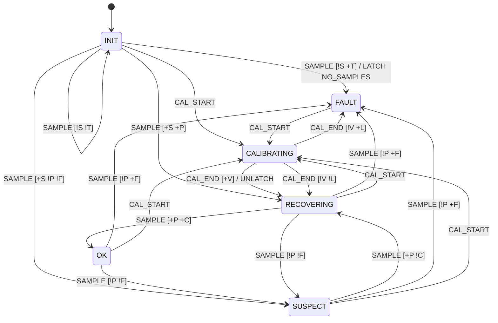

# Spec: hazard fix C2 (stick plausibility and the stick fault state machine)

Status: **spec for the owner's approval** (2026-10-08). No code, test data, table or golden
has been changed. A different agent implements it after approval (CS-SAF-05; D1: the owner is
the only approver for now). Base: `dev_refactor` 5669d6c.

Inputs: [hazard-fixes.md](hazard-fixes.md) §4 C2 (v2 rules), §7 D2 (firmware only; the 0 mV
low rail is a residual hazard), §9 (M1, G1-G5, D4; order C1 → C3 → C4 → C2); hazards H3, H9,
H10 ([refactor.md](refactor.md) §1); the C1 spec (`dev_ai_hazard_c1_spec`,
`docs/plans/hazard-c1-spec.md`: the output permit, the neutral latch, the stick-health hook);
the C4 spec (`dev_ai_hazard_c4_spec`, O9: the X/Y producer can starve);
[post-limits-proposal.md](post-limits-proposal.md) (board 2 data); `components/stick`,
`components/control`, `components/joystick_cal`, `main/main.cpp` (`AdcStickIo`), espp
`ContinuousAdc`, `tools/bench`.

C2 lands last on lane S, after C1 (permit, neutral latch, `STATE`), C3 (persistent fault
indicator) and C4 (ADC task priority, clock, stack). It builds on their hooks and says where.

## 0. Exec summary

**What C2 adds.** A stick monitor on the ADC task. Every cycle it checks the three raw reads
before any averaging or lowpass of ours, and runs a small state machine: INIT, OK, SUSPECT,
RECOVERING, FAULT, CALIBRATING. Only OK lets the stick drive. Everything else sends a literal
0, keeps the stick's menu keys silent, and passes the stick button through.

**What the user sees.**

| What happens to the stick | Detected | The chair | The screen | How it clears |
| --- | --- | --- | --- | --- |
| One bad sample: failed read, NaN, above the rail, X/Y not updated for 300 ms | yes, same cycle | stops at once (output 0 from that cycle, ≤ 40 ms) | Drive: "Checking the joystick", then "Centre the joystick to drive" | by itself after 3 good samples (~105 ms), then the stick centred for 300 ms (C1's latch) |
| Bad samples 3 times within 30 cycles (~1 s), or a lasting fault | yes, by the 3rd bad cycle (~105 ms if continuous) | stops at once; the HMI also asks the MCB to stop (DISABLE, O6) | "Joystick fault: recalibrate to clear" on Drive, and C3's fault indicator on every screen. Stick menu keys do nothing; touch works | only a calibration run that ends with a valid record (Settings → Joystick, hold Calibrate by touch), or a reboot |
| No X/Y data at all within 1 s of start | yes | output 0 | as FAULT | as FAULT |
| Never calibrated, or the saved calibration fails the new check | (C1, G5) | output 0 | "The joystick must be calibrated first" | calibrate |
| A calibration run | detection paused | output 0 (today's rule) | the calibration screen | the run's end |

**Residual hazards, stated plainly.**

1. **Open pot at 0 mV (low rail): not detected (D2).** Board 2 calibrates its low ends at
   6-11 mV, so 0 mV looks like full travel. An open horizontal pot commands full left, an open
   vertical pot **full forward**, an open twist pot full counter-clockwise. Mitigated only in
   part: at boot and on every entry to Drive the stick must read neutral for 300 ms first (G1,
   C1), so a pot that is already open never drives. A pot that opens **while driving** drives
   at full deflection until the user stops (exit hold on the stick button, burger key) or the
   MCB stops. If the MCB ignores the DISABLE (G4), only the MCB can stop it.
2. **A short to the 3.3 V rail is detected only if the ADC reads it above the limit.** The
   limit is the calibrated max + 100 mV (≤ 3150 mV). If the P4's ADC at 12 dB saturates below
   that, a rail short looks like full travel. Nobody has measured it yet (O1, D2).
3. **Wrong but plausible readings are not detected.** A wiper stuck mid-travel, a drifting
   pot, or a short between two axes reads inside the band and drives.
4. **A spike shorter than one X/Y window is seen only through its maximum.** X/Y come from
   espp's continuous ADC as one mean per window (~128 ms). C2 adds the window's maximum (O4).
   A dip toward 0 mV is not checked (residual 1).
5. **A latched fault is held in RAM.** A reboot clears it. An intermittent fault may then
   not show again for a while (O9).

**What changes outside the stick.**

- H9 is fixed: a cycle with a failed read sends neutral XYTwist instead of nothing.
- The calibration record gets an upper bound and a finite check at load and at the end of a
  run. A saved record with a max above 3050 mV is no longer used (G5 then applies).
- espp's `ContinuousAdc` is vendored with a small change: a per-window maximum and a sequence
  number per channel (O4).
- Drive table (C2b, lane D, optional per O6/O7): a stick FAULT while driving stops like an
  exit hold (DISABLE, G4 re-sends); the unlock hold is refused while the stick is in FAULT.
- Bench injection gains NaN, stale X/Y and one-cycle faults.

## 1. Scope

| In C2 | Not in C2 |
| --- | --- |
| Plausibility of the raw reads; the monitor's table, oracle, 100 % branches | the neutral latch and the output permit (C1 owns them; C2 writes their stick-health input) |
| Stale X/Y detection (C4 O9) | preventing `ContinuousAdc` starvation (pinning or priority, O14) |
| H9: neutral on a failed read | the low-rail hardware fix (D2, EE) |
| Calibration validation at load and at hand-over | the calibration run's own table (unchanged) |
| Fault while driving: stick side; drive-table rows as C2b (lane D) | a fault flag in XYTwist (wire format unchanged; D3) |
| Bench injection: NaN, stale, one-cycle; `STATE` fields | the seat path |

## 2. The raw sample and its plausibility

### 2.1 What the monitor gets each cycle (`RawSample`)

| Field | From | Today |
| --- | --- | --- |
| horizontal, vertical: window mean mV (optional) | vendored `ContinuousAdc`, one locked read for both | `get_mv` twice |
| horizontal, vertical: window max mV | new: the largest conversion of the window, converted to mV | not available |
| horizontal, vertical: window sequence (`uint32`) | new: +1 for each window that held at least one conversion of that channel | not available |
| twist: mean mV (optional) | `read_twist_mv`: mean of the successful oneshot reads | same |
| twist: max mV of the single reads | new, same loop | not available |
| twist: number of successful reads (0..8) | new, same loop | not available |

The pipeline still gets `RawReadsMv` (the three means) as today. `RawSample` is what the monitor
judges. "Raw" means before our averaging and lowpass: for X/Y the per-window maximum stands in
for the individual conversions, because espp averages inside its own task.

### 2.2 Plausible, per cycle

A sample is plausible only if every line holds:

| # | Check | Implausible kind |
| --- | --- | --- |
| P1 | all three means present | `MISSING` (axis) |
| P2 | every mean and max finite | `NAN` (axis; also ±inf) |
| P3 | every mean ≥ 0 mV | `NEGATIVE` (axis; the ADC cannot produce it) |
| P4 | every max ≤ its high limit: `min(HIGH_RAIL_MV, cal.max_mv + CAL_OVERSHOOT_MV)` per axis, from the calibration in use | `HIGH` (axis) |
| P5 | X and Y each: its sequence changed less than `XY_STALE_MS` ago (by the monitor's clock; a channel that never changed counts from the monitor's first cycle) | `STALE` (axis) |
| P6 | all `TWIST_OVERSAMPLE` (8) twist reads succeeded | `TWIST_PARTIAL` |

The first failing check (order P1..P6, axes H, V, twist) is the sample's reason. 0 mV up to the
calibrated min is plausible: that is residual 1, on purpose. A sequence wrap (2^32 − 1 → 0)
counts as a change. Ages follow C4's rule (REQ-CTL-07): `uint32` ms modulo 2^32.

Board 2's limits: horizontal 3071 mV, vertical 3062 mV, twist 3060 mV. Ideal defaults (never
calibrated): 3150 mV.

## 3. The state machine (`hmi::stick::StickMonitor`)

### 3.1 States

| State | Meaning | Command | Stick keys | Stick health (C1 hook) | Hold reason |
| --- | --- | --- | --- | --- | --- |
| INIT | waiting for the first X and Y windows | literal 0 | silent | CHECK | STICK_CHECK |
| OK | samples plausible | the permit decides (C1) | live | OK | (C1's others) |
| SUSPECT | the newest sample was implausible | literal 0 | silent | CHECK | STICK_CHECK |
| RECOVERING | plausible again, counting good samples | literal 0 | live | CHECK | STICK_CHECK |
| FAULT | latched | literal 0 | silent | FAULT | STICK_FAULT |
| CALIBRATING | a calibration run owns the stick; detection paused | literal 0 | silent (today's rule) | CHECK | CALIBRATING (C1, first) |

- Literal 0 is (+0.0, +0.0, +0.0), not a multiply (C1's REQ-STK-10).
- "Silent": the stick's key is 0, no flick, the key trigger is released. The remote UI's key
  (bench) still overrides, as today.
- The stick button bit reaches XYTwist unchanged in every state. It is a separate GPIO, and the
  exit hold runs on it, so the user can still stop (O12).
- The bars keep showing the mapped position whenever the three means exist (a diagnostic).
- CHECK is a new `StickHealth` value. C1's `NOT_MONITORED` is no longer written by any build.

### 3.2 Inputs (one per ADC cycle)

The island samples `joystick_cal_running()` once per cycle and uses that one value for the
monitor and for the pipeline's `calibrating()`.

| Input | When |
| --- | --- |
| `CAL_START` | calibrating is true and the state is not CALIBRATING |
| `CAL_END` | calibrating is false and the state is CALIBRATING |
| `SAMPLE` | otherwise (every cycle, failed reads included) |

### 3.3 Guards

| Guard | True when |
| --- | --- |
| `P` PLAUSIBLE | this sample passes §2.2 |
| `S` STARTED | X and Y sequences have each changed at least once since the monitor's first cycle |
| `T` START_TIMED_OUT | now − first cycle ≥ `START_MAX_MS` |
| `F` REACHES_FAULT | the implausible count over the last `FAULT_WINDOW_CYCLES` samples, this one included, ≥ `FAULT_COUNT` |
| `C` CLEAN | consecutive plausible samples, this one included, ≥ `RECOVER_CLEAN_CYCLES` |
| `L` LATCHED | the fault latch is set |
| `V` NEW_VALID_CAL | the validated-calibration generation (REQ-CAL-10) differs from the one stored at `CAL_START` |

### 3.4 Actions

| Action | Does |
| --- | --- |
| `PUSH_GOOD` | window ← good; clean run + 1 |
| `PUSH_BAD` | window ← bad; clean run := 0; count the kind; store the reason |
| `NOTE_SUSPECT` | suspect onsets + 1 |
| `LATCH` | latch := true; faults + 1; fault reason := the sample's reason (or `NO_SAMPLES`, `INTERNAL`) |
| `COUNT_KIND` | count the sample's implausible kind, if any (diagnostics only) |
| `SUSPEND` | store the calibration generation |
| `RESUME` | window emptied; clean run := 0 |
| `UNLATCH` | latch := false |

### 3.5 Transitions, row by row (`STICK_MONITOR_TRANSITIONS`)

`+X` = X true, `!X` = X false, `—` = no guard. Actions run left to right.

| # | From | Input | Guard | To | Actions |
| --- | --- | --- | --- | --- | --- |
| 1 | INIT | SAMPLE | `!S !T` | INIT | — |
| 2 | INIT | SAMPLE | `!S +T` | FAULT | LATCH (`NO_SAMPLES`) |
| 3 | INIT | SAMPLE | `+S +P` | RECOVERING | PUSH_GOOD |
| 4 | INIT | SAMPLE | `+S !P !F` | SUSPECT | PUSH_BAD, NOTE_SUSPECT |
| 5 | INIT | SAMPLE | `+S !P +F` | FAULT | PUSH_BAD, LATCH |
| 6 | OK | SAMPLE | `+P` | OK | PUSH_GOOD |
| 7 | OK | SAMPLE | `!P !F` | SUSPECT | PUSH_BAD, NOTE_SUSPECT |
| 8 | OK | SAMPLE | `!P +F` | FAULT | PUSH_BAD, LATCH |
| 9 | SUSPECT | SAMPLE | `+P !C` | RECOVERING | PUSH_GOOD |
| 10 | SUSPECT | SAMPLE | `+P +C` | OK | PUSH_GOOD |
| 11 | SUSPECT | SAMPLE | `!P !F` | SUSPECT | PUSH_BAD |
| 12 | SUSPECT | SAMPLE | `!P +F` | FAULT | PUSH_BAD, LATCH |
| 13 | RECOVERING | SAMPLE | `+P !C` | RECOVERING | PUSH_GOOD |
| 14 | RECOVERING | SAMPLE | `+P +C` | OK | PUSH_GOOD |
| 15 | RECOVERING | SAMPLE | `!P !F` | SUSPECT | PUSH_BAD, NOTE_SUSPECT |
| 16 | RECOVERING | SAMPLE | `!P +F` | FAULT | PUSH_BAD, LATCH |
| 17 | FAULT | SAMPLE | — | FAULT | COUNT_KIND |
| 18-22 | INIT, OK, SUSPECT, RECOVERING, FAULT (one row each) | CAL_START | — | CALIBRATING | SUSPEND |
| 23 | CALIBRATING | SAMPLE | — | CALIBRATING | — |
| 24 | CALIBRATING | CAL_END | `+V` | RECOVERING | RESUME, UNLATCH |
| 25 | CALIBRATING | CAL_END | `!V +L` | FAULT | RESUME |
| 26 | CALIBRATING | CAL_END | `!V !L` | RECOVERING | RESUME |

Notes:

- Guards `C` and `F` are judged after this sample is counted. Row 10 fires only if
  `RECOVER_CLEAN_CYCLES` is 1, row 5 only if `FAULT_COUNT` is 1; they keep the table complete
  for any constant. A `static_assert` keeps `FAULT_COUNT ≥ 2` and `FAULT_WINDOW_CYCLES ≤ 32`
  (one `uint32_t` bitmask).
- Any combination not listed changes nothing (TS-UNIT-08). `CAL_END` outside CALIBRATING and
  `CAL_START` inside it cannot be built by §3.2; the oracle still checks they change nothing.
- **Safe state.** A state or input outside its enum: FAULT, LATCH (`INTERNAL`). Not a table
  row (as in drive_session).
- **Ways out (CS-SAF-02).** INIT: row 2 at 1 s. SUSPECT: at most `FAULT_COUNT` cycles, then OK
  path or FAULT. RECOVERING: `RECOVER_CLEAN_CYCLES` or SUSPECT. CALIBRATING: the run's own step
  timeouts (600 periods each, REQ-CAL-05) and its cancel. FAULT has no timeout on purpose: it
  is the safe state, and its way out is the user's calibration (or a reboot). TABLE note in the
  README records this.
- The window is not fed in FAULT or CALIBRATING. Leaving CALIBRATING empties it.

### 3.6 Diagram (D4, hand-drawn from the table)

### 3.7 How it composes with C1's permit

C1's permit sends the stick only when: the gate, no calibration, a measured calibration, POST
PASS, stick health allows, and the neutral latch. After C2, stick health allows only in OK.
Any other state clears C1's neutral latch. So **every** return to OK (after a glitch, after
boot, after a recalibration) needs the stick centred for 300 ms before the chair moves. The
monitor does not repeat that rule; it relies on C1's REQ-STK-12, and STK-078 tests the two
together.

H9 lives in the pipeline: a cycle with a missing mean publishes literal 0 with the button bit,
sets the stick key to 0 (remote key still overrides), releases the key trigger, and calls nothing
else (no bars, no calibration take, no lowpass, no `note_raw`).

## 4. Constants

New constants live in `components/stick/include/stick/stick_monitor.hpp`, named, with their
data in the comment (D4 style).

| Name | Value | Data behind it | Status |
| --- | --- | --- | --- |
| `HIGH_RAIL_MV` | 3150 | Board 2 calibrated max 2960-2971 mV. The ideal axis (and the bench injection's top) is 3300 mV. 3150 sits 179 mV above the highest board-2 end and 150 mV below the rail | **proposed**; to measure (O1): what the P4 ADC reads with a wiper shorted to 3.3 V |
| `CAL_OVERSHOOT_MV` | 100 | A calibrated end is the mean of a 1 s hold with ≤ 30 mV spread (X/Y) or ≤ 60 mV (twist) (`kSteadyMv`). Single twist reads: ~50 mV p-p at rest (main.cpp note). 100 mV is 2× the twist p-p and 30× the X/Y window noise (3 mV) | **proposed**; to measure (M-1): the per-read max at each end stop vs the cal max |
| low limit | 0 mV (reads below 0 are implausible) | 0 mV is a legal reading of a pot at its end (residual 1) | fixed by D2 |
| `FAULT_WINDOW_CYCLES` (M) | 30 | 30 cycles = 1.05 s at the measured 35.0 ms cycle; the same span as POST's `WINDOW_MIN_SAMPLES` (D4) | proposed |
| `FAULT_COUNT` (N) | 3 | 0 failed cycles in about 14,600 (85 runs, board 2; 95 % upper bound 2 × 10⁻⁴ per cycle). At that bound a false latch is about 4 × 10⁻⁴ per hour of use, but single glitches (each a stop, O8) about 20 per hour; the true rate is likely far lower, and the soak (C2-15) must show 0. A lasting fault latches in 3 cycles (~105 ms); alternating bad/good on the 5th cycle | proposed |
| `RECOVER_CLEAN_CYCLES` | 3 | ~105 ms of good samples after a glitch; then C1's 300 ms neutral | proposed |
| `XY_STALE_MS` | 300 | X/Y windows: 1024 B ÷ 4 B per result = 256 conversions at 2 × 1000 Hz = **128 ms** per window (computed; to measure, `joy.xy_age_max`). 300 ms ≈ 2.3 windows. Seen by the ADC task within one more cycle (≤ 340 ms) | proposed |
| `START_MAX_MS` | 1000 | ~8 windows after the task's first cycle | proposed |
| `TWIST_OVERSAMPLE` | 8 (all must succeed) | today's `kStickCycle.twist_oversample`; no partial-failure data exists (`joy.valid` counts "at least 1 of 8") | proposed (O5); one constant, `static_assert`ed equal to the island's |
| `kNeutralHold` | 300 ms | G1, D4 approved | C1's constant, not redefined |
| `kFullTravelMv` | 1000 mV each way | existing (REQ-CAL-02), equal to POST's `CAL_MIN_HALF_SPAN_MV` | unchanged |

Derived: a calibration is valid only if `max_mv + CAL_OVERSHOOT_MV ≤ HIGH_RAIL_MV`, that is
max ≤ 3050 mV. Board 2 (2971) passes with 79 mV to spare. Boards 1 and 3 are not measured: read
their boot log line `loaded …joystick_cal.txt: …` before flashing C2 (O1).

## 5. A fault while driving (M1, G3, G4)

### 5.1 What the HMI does

| Moment | HMI |
| --- | --- |
| first implausible sample (SUSPECT) | literal 0 on that cycle's XYTwist; XYTwist keeps flowing at the ADC rate. No DISABLE. Drive notice "Checking the joystick" |
| FAULT (3rd bad sample) | output stays 0. **If O6 = yes:** on the next UI tick (≤ 250 ms) the drive table stops as for an exit hold: DISABLE, then C1's re-sends every 250 ms, "MCB did not stop" at 5 s, 1 Hz after. Banner "Joystick fault". Persistent indicator on every screen |
| MCB obeys the DISABLE | it leaves ENABLED; the Tab5 leaves Drive (M1). Locked screen, the indicator stays |
| MCB ignores it (G4) | the Tab5 stays on Drive (M1). **The stick output stays 0** (G3). The re-sends continue as C1 specifies |
| MCB re-enables later (on its own) | the Tab5 enters Drive (M1), output 0 (FAULT), and row 50/51 asks it to stop again |
| user releases the stick, fault gone | nothing resumes: FAULT is latched |

### 5.2 Conflict with G4, flagged

G4 says that after the HMI's stop, while the MCB stays ENABLED, "the stick keeps driving". For
a stop caused by a stick FAULT, G3 says no stick output with a stick fault. **This spec lets G3
win**: the stick never drives in FAULT, even if the MCB keeps ENABLED. The user's own stop
(exit hold, burger key) with a healthy stick keeps G4 as written. O6 asks the owner to confirm.

The DISABLE is a request (M1). It is not needed to stop the chair: the literal 0 already does.
It is there so the MCB does not stay ENABLED behind a broken stick.

### 5.3 C2b: drive-table rows (lane D, after C1's 49 rows)

Only if O6 (rows 50-51) and O7 (row 52) are approved. Appended, so every row keeps its number.

| # | From | Input | Guard | To | Actions |
| --- | --- | --- | --- | --- | --- |
| 50 | UNLOCKING | TICK_STICK_FAULT | `+STICK_FAULT` | EXITING | as row 21 (exit hold: SEND_DISABLE, latch the exit, clear the menu flag, arm the deadline, ARM_STOP_TIMER), then SHOW_STICK_FAULT |
| 51 | DRIVING | TICK_STICK_FAULT | `+STICK_FAULT` | EXITING | as row 50 |
| 52 | LOCKED | UNLOCK_HOLD_DONE | `+STICK_FAULT` | LOCKED | SHOW_REFUSAL(STICK_FAULT); row 18 gains `!STICK_FAULT` |

- New Env guard `STICK_FAULT`: the stick-health atomic reads FAULT at the sample. SUSPECT,
  RECOVERING, INIT and CHECK do not set it (transients never stop the MCB).
- New tick sub-step `TICK_STICK_FAULT`, placed in `TICK_SEQUENCE` right after TICK_FOLLOW, so a
  relock in FOLLOW wins and the stop timer of rows 44-49 starts on the same tick.
- EXITING and EXIT_REFUSED: no row (already stopping). ASKING: no row (the MCB decides; if it
  grants, row 1-2 enter Drive and row 50 stops it).
- The fingerprint changes; the oracle gains the STICK_FAULT dimension (×2).

## 6. Calibration: the way out and its validation

- **Reachable by touch.** Settings → Joystick → hold Calibrate (`ui_CalibrateButton`), as
  today. In FAULT the stick keys are silent, so the touch path is the way. C1 allows a run only
  while locked (its REQ-UI-16).
- **Detection paused.** CALIBRATING feeds nothing to the window; the output is 0 (today's rule).
- **Validation (REQ-CAL-09)**, one function used at boot load and before a run's record is
  handed to the ADC task: every number finite; per axis min ≥ 0; centre − min ≥ 1000 mV;
  max − centre ≥ 1000 mV (so min < centre < max); max + `CAL_OVERSHOOT_MV` ≤ `HIGH_RAIL_MV`.
- A record that fails at load is not used: defaults, "never calibrated" (G5, C1's
  `joystick_cal_measured()` false), one log line with the reason.
- A run whose record fails ends in REJECT (the run's existing path); nothing is handed over;
  the generation counter does not move. In FAULT the monitor goes back to FAULT (row 25). A
  pot shorted to the rail therefore cannot be "calibrated away": its end reads above 3050 mV.
- **Generation counter (REQ-CAL-10).** `joystick_cal` adds 1 to an atomic each time it hands a
  validated record to the ADC task. Row 24 needs it to have moved during the run.

## 7. Requirements

Format: the README tables (`tests/reqmatrix.py`). A retired row stays, starts with
`RETIRED 2026-10-xx, superseded by REQ-...`, lists no tests, and no test may cite it. IDs below
assume C1 and C4 land as specified (C1: REQ-STK-10..14, REQ-CAL-08, REQ-UI-16..18,
REQ-DRV-22..34, REQ-DAD-07..10, REQ-RUI-05; C4: REQ-CTL-01..14). C1 and C4 both claim
REQ-UI-16/17 (O13); C2 skips to REQ-UI-21 to stay clear of either fix.

### 7.1 Retired

| ID | Successor | Why |
| --- | --- | --- |
| REQ-STK-05 | REQ-STK-16 | an invalid cycle now publishes neutral (H9) |
| REQ-STK-07 | REQ-STK-25 | the injection mask grows (NaN, stale, one cycle) |
| REQ-STK-13 (C1) | REQ-STK-27 | the hold reason gains STICK_CHECK |
| REQ-STK-14 (C1) | REQ-STK-26 | stick health: only OK allows |
| REQ-CAL-02 | REQ-CAL-09 | validation gains the upper bound and finiteness |
| REQ-RUI-05 (C1), the `PERMIT STICK` part only | REQ-RUI-06 | the monitor is now the only writer of stick health |

### 7.2 New

| ID | Component | Requirement |
| --- | --- | --- |
| REQ-STK-15 | stick | A sample is plausible exactly when §2.2 P1-P6 hold, with the high limit `min(HIGH_RAIL_MV, cal max + CAL_OVERSHOOT_MV)` per axis from the calibration in use. 0 mV up to the calibrated min is plausible (D2 residual). The reason is the first failing check in P1..P6 order, axes horizontal, vertical, twist |
| REQ-STK-16 | stick | A cycle with any mean missing publishes (+0.0, +0.0, +0.0) with the button bit, sets the stick key to 0 (the remote key still overrides), releases the key trigger, and calls nothing else |
| REQ-STK-17 | stick | The monitor follows `STICK_MONITOR_TRANSITIONS` exactly, one input per cycle chosen as in §3.2; any other combination changes nothing; a state or input outside its enum gives FAULT, latched, reason `INTERNAL` |
| REQ-STK-18 | stick | The window holds the last `FAULT_WINDOW_CYCLES` samples judged in INIT (after S), OK, SUSPECT and RECOVERING. `F` counts this sample. CALIBRATING and FAULT feed nothing; leaving CALIBRATING empties it |
| REQ-STK-19 | stick | Outside OK the command is literal 0. Outside OK and RECOVERING the stick key is 0, nothing flicks and the key trigger is released. The button bit reaches XYTwist unchanged in every state, invalid cycles included |
| REQ-STK-20 | stick | INIT lasts until X and Y have each delivered a window; with none from either by `START_MAX_MS` after the first cycle, FAULT with reason `NO_SAMPLES` |
| REQ-STK-21 | stick | FAULT is latched. It is left only through a calibration run that ends after a newly validated record was handed over (→ RECOVERING, latch cleared), or by a reset. A run that ends otherwise returns to FAULT |
| REQ-STK-22 | stick | RECOVERING becomes OK after `RECOVER_CLEAN_CYCLES` consecutive plausible samples. Any state other than OK clears C1's neutral latch, so output resumes only after the stick has read neutral for `kNeutralHold` |
| REQ-STK-23 | stick | The ADC task alone writes, as lock-free atomics: the state, the stick health, the last reason (kind and axis), the fault reason, counters (suspect onsets, faults, implausible samples per kind; only go up) and `xy_age_max_ms` (largest X/Y sequence age seen since the first window) |
| REQ-STK-24 | stick | The monitor allocates nothing, logs nothing, takes no lock and makes no indirect call; its step is a `switch` on `enum class` values; every shared value has `is_always_lock_free` asserted |
| REQ-STK-25 | stick | `STICK <h> <v> <tw> <mask> <seq>`: mV 0..3300, mask 0..255, seq 0..2^32−1, else rejected. Mask bits: 0-2 the read fails (h, v, twist), 3-5 the value is NaN (h, v, twist), 6 X/Y sequences frozen, 7 the faults of bits 0-6 apply to the first cycle that drains this message only. Otherwise an injected sample is fresh each cycle, twist 8 of 8 reads good, each max equal to its value. Expiry and refresh as REQ-STK-07 |
| REQ-STK-26 | stick | Stick health OK allows output; CHECK, FAULT and NOT_MONITORED withhold. Health is OK exactly in state OK, FAULT in FAULT, CHECK otherwise |
| REQ-STK-27 | stick | The hold reason is the first of GATE_SHUT, CALIBRATING, NOT_CALIBRATED, POST_NOT_PASSED, STICK_FAULT, STICK_CHECK, CENTRE_FIRST, else NONE |
| REQ-CTL-15 | control | Each cycle the island reads both X/Y windows (mean, max, sequence) in one call, the twist's reads (mean, max, count), samples `calibrating` once, steps the monitor once, then runs the pipeline with the same `calibrating`. On valid and invalid cycles alike |
| REQ-CTL-16 | control | The vendored `ContinuousAdc` keeps espp's mean per window and adds, per channel, the window's largest conversion in mV and a `uint32` sequence that advances only for a window holding at least one conversion of that channel. Its `README.md` lists every change from espp |
| REQ-CAL-09 | joystick_cal | A record is valid exactly when all nine numbers are finite and, per axis, min ≥ 0, centre − min ≥ `kFullTravelMv`, max − centre ≥ `kFullTravelMv`, and max + `CAL_OVERSHOOT_MV` ≤ `HIGH_RAIL_MV`. Boot uses only a valid saved record; a run hands over only a valid record |
| REQ-CAL-10 | joystick_cal | A generation counter (lock-free atomic) goes up by 1 each time a validated record is handed to the ADC task, and at no other time |
| REQ-DRV-35 | drive_session | (O6) On a tick, UNLOCKING or DRIVING with STICK_FAULT stops as the exit hold does and shows the STICK_FAULT banner (rows 50-51) |
| REQ-DRV-36 | drive_session | (O7) The unlock hold with STICK_FAULT sends nothing and shows the refusal (row 52) |
| REQ-DAD-11 | drive_adapter | The Env's STICK_FAULT is the stick-health atomic read at the sample |
| REQ-UI-21 | hmi_ui | While stick health is FAULT, C3's persistent fault indicator shows "Joystick fault" on every screen, and the Joystick screen names the reason in words |
| REQ-UI-22 | hmi_ui | The UI task logs each change of the stick state once, with the reason and the counters; the ADC task logs nothing |
| REQ-RUI-06 | remote_ui | Bench builds only: `STATE` adds the stick state, reason, fault reason, counters and `xy_age_max_ms`; `PERMIT STICK` is removed; a release ELF has none of these symbols |

## 8. Tests (written from this spec)

No expected value is generated from the new code (CORE never-list). New cases join the
`L1-STK`, `L1-CAL`, `L1-CTL` apps; `tests/manifest.d` lists the REQs. 100 % branch coverage of
`stick_monitor.hpp` (CS-SAF-05). Fake time only.

### 8.1 Oracle and table checks

| ID | Test | Expected |
| --- | --- | --- |
| STK-070 | every state (6) × input (3) × guards (P, S, T, F, C, L, V: 128) through the transition function | the table's row, or no change at all (state, latch, window, counters) |
| STK-071 | table invariants | one row per listed combination; no two rows match one combination; every non-FAULT state has a row leaving it; FAULT is left only by CAL_START; LATCH only on rows into FAULT; UNLATCH only on row 24 |
| STK-072 | corrupted state 99 and input 99 | FAULT, latched, reason `INTERNAL` |

### 8.2 Classification (REQ-STK-15)

Board-2 calibration unless stated. "OK" = plausible.

| ID | Case | Expected |
| --- | --- | --- |
| STK-073 | each axis mean: −0.001, 0, 6, cal min, centre, cal max | implausible `NEGATIVE`; OK ×5 |
| STK-074 | max at the limit and 0.01 mV above: H 3071/3071.01, V 3062/3062.01, twist 3060/3060.01 | OK; `HIGH` |
| STK-075 | ideal defaults: 3150 / 3150.01 on each axis | OK; `HIGH` |
| STK-076 | NaN, +inf, −inf in each mean and each max | `NAN` (axis) |
| STK-077 | each of the 7 missing patterns | `MISSING`, first missing axis |
| STK-078 | X/Y mean below the limit, window max above | `HIGH` |
| STK-079 | twist 7 of 8 reads; 8 of 8 with one read above the limit | `TWIST_PARTIAL`; `HIGH` twist |
| STK-080 | X sequence unchanged 299 ms then 300 ms (Y fresh); same for Y; a change resets; 2^32−1 → 0 counts as a change | OK, `STALE` H; same for V; OK; OK |
| STK-081 | two failures at once (missing V and HIGH twist) | reason `MISSING` V (order) |

### 8.3 Behaviour (REQ-STK-16..27), on 35 ms fake cycles

| ID | Case | Expected |
| --- | --- | --- |
| STK-082 | boot: no window until 128 ms, then plausible windows every 128 ms | INIT, output 0, keys silent until the first X and Y windows; then RECOVERING; OK on the 3rd good sample |
| STK-083 | boot: no window at all | INIT until 999 ms; FAULT `NO_SAMPLES` on the first cycle at ≥ 1000 ms |
| STK-084 | OK, driving forward with the permit open; one implausible sample | that cycle's command +0.0 ×3; SUSPECT; RECOVERING; OK after 3 good; then output 0 until 300 ms neutral (C1 latch), then the stick's value |
| STK-085 | OK; implausible every cycle | output 0 from the 1st; FAULT on the 3rd |
| STK-086 | OK; bad, good, bad, good, bad | FAULT on the 5th cycle |
| STK-087 | bad at cycles 0, 15, 29 vs bad at 0, 15, 30 | FAULT at 29; never FAULT (the first left the window) |
| STK-088 | FAULT; 1000 good cycles, stick centred | still FAULT, output 0, keys 0 |
| STK-089 | FAULT; CAL_START; 100 implausible samples; CAL_END with no new record | CALIBRATING (nothing counted); then FAULT |
| STK-090 | FAULT; CAL_START; generation +1; CAL_END | RECOVERING, window empty, latch clear; OK after 3 good |
| STK-091 | OK; CAL_START; CAL_END with no new record | RECOVERING (not FAULT); window empty |
| STK-092 | keys: full right held in INIT, SUSPECT, FAULT, CALIBRATING | joy_key 0, no flick; a remote key still sets joy_key |
| STK-093 | keys: full right held through SUSPECT → RECOVERING | key 0 in SUSPECT; in RECOVERING the key re-engages with one flick |
| STK-094 | button pressed in each state and on an invalid cycle | XYTwist button bit set every time |
| STK-095 | each invalid pattern (7) | published, +0.0 ×3, button as read, key 0 (remote key wins if set), no bars, no calibration take, no lowpass call, no `note_raw` |
| STK-096 | **6 mV drives full**: OK, vertical 6 mV, permit open after 300 ms neutral | y = +1.0 × speed scale; state OK |
| STK-097 | **RESIDUAL D2**: each axis at 0 mV, permit open | state OK; full left / **full forward** / full counter-clockwise (pins the residual) |
| STK-098 | **rail while driving**: forward held, then horizontal 3300 mV for 1 s, then centred | deflected before; +0.0 from the first rail cycle; FAULT on the 3rd; 0 after centring (latched) |
| STK-099 | counters and reasons over a scripted mix | each counter equals the scripted count; last reason and fault reason as scripted; counters never go down |
| STK-100 | 10,000 cycles of monitor + pipeline under the armed allocation guard | 0 allocations (TS-DET-08) |
| STK-101 | hold reason over all combinations including STICK_CHECK | first in REQ-STK-27 order |
| STK-102 | health per state | OK only in OK; FAULT in FAULT; CHECK otherwise; NOT_MONITORED withholds |
| STK-103 | injection: mask bits 3-5 (NaN), 6 (stale: sequences frozen while set), 7 (one cycle) | as REQ-STK-25; with bit 7 the second cycle draining the same message is plausible |
| STK-104 | hostile `STICK` arguments with the new range (mask 255 accepted, 256 rejected, plus TS-UNIT-07's set) | as REQ-STK-25 |

### 8.4 Calibration and island

| ID | Case | Expected |
| --- | --- | --- |
| CAL-410 | `valid()` boundaries: min −0.1 / 0; span 999.9 / 1000 each way; max 3050 / 3050.1; NaN or inf in each of the 9 numbers | invalid / valid; invalid / valid; valid / invalid; invalid |
| CAL-411 | saved file with horizontal max 3100 | defaults used, `joystick_cal_measured()` false, one log line naming the axis |
| CAL-412 | a run whose right end holds at 3200 mV | REJECT; nothing handed over; generation unchanged |
| CAL-413 | two completed runs, one rejected, one cancel | generation +2 |
| CTL-022 | island cycle with fakes: one `calibrating` sample used by monitor and pipeline; monitor stepped before the pipeline on valid and invalid cycles | as REQ-CTL-15 |
| CTL-023 | X/Y wiring: the fake ADC's channel 1 (horizontal) at 3300 mV | reason `HIGH` **horizontal** (guards the cross-wired channels) |
| CTL-024 | the vendored window bookkeeping (a pure helper, host-built): conversions per channel → mean, max, sequence; a window with no conversion of a channel | mean as espp's; max; that channel's sequence unchanged |

### 8.5 C2b (lane D, if O6/O7)

| ID | Case | Expected |
| --- | --- | --- |
| DRV-120 | oracle with the STICK_FAULT dimension | rows 50-52 or no change |
| DSO-020 | rows 50-51 carry row 21's actions then SHOW_STICK_FAULT; `TICK_SEQUENCE` has TICK_STICK_FAULT second; row 18 reads `!STICK_FAULT` | as written |
| GLD-120 | DRIVING; stick FAULT; tick | `P(D), N:STOPPING, B:STICK_FAULT`; MCB IDLE; tick: `L, lock(1), gate, P(D)` |
| GLD-121 | DRIVING; stick FAULT; MCB stays ENABLED; ticks to 7 s | as C1's GLD-105 (re-sends, MCB_DID_NOT_STOP at 5 s), never `L` |
| GLD-122 | LOCKED; stick FAULT; unlock hold | refusal STICK_FAULT, no `P` |

### 8.6 Existing tests and data that change (owner approval, each)

| # | What | Why |
| --- | --- | --- |
| E1 | `golden_stick.inc` is **not edited**. STK-001/002 replay it with health OK. The 8 invalid rows (1869-1875, 1877) now expect: published, +0.0 ×3, key 0, bars not set. All other rows stay bit-exact (C1's E9 exceptions still apply) | REQ-STK-16 |
| E2 | 73 golden rows carry a read above the proposed limits (46 grid, 24 sweep, the 3 `SHORT_*` rows). In the pipeline replay they stay as frozen; through the monitor they would be 0. STK-098 covers that path. Numbers for HIGH 3150 / overshoot 100; they move if O1 moves | the frozen table pins the mapping, not the monitor |
| E3 | STK-005, STK-015 retired (successor STK-095) | H9 fixed |
| E4 | STK-010, 011, 012, 014: assertions unchanged; names change from "today …" to "RESIDUAL (D2) …" | the low rail stays a residual |
| E5 | STK-013: assertion unchanged (the mapping still clamps); name says the monitor withholds it (STK-098) | |
| E6 | STK-049's last part (a failed read publishes nothing) now expects a neutral publish | H9 |
| E7 | STK-041 (mask 8 rejected) and STK-046 (masks 0..7) follow REQ-STK-25 | |
| E8 | CAL-013, CAL-107 retired (successor CAL-410); CAL-011, 012, 106, 015, 016 call `valid()` (same expectations) | REQ-CAL-09 |
| E9 | C1's STK-066 and STK-067 replaced by STK-101 and STK-102; C1's `PERMIT STICK` verb and bench step B5''-12 removed (C2's rows replace it) | the monitor is the only writer |
| E10 | self test: three new checks (`joy.health`, `joy.bad_samples`, `joy.xy_age_max`); the B2 count marker and the B3 baseline IDs move (declared) | observability |

## 9. Bench checks (B5'' C2 rows; scripted verdicts)

Build: `ci/sdkconfig.stick_inject`. Sim, remote UI and `STATE` as in C1 §6. "Forward" = the
vertical read at the board's calibrated min (read from `STATE`); "centre" = the calibrated
centres; refresh every 100 ms. Each step starts Locked, sim `ok`, POST passed (stick injected
at rest), stick OK, Settings speed 10, and ends Locked with the stick OK (graded clean-up; a
latched FAULT is cleared by an injected calibration as in C2-13). t = the PC time the step's
first changed STICK message was sent; the sim timestamps on the same PC clock.

| Step | Script | Pass if |
| --- | --- | --- |
| C2-1 6 mV | sim `a`, Drive; centre 0.5 s; vertical 6 mV (h, twist centre) 2 s | `STATE` stick OK throughout; ≥ 90 % of XYTwist in [t + 0.3 s, t + 2 s] have y ≥ 0.99 |
| C2-2 0 mV (residual D2) | as C2-1 with 0 mV | **same result as C2-1** (state OK, y ≥ 0.99): the residual behaves as documented; the report prints "RESIDUAL-D2 confirmed" |
| C2-3 rail | Drive, forward 1 s; horizontal 3300 mV; then centre 3 s | every XYTwist after t + 200 ms is exactly 0 on all axes; `STATE` FAULT within t + 500 ms, fault reason HIGH horizontal; still FAULT and 0 after centring; notice STICK_FAULT |
| C2-3b limit edge | Drive, centre; vertical at its limit − 20 mV for 2 s; then limit + 20 mV | first: OK, full reverse (y ≤ −0.99 after neutral); second: FAULT HIGH vertical |
| C2-4a one bad cycle | Drive, forward; one message with mask 0x81 (horizontal fails, one cycle); forward held 2 s; centre 0.5 s; forward | never FAULT; ≥ 1 zero XYTwist after t; 0 while forward stays held (C1 latch); y > 0 within 0.3 s of the final forward; suspect onsets +1 |
| C2-4b alternating | Drive, forward; mask 0x81 every 200 ms for 1 s | FAULT within t + 1.0 s; 0 from t + 200 ms |
| C2-4c sparse | Drive, centre; mask 0x81 every 1.2 s for 12 s | never FAULT (N of M, not lifetime); suspect onsets +10 |
| C2-5 failed read | Drive, forward; vertical read fails (mask 0x02) 2 s | XYTwist keeps arriving at ≥ 25 Hz (H9: neutral, not silence) and is all 0 after t + 200 ms; FAULT MISSING vertical by t + 500 ms |
| C2-6 stale | Drive, forward; mask 0x40 (X/Y frozen) 2 s | at least one y > 0 in [t, t + 250 ms]; all 0 after t + 550 ms; FAULT STALE by t + 800 ms |
| C2-7 NaN | as C2-5 with mask 0x10 (vertical NaN) | as C2-5, reason NAN vertical |
| C2-8 fault while driving, MCB obeys (O6) | sim normal; Drive, forward; rail | exactly one DISABLE in [t, t + 600 ms], none before; Locked within t + 1.5 s; banner STICK_FAULT; no ENABLE; no non-zero XYTwist after t + 200 ms |
| C2-9 MCB ignores (O6) | sim `s`; as C2-8; watch 7 s | DriveScreen throughout; **every** XYTwist after t + 200 ms is 0 (G3 over G4); DISABLE gaps ≤ 0.4 s for 5 s, MCB_DID_NOT_STOP at 5.0-5.5 s after the first, gaps 0.85-1.3 s after |
| C2-10 release, no auto-resume | after C2-3: centre 5 s, forward 2 s, sim `a` (re-enable), centre 0.5 s, forward 2 s | no non-zero XYTwist at all; `STATE` FAULT throughout; Drive notice STICK_FAULT |
| C2-11 keys silent | FAULT; Settings list on screen; inject full down, up, right, left, 0.5 s each with centre between | focus and screen unchanged (`STATE`); joy_key 0 throughout. Control run in OK first: the same injection moves the focus |
| C2-12 indicator persists | FAULT; `SCREEN` Home, Settings, Joystick, Drive, 15 s each | the fault indicator is reported on every screen (`STATE`) and is in each `SHOT`; still FAULT after 60 s |
| C2-13 way out by touch | FAULT, centre; Joystick screen; `PRESS` on Calibrate 2 s, `RELEASE`; inject the run (rest, each end, release) with board-2-like values | calibrating 1, then the run completes; `STATE` RECOVERING then OK; sim `a`, centre 0.5 s, forward: y > 0 within 0.3 s. Repeat with one end at 3200 mV: REJECT, still FAULT |
| C2-14 boot | Restart HMI tile; stick injected at centre from the first second | `STATE` reaches OK within 1.5 s of the first `STATE` reply; never FAULT; `xy_age_max_ms` ≤ 200 |
| C2-15 soak | 30 min on Drive, centre injected, then the self test | `joy.bad_samples` = 0, `joy.xy_age_max` ≤ 200 ms, `joy.health` OK; `time.adc_avg` 34.5-35.5 ms; `time.adc_max` ≤ 40 ms; `mem.stk_adc` ≥ 2048 B |
| C2-16 (O14) real starvation | bench-only `STALL CADC 1000` (suspends the `ContinuousAdc` task 1 s) | FAULT STALE; output 0 by 340 ms after the stall start (+ transport) |

Owner checks with the real stick (no injection, by hand; not graded by script):

| # | Check | Record |
| --- | --- | --- |
| M-1 | hold each end 2 s on boards 1, 2, 3 | per-axis max of the window/oneshot maxima (`STATE`) vs the cal max: must stay ≥ 50 mV under the limit |
| M-2 | D2: a wiper shorted to 3.3 V through 100 Ω, each axis, one board | the reading; if ≤ the limit, residual 2 is real (O1) |
| M-3 | the boot log line `loaded …joystick_cal.txt` on boards 1 and 3 | every max ≤ 3050 mV, else they lose their calibration at C2's first boot |

## 10. Implementation notes

### 10.1 Files

| File | Change |
| --- | --- |
| `components/stick/include/stick/stick_monitor.hpp` (new) | constants, `RawSample`, `classify()`, enums, `STICK_MONITOR_TRANSITIONS`, `StickMonitor` (window bitmask, clean run, latch, counters), invariants as `static_assert` |
| `components/stick/include/stick/stick_pipeline.hpp` | H9 invalid-cycle publish; keys silent from an Io flag; no change to mapping |
| `components/stick/include/stick/bench_inject.hpp` | mask bits 3-7; builds a `RawSample` |
| `components/stick/README.md`, `TABLE` note, tests | §7, §8 |
| `components/control/include/control/stick_island.hpp` | gathers `RawSample`; one `calibrating` sample; steps the monitor before the pipeline |
| `components/espp_adc/` (new, vendored override of `espp/adc`) | espp's code unchanged except REQ-CTL-16; `README.md` lists the diff; excluded from clang-format like other vendored code |
| `components/joystick_cal` | `valid()` (replaces `plausible()`), generation counter |
| `main/main.cpp` | `AdcStickIo`: health atomic, keys flag, `calibrating` cached, observability atomics |
| `components/drive_session`, `drive_adapter` (C2b, lane D) | §5.3 |
| `components/hmi_ui` | texts, indicator, Joystick-screen reason, log on change |
| `components/remote_ui` | `STATE` fields, `PERMIT STICK` removed, `STALL CADC` (O14) |
| `main/selftest*`, `scripts/` PC copy | three `joy.*` checks |
| `tools/bench/scenario_c2.py` (new) | §9 |
| docs | `how-the-firmware-works.md`, `refactor.md` H3/H9 status, `hazard-fixes.md` C2 status, `project-profile.md` residual row (keep) |

### 10.2 Commit order (refactor separate from behaviour; CI green at each)

| # | Kind | Commit | Bench before merge |
| --- | --- | --- | --- |
| 1 | R | vendor `espp/adc` unchanged as `components/espp_adc` (override) | B2, B3 unchanged; binary diff limited to paths |
| 2 | R | window max and sequence in the vendored copy, unused; CTL-024 | B3 unchanged |
| 3 | R | `stick_monitor.hpp`, its table and L1 (unused by the firmware); `valid()` added, unused | L1 only |
| 4 | R | the island gathers `RawSample`, `calibrating` sampled once; nothing reads them yet | SU, B3 unchanged |
| 5 | test | injection mask bits 3-7, `STATE` fields (bench builds only) | release ELF symbol check |
| 6 | B | calibration validation at load and hand-over, generation counter (E8) | B2 (the `loaded` line), M-3 first |
| 7 | B | the monitor wired: health, keys, H9 neutral, observability (E1-E7, E9) | B2, B3, B5, C2-1..7, C2-10..14 |
| 8 | B | UI: texts, indicator, reason, log; self-test checks (E10) | B4 walk, C2-11, C2-12 |
| 9 | B | C2b drive-table rows (lane D, fingerprint) | C2-8, C2-9, C1's B5'' |
| 10 | test | `scenario_c2.py`; C2-16 if O14 | full §9 |
| 11 | docs | §10.1 docs rows | — |

The implementer never edits `golden_stick.inc`, a drive golden, or an expected value to make a
check pass. The declared changes are E1-E10, the self-test rows and the fingerprint.

### 10.3 The ADC path: stack and time

- **No allocation, no logging, no lock added.** The monitor is plain inline code on plain values.
  The vendored `ContinuousAdc` read takes its existing `data_mutex_` **once** for both channels
  (today: twice, once per `get_mv`). Logging happens on the UI task (REQ-UI-22).
- **Frames** (`-fstack-usage`, as C4's SU step): the `Read ADC` invoker frame ≤ 288 B (C4
  allows 256 B; `RawSample` adds about 40 B; this raises C4's bound by 32 B, declared);
  `read_twist_mv` ≤ 256 B (240 B today, plus max and count); each new function on the path
  ≤ 96 B and `static` or inline; no `dynamic` entry. On the board: `mem.stk_adc` ≥ 2048 B on
  C4's 6144 B stack, also after the stress run (CS-MEM-04).
- **Time.** Added work per cycle: 8 compares in the twist loop, one locked copy of ~24 B, about
  50 instructions of monitor, five relaxed atomic stores. Expected well under 10 µs at 360 MHz.
  Measured, not assumed: B3 `time.adc_avg` stays in 34.5-35.5 ms and `time.adc_max` ≤ 40 ms
  (C4's bands), before and after commit 7.
- **Clock.** The monitor takes `now` as a parameter: C4's injected `uint32` ms clock. Host tests
  use fake time.
- **The `ContinuousAdc` task** is espp's (priority 5, unpinned). Its change (max, sequence) runs
  there, once per window, not on the ADC path.

### 10.4 Risks

- False SUSPECTs stop the chair until the stick is re-centred. At the 95 % upper bound of the
  board-2 data that is about 20 stops an hour; nothing was seen in 14,600 cycles. The soak
  (C2-15) and `joy.bad_samples` must show 0 before merge. The twist rule (8 of 8) has no data yet (O5).
- A saved calibration above 3050 mV becomes "not calibrated" at the first C2 boot (M-3).
- If the X/Y window period differs from 128 ms, `XY_STALE_MS` must be re-checked against
  `joy.xy_age_max` (pass band ≤ 200 ms keeps 1.5× margin).
- Vendoring espp means taking espp updates by hand (O4).

## 11. Open questions for the owner

| # | Question | Recommendation |
| --- | --- | --- |
| O1 | `HIGH_RAIL_MV` 3150 and `CAL_OVERSHOOT_MV` 100 (cal max ≤ 3050). Needs M-2 (what a 3.3 V short reads) and M-1/M-3 (boards 1, 3). | approve as proposed; revisit after M-1..M-3 |
| O2 | N = 3 bad of M = 30 cycles latches; 3 good samples end SUSPECT. | approve |
| O3 | `XY_STALE_MS` 300, `START_MAX_MS` 1000. | approve; confirm with `joy.xy_age_max` |
| O4 | Vendor espp's `adc` to get the window max and a sequence (REQ-CTL-16)? Alternatives: an upstream espp PR first (slower), or check only the window means (no "before averaging" for X/Y, and no stale detection at all). | vendor now, offer it upstream |
| O5 | Twist: all 8 oneshot reads must succeed. Strict, with no partial-failure data. Or allow 1 of 8 to fail? | 8 of 8; loosen only if the soak shows partials |
| O6 | Stick FAULT while driving: also send DISABLE through the exit-hold path (C2b rows 50-51)? And confirm **G3 wins over G4**: the stick stays at 0 while the MCB stays ENABLED after that stop. | yes, both |
| O7 | Refuse the unlock hold while the stick is in FAULT (row 52)? | yes |
| O8 | A single glitch stops the chair until the stick is centred 300 ms (C1's latch clears on any non-OK state). The alternative (resume without re-centring after SUSPECT) breaks "clearing never resumes without neutral". | accept the stop |
| O9 | The latch is RAM only; a reboot clears it. Persist "stick fault since the last calibration" in flash? | not in C2; revisit with field data |
| O10 | Stick keys stay live in RECOVERING and when never calibrated (touch also works). | yes |
| O11 | Texts: "Joystick fault: recalibrate to clear" (FAULT, indicator), "Checking the joystick" (INIT, SUSPECT, RECOVERING). | approve or reword |
| O12 | The stick button bit passes in every state (separate GPIO; the exit hold needs it). Also ask the MCB team what it does with that bit (add to D3). | yes |
| O13 | C1's spec and C4's spec both claim REQ-UI-16 and REQ-UI-17. Renumber C4's to 19-20? (C2 uses 21-22.) | renumber C4 |
| O14 | `ContinuousAdc` starvation (C4 O9): C2 detects it in ≤ 340 ms; it does not prevent it. Pin or raise that task, and add the bench `STALL CADC` verb (C2-16)? | add the verb; decide pinning with C4's measurements |
| O15 | Bench additions: mask bits 3-7 and `STATE` fields (REQ-STK-25, REQ-RUI-06). | yes |
| O16 | The residual hazard text (§0) for the risk file and the user manual; the EE fix (D2) stays open. | approve the wording |

## 12. Found while writing this spec

| Finding | Where | Note |
| --- | --- | --- |
| X/Y update about every 128 ms (one `ContinuousAdc` window), while XYTwist goes out every 35 ms: each X/Y value is sent 3-4 times, and the stick lags by up to ~128 ms plus the window's averaging | `main.cpp` StickIsland config (`window_size_bytes = 1024`, 1 kHz × 2) | not C2's to change; a 256 B window would give ~32 ms. Measure with `joy.xy_age_max` |
| Before the first window, espp's `get_mv` returns 0 mV for X/Y (`values_` starts at 0): for ~128 ms after start the stick maps to full left / full forward | espp `ContinuousAdc::init` | the gate hides it today; C2's INIT holds output and keys |
| A frozen X/Y looks perfectly still to POST's `STILL_*` checks | `components/post` | C2's stale check covers it once POST and C2 both run |
| C1 and C4 specs collide on REQ-UI-16/17 | the two spec branches | O13 |
