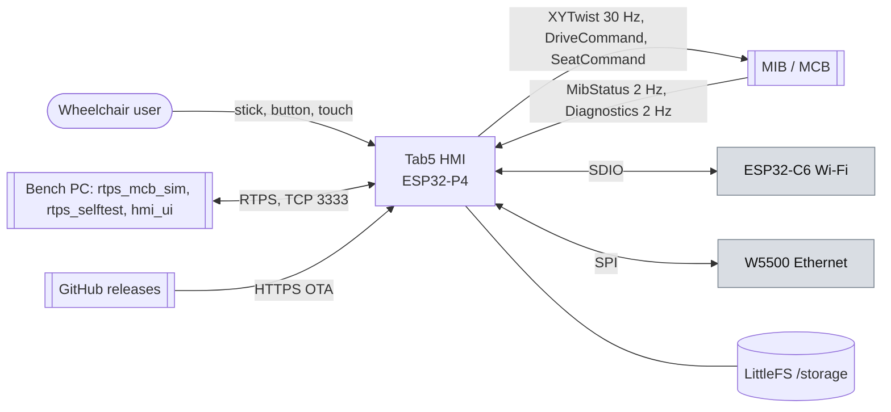
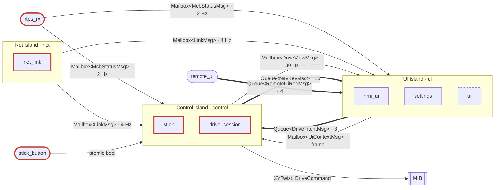
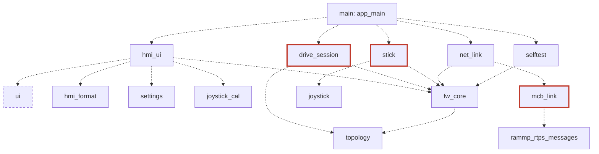

# Plan: bring pace-hmi-fw to fw-standards v0.2

Status: **draft for approval, revised after two adversarial reviews** (Part A, 2026-10-06 01:55). Branch `dev_refactor` at e2047a4.
Standards: `fw-standards` dev a132375 (CORE, CODING_SPEC, TESTING_SPEC, AI_SPEC v0.2).
Written for: the firmware owner, reviewing before an unattended overnight run, and the agents
that execute it.

## 0. Summary

- The code works on the bench: baseline build passes (1 third-party warning, 4,398,912 B binary),
  self test 56/0/1 PASS on board 2, UI contract OK (147 assumptions).
- It is far from the standards. One 6,405-line `main.cpp` holds about 470 statics, a 1,575-line
  `app_main` and every screen. A global recursive `lvgl_mutex` is taken by 7+ tasks, there are no
  islands, channels, tests or POST, and 5 detached `std::thread`s run.
- It also has **safety gaps that are behaviour, not structure** (§3): the HMI unlocks on an
  ENABLED it never asked for, there is no POST before motion, an open-circuit stick reads as full
  deflection, and the stick gate depends on the UI task staying alive. Tonight's refactor
  **preserves** that behaviour and pins it with tests. Fixing it is a behaviour change that needs
  two human approvals, so the fixes are written as parked proposals (§3.3).
- Tonight, merged if checks pass: tooling and the ratchet baseline, a host L1 runner, a
  binary-guarded split of `main.cpp` into one-TU fragments, the `fw_core` helpers, `hmi_format`,
  the selftest table, and the dead `sample_ui_*` files.
- Pushed as drafts for your review: topology, settings, joystick_cal, and the two safety
  extractions (`drive_session`, `stick`) against re-derived as-is tables.
- Cut: the RTPS→UI mailbox (§4, step 12).

## 1. Audit: top gaps by rule, safety first

C = confirmed in code by the auditor and spot-checked by the orchestrator; S = suspected.

| # | Rule | Gap | Where | |
| --- | --- | --- | --- | --- |
| H1 | CS-SAF-03 | An ENABLED that this HMI never asked for unlocks it, and the stick drives about 1.3 s later: after a link blip, after an HMI reset, or on a late grant. The comment says this is deliberate ("asked or not") | `main.cpp:1558-1586` | C |
| H2 | CS-SAF-03, TS-POST-01/04 | No boot POST, and nothing gates motion on POST or on the reset reason; no DISABLE is sent at boot | `main.cpp:5200-5205`, `3418` | C |
| H3 | CS-SAF-03, CS-ERR-04 | Stick raw mV outside the calibration is clamped to ±1, so an open or shorted pot reads as full deflection; no plausibility check | `range_mapper.hpp:195` via `main.cpp:6131` | C |
| H4 | CS-SAF-04, CS-OWN | The stick gate `stick_drives` is written only by the UI task. A stalled LVGL task keeps live stick values flowing; the ADC task checks neither link age nor MIB state | `main.cpp:3418`, `6227` | C |
| H5 | CS-SAF-03 | Link loss and an unrequested stop never send DISABLE; `drive_request` stays ENABLE, and a later profile click re-sends it | `main.cpp:1589-1606`, `582-589` | C |
| H6 | CS-SAF-03 | DriveCommand and SeatCommand are one-shot BEST_EFFORT, with the result ignored; a lost DISABLE is never re-sent | `main.cpp:1540`, `rtps_comms.cpp:125-152` | C |
| H7 | CS-SAF-01 | Any RTPS peer can start a self test. Its overlay suppresses the exit hold while the stick still drives | `rtps_comms.cpp:160-167`, `selftest.cpp:1209`, `main.cpp:1794` | C |
| H8 | CS-ERR-04 | A NaN or huge seat value from the MIB is UB in `seat_raw`; one press then commands the axis to its min or max. Unknown seat value steps from `min` | `hmi_rtps_spec.hpp:90-94`, `main.cpp:2531-2536` | C |
| H9 | CS-SAF-03 | An ADC read failure stops XYTwist instead of sending neutral, and isn't shown | `main.cpp:6110` | C |
| H10 | CS-SAF-02 | No neutral-stick check before ENABLE or before the gate opens; seat presses not gated on `seat_ready` | `main.cpp:1652`, `3418`, `1979` | C |
| H11 | CS-SAF-06, CS-CON | No task watchdog on any app task; ADC task at priority 0, unpinned, 1,496 B stack free; TWDT fired on `main` at 8 s into boot (board 2) (corrected 2026-10-06: measured prio 5 via the pthread default, core picked by first FPU use; see hazard-fixes C4) | `main.cpp:6248`; boot log | C |
| H12 | CS-SAF-03 | A reset or panic is never shown (`esp_reset_reason` unread); battery "78%" and range "19 mi" are permanent placeholders | `ui_comp_topbar.c:42`, `ui_DriveScreen.c:189` | C |
| H14 | CS-SAF, CS-OWN-09 | The stick-button bit reaches XYTwist only after the Button task takes `lvgl_mutex` (held for a whole render, ~100 ms): up to 3 ADC cycles late | `main.cpp:856-865` | C |
| H15 | CS-UI-02 | `app_main` builds the UI without the lock (5050–5800) while the side-button and GPIO48 tasks are already live: a press during boot can corrupt LVGL's lists | `main.cpp:5003`, `5329`, `743`, `856` | C |
| H16 | CS-OWN-01 | The audio stream buffer has three writers (touch, UI, rtps_worker via banner sounds) and no lock; a FreeRTOS stream buffer allows one | `audio.cpp:289` | C |
| H13 | CS-SAF-01, CS-LAY-09 | The remote UI (bench only) has no auth and can press the stick button; nothing stops it in a release build | `remote_ui.cpp:300` | C |
| G1 | CS-OWN-01..12, CS-UI-02 | No islands or channels; `lv_*` from 7+ tasks under a recursive mutex; RTPS rx blocks on it for a frame | `main.cpp:76` + 47 sites | C |
| G2 | CS-ERR-02 | About 45 unchecked `esp_*` results | `rtps_comms.cpp`, `github_ota.cpp` | C |
| G3 | CS-CON-01, CS-CMP-04 | 5 detached `std::thread`, 1 `xTaskCreate`, 6 `vTaskDelay`, 23 `sleep_for` | see the build audit | C |
| G4 | CS-FIL-01, CS-LAY-01 | `main.cpp` 6,405 lines, `app_main` 1,575, `selftest.cpp` 1,294 | | C |
| G5 | CS-LNG-02, CS-FMT-02 | No `fw_component_options`; `CMAKE_CXX_STANDARD` after `project()`; cppcheck `--std=c++17`; no clang-tidy | `CMakeLists.txt:57`, `static_analysis.yml:32` | C |
| G6 | TS-LVL L0–L2 | No unit or host tests; the UI contract is not in CI; the remote-UI variant is never built in CI | | C |
| G7 | CS-LAY-04/05, CS-UI-01 | Export not under `generated/`; hand-edited `ui_events.cpp` inside it; vendored BSP and joystick have no README with changes | `components/ui`, `components/*` | C |
| G8 | CS-CFG-02 | `settings.txt` unversioned; a bad token stops parsing silently; a failed mount formats `/storage` silently | `settings.cpp:70`, `file_system.cpp:352` | C |
| G9 | CS-MEM-01 | 2 raw `new`, 13 `heap_caps_*` outside the allocator shim | | C |
| G10 | CS-TYP-03 | X-macro spec tables; `kActionRun` is a parallel array | `*_spec.h` | C |
| G11 | CS-LAY-10 | Dead: `sample_ui_*.c` (7 files), `drive_text_subject`, the ThorVG workaround | | C |
| G12 | TS-POST-05 | Self-test lines are not the fixed format | `selftest.cpp:852-868` | C |

## 2. Target design

### 2.1 Islands and adapters

| Task | Role | Owns | Period / trigger | Safety |
| --- | --- | --- | --- | --- |
| `ui` | island | LVGL, every screen model and view, subjects, settings (in RAM) and their persistence requests, haptics and audio feedback | `lv_timer` drain before each frame, 8 ms | no (but shows faults) |
| `control` | island | stick pipeline, drive session, motion gate, seat gate, the motion publishers | 33 ms (30 Hz, today's ADC rate) | **yes** |
| `net` | island | link bring-up (Wi-Fi/Ethernet/DHCP), the RTPS participant lifecycle and link state | event-driven, 250 ms tick | yes (link state) |
| `selftest` | island, on demand | one self-test run (and boot POST) | on request | POST gates motion |
| `ota` | island, on demand | one release list or install | on request | no |
| `wifi_scan` | island, on demand | one Wi-Fi scan or join for the Internet screen | on request | no |
| `fw_hash` | island, on demand | the firmware SHA-256 | once at boot | no |
| `stick_button` | adapter | — : GPIO48 edge → `StickButtonCh` | ISR edge | yes |
| `rtps_rx` (espp `rtps_worker`, foreign) | adapter | — : decode, validate → `McbStatus*Ch`, `DiagCh`, `HmiCommandCh`, `BrightnessCh` | per sample | yes |
| `remote_ui` | adapter, test builds only | — : TCP 3333 lines → `RemoteUiReqCh`; replies from `RemoteUiRepCh` | per line | bench only |
| `log_hook` (vprintf on any task) | adapter | — : log bytes → `LogRingCh` | per write | no |
| `side_button`, `touch` | adapters | — : edges and points → `UiInputCh` | ISR / poll | no |
| `housekeeping` | island | IMU, battery (INA226), RTC; replaces the "Data Display Task" | 20 ms today; 1 Hz target | no |


The "Data Display Task" (`main.cpp:5891`, 6 KB, prio 10, core 1) reads the IMU, battery and RTC and
also draws demo lines on the hidden boot screen. Only the demo drawing is dead.

### 2.2 Draft `topology.hpp` (pure C++, no FreeRTOS includes)

```cpp
#pragma once
// components/topology/include/topology.hpp: DRAFT, for review. People own this file (CS-OWN-13).
#include <array>
#include <cstddef>
#include <cstdint>
#include <string_view>
#include "rates_constants.hpp"   // UPPER_CASE rates and depths, no dependencies
#include "messages.hpp"          // every Message type below

namespace hmi::topo {

enum class Task : uint8_t { UI, CONTROL, NET, SELFTEST, OTA, WIFI_SCAN, FW_HASH,
                            STICK_BUTTON, RTPS_RX, REMOTE_UI, LOG_HOOK, SIDE_BUTTON, TOUCH };
enum class Role : uint8_t { ISLAND, ADAPTER };
enum class Start : uint8_t { BOOT, ON_DEMAND };
enum class Kind : uint8_t { MAILBOX, QUEUE, ATOMIC, CONST };
enum class Full : uint8_t { OVERWRITE, DROP_NEWEST_COUNT, BLOCK_TIMEOUT, RAISE_FAULT };

struct TaskRow { Task id; std::string_view name; Role role; uint32_t stack; uint8_t prio;
                 int8_t core; bool safety; Start start; };
struct ForeignTaskRow { std::string_view name; Start start; };
struct ComponentRow { std::string_view name; Task task; };
struct ChannelRow { std::string_view id; Kind kind; std::string_view message;
                    Task producer; Task consumer; uint32_t rate_or_depth; Full full; };

// Stacks and priorities are today's values or placeholders marked TBD until the stress test
// measures them (CS-MEM-04). Priorities: control above ui so an LVGL stall can't starve it.
inline constexpr std::array TASKS{
  TaskRow{Task::UI,           "ui",           Role::ISLAND,  16384, 20, 1,  false, Start::BOOT},
  TaskRow{Task::CONTROL,      "control",      Role::ISLAND,   6144, 22, 0,  true,  Start::BOOT},
  TaskRow{Task::NET,          "net",          Role::ISLAND,   6144,  5, -1, true,  Start::BOOT},
  TaskRow{Task::SELFTEST,     "selftest",     Role::ISLAND,   8192,  4, -1, true,  Start::ON_DEMAND},
  TaskRow{Task::OTA,          "ota",          Role::ISLAND,   8192,  3, -1, false, Start::ON_DEMAND},
  TaskRow{Task::WIFI_SCAN,    "wifi_scan",    Role::ISLAND,   6144,  3, -1, false, Start::ON_DEMAND},
  TaskRow{Task::FW_HASH,      "fw_hash",      Role::ISLAND,   4096,  1, -1, false, Start::ON_DEMAND},
  TaskRow{Task::STICK_BUTTON, "Button",       Role::ADAPTER,  4096,  5, -1, true,  Start::BOOT},
  TaskRow{Task::REMOTE_UI,    "remote_ui",    Role::ADAPTER, 16384,  3, -1, false, Start::BOOT},
  TaskRow{Task::SIDE_BUTTON,  "side_button",  Role::ADAPTER,  4096,  5, -1, false, Start::BOOT},
  TaskRow{Task::TOUCH,        "touch",        Role::ADAPTER,  4096,  5, -1, false, Start::BOOT},
};
// RTPS_RX and LOG_HOOK run on foreign tasks; they are listed so CHANNELS can name them.
inline constexpr std::array FOREIGN_TASKS{
  ForeignTaskRow{"rtps_worker", Start::BOOT},  ForeignTaskRow{"main", Start::BOOT},
  ForeignTaskRow{"IDLE0", Start::BOOT},        ForeignTaskRow{"IDLE1", Start::BOOT},
  ForeignTaskRow{"ipc0", Start::BOOT},         ForeignTaskRow{"ipc1", Start::BOOT},
  ForeignTaskRow{"esp_timer", Start::BOOT},    ForeignTaskRow{"sys_evt", Start::BOOT},
  ForeignTaskRow{"tiT", Start::BOOT},          // lwIP
  // esp_hosted, Wi-Fi, W5500 and espp socket tasks: filled from a real boot (TS-DET-09).
};
inline constexpr std::array COMPONENTS{
  ComponentRow{"hmi_ui", Task::UI},          ComponentRow{"stick", Task::CONTROL},
  ComponentRow{"drive_session", Task::CONTROL}, ComponentRow{"net_link", Task::NET},
  ComponentRow{"selftest", Task::SELFTEST},  ComponentRow{"github_ota", Task::OTA},
  ComponentRow{"settings", Task::UI},        ComponentRow{"log_capture", Task::UI},
};
inline constexpr std::array CHANNELS{
  // MCB → HMI. Fan-out = one mailbox per consumer.
  ChannelRow{"MCB_TO_CONTROL", Kind::MAILBOX, "McbStatusMsg",  Task::RTPS_RX, Task::CONTROL, MIB_STATUS_HZ, Full::OVERWRITE},
  ChannelRow{"MCB_TO_UI",      Kind::MAILBOX, "McbStatusMsg",  Task::RTPS_RX, Task::UI,      MIB_STATUS_HZ, Full::OVERWRITE},
  ChannelRow{"DIAG",           Kind::MAILBOX, "DiagMsg",       Task::RTPS_RX, Task::UI,      DIAG_HZ,       Full::OVERWRITE},
  ChannelRow{"HMI_COMMAND",    Kind::QUEUE,   "HmiCommandMsg", Task::RTPS_RX, Task::UI,      HMI_COMMAND_DEPTH, Full::DROP_NEWEST_COUNT},
  ChannelRow{"BRIGHTNESS",     Kind::MAILBOX, "BrightnessMsg", Task::RTPS_RX, Task::UI,      0,             Full::OVERWRITE},
  ChannelRow{"LINK_TO_CONTROL",Kind::MAILBOX, "LinkMsg",       Task::NET,     Task::CONTROL, NET_TICK_HZ,   Full::OVERWRITE},
  ChannelRow{"LINK_TO_UI",     Kind::MAILBOX, "LinkMsg",       Task::NET,     Task::UI,      NET_TICK_HZ,   Full::OVERWRITE},
  // UI ↔ control. Intents that must not be lost are queued (CS-OWN-04).
  ChannelRow{"DRIVE_INTENT",   Kind::QUEUE,   "DriveIntentMsg", Task::UI,     Task::CONTROL, DRIVE_INTENT_DEPTH, Full::RAISE_FAULT},
  ChannelRow{"SEAT_REQUEST",   Kind::QUEUE,   "SeatRequestMsg", Task::UI,     Task::CONTROL, SEAT_REQUEST_DEPTH, Full::DROP_NEWEST_COUNT},
  ChannelRow{"UI_CONTEXT",     Kind::MAILBOX, "UiContextMsg",   Task::UI,     Task::CONTROL, UI_FRAME_HZ,   Full::OVERWRITE}, // screen, menu, overlay, heartbeat
  ChannelRow{"STICK_SETTINGS", Kind::MAILBOX, "StickSettingsMsg", Task::UI,   Task::CONTROL, 0,             Full::OVERWRITE},
  ChannelRow{"DRIVE_VIEW",     Kind::MAILBOX, "DriveViewMsg",   Task::CONTROL, Task::UI,     CONTROL_HZ,    Full::OVERWRITE},
  ChannelRow{"STICK_VIEW",     Kind::MAILBOX, "StickViewMsg",   Task::CONTROL, Task::UI,     CONTROL_HZ,    Full::OVERWRITE},
  ChannelRow{"NAV_KEY",        Kind::QUEUE,   "NavKeyMsg",      Task::CONTROL, Task::UI,     NAV_KEY_DEPTH, Full::DROP_NEWEST_COUNT},
  ChannelRow{"STICK_BUTTON",   Kind::ATOMIC,  "bool",           Task::STICK_BUTTON, Task::CONTROL, 0,       Full::OVERWRITE},
  ChannelRow{"BUTTON_EVENT",   Kind::QUEUE,   "ButtonEdgeMsg",  Task::STICK_BUTTON, Task::UI, BUTTON_DEPTH, Full::DROP_NEWEST_COUNT},
  // Tools, workers and logs → UI.
  ChannelRow{"UI_INPUT",       Kind::QUEUE,   "UiInputMsg",     Task::SIDE_BUTTON, Task::UI, UI_INPUT_DEPTH, Full::DROP_NEWEST_COUNT},
  ChannelRow{"REMOTE_UI_REQ",  Kind::QUEUE,   "RemoteUiReqMsg", Task::REMOTE_UI, Task::UI,  REMOTE_DEPTH,  Full::BLOCK_TIMEOUT},
  ChannelRow{"REMOTE_UI_REP",  Kind::QUEUE,   "RemoteUiRepMsg", Task::UI, Task::REMOTE_UI,  REMOTE_DEPTH,  Full::BLOCK_TIMEOUT},
  ChannelRow{"SELFTEST_REQ",   Kind::QUEUE,   "SelfTestReqMsg", Task::UI, Task::SELFTEST,   1,             Full::DROP_NEWEST_COUNT},
  ChannelRow{"SELFTEST_EVENT", Kind::QUEUE,   "SelfTestEventMsg", Task::SELFTEST, Task::UI, SELFTEST_DEPTH, Full::DROP_NEWEST_COUNT},
  ChannelRow{"POST_RESULT",    Kind::ATOMIC,  "PostVerdict",    Task::SELFTEST, Task::CONTROL, 0,          Full::OVERWRITE},
  ChannelRow{"OTA_EVENT",      Kind::QUEUE,   "OtaEventMsg",    Task::OTA, Task::UI,        OTA_DEPTH,     Full::DROP_NEWEST_COUNT},
  ChannelRow{"WIFI_EVENT",     Kind::QUEUE,   "WifiEventMsg",   Task::WIFI_SCAN, Task::UI,  WIFI_DEPTH,    Full::DROP_NEWEST_COUNT},
  ChannelRow{"LOG_RING",       Kind::QUEUE,   "LogChunkMsg",    Task::LOG_HOOK, Task::UI,   LOG_DEPTH,     Full::DROP_NEWEST_COUNT},
};
static_assert(validate(TASKS, FOREIGN_TASKS, COMPONENTS, CHANNELS));  // in topology_validate.hpp

using McbToControlCh = Channel<"MCB_TO_CONTROL", McbStatusMsg>;
// … one `using` per row, generated by hand in the same order.

} // namespace hmi::topo
```

Open points in the draft (for review, not decided tonight):
- Motion publishers: `control` calls an injected `MotionPublisher` (espp RTPS writer; its locks
  are espp's own, CS-OWN-08 allows that). The alternative is a queue to `net`, which costs one
  hop of latency.
- `McbStatusMsg` must be trivially copyable and ≤128 B: the adapter copies the three wire
  strings into fixed `char[32]` fields and validates every enum and float (H8).
- `validate()` rejects: a duplicate id, a dangling task, producer == consumer, and any
  `DROP_*` queue into a `safety` task (DRIVE_INTENT is RAISE_FAULT for that reason).

### 2.3 Components, one concern each

| Component | Owns (one sentence) | Task | Safety | Host L1 | From |
| --- | --- | --- | --- | --- | --- |
| `fw_core` | the channel helpers, `Message`, `ThreadChecker`, `Owned<T>`, `check()` and the context base | — | used by safety | yes | new |
| `topology` | the task, component and channel tables and their validation | — | yes | yes | new |
| `hmi_format` | pure text formatting for the screens (speed, steppers, seat, clock, diagnostics) | ui | no | yes | `main.cpp` |
| `settings` | the persisted settings: spec table, codec, validation, defaults | ui | no (holds stick settings) | yes | `settings.*`, `settings_spec.h` |
| `joystick_cal` | the calibration record: codec, plausibility, the calibration run as a model | ui | yes (feeds the stick) | yes | `joystick_cal.cpp` |
| `stick` | stick pipeline: raw mV → validated, scaled command, with dead band and staleness | control | **yes** | yes | `main.cpp:6089-6246`, `components/joystick` |
| `drive_session` | the drive/lock state machine and the motion gate | control | **yes** | yes | `main.cpp:1509-1725`, `3418` |
| `mcb_link` | decode and validate MIB messages into Messages; link-state classification | rtps_rx / net | **yes** | yes | `rtps_comms.cpp:160-222`, `869-882` |
| `net_link` | Wi-Fi/Ethernet/DHCP bring-up and the RTPS participant | net | yes | no (board) | `rtps_comms.cpp` |
| `selftest` | the check table, POST and the extended self test | selftest | yes (POST gates) | table + evaluate | `selftest*.{cpp,h}` |
| `hmi_ui` | screen models and views, navigation, chrome | ui | shows faults | models yes | `main.cpp`, `*_ui.cpp` |
| `ui` (generated) | the SquareLine export, in `generated/` | ui | no | n/a | `components/ui` |
| `haptics` | DRV2605 and DA7280 drivers and the feedback patterns | ui | no | no | `da7280.hpp`, `main.cpp:4437-4750` |
| `github_ota` | release list and install | ota | no | parser yes | `github_ota.cpp` |
| `remote_ui` | the bench debug channel | remote_ui | bench only | parser yes | `remote_ui.cpp` |
| `log_capture` | the boot and runtime log ring | log_hook / ui | no | ring yes | `log_capture.cpp`, `log_view.cpp` |

### 2.4 Safety state machines (transition tables)

#### A. Drive session: as-is, first draft (incomplete: see §3.1; re-derived before any extraction)

States: `LOCKED`, `ASKING` (ENABLE sent, waiting), `UNLOCKING` (1 s unlock animation),
`DRIVING`, `EXITING` (DISABLE sent, waiting 750 ms), `EXIT_REFUSED` (exit latched, still enabled).
`driving_ok` = link CONNECTED and MIB ENABLED. `mcb_ready` = CONNECTED and MIB in IDLE or ENABLED.

| from | input | guard | to | action |
| --- | --- | --- | --- | --- |
| LOCKED | HOLD_DONE (1.5 s) | mcb_ready | ASKING | send ENABLE; warn at +750 ms, give up at +2 s |
| LOCKED | HOLD_EARLY (≥500 ms) | !mcb_ready | LOCKED | show REFUSED_DRIVE 3 s; refusal sound |
| LOCKED | MIB_UPDATE | driving_ok | UNLOCKING | **unlock with no request (H1)** |
| ASKING | MIB_UPDATE | driving_ok | UNLOCKING | clear deadlines |
| ASKING | TICK | now ≥ warn | LOCKED | show NOT_GRANTED |
| LOCKED | TICK | now ≥ give_up | LOCKED | send DISABLE |
| UNLOCKING | TICK | 1 s elapsed | DRIVING | load Drive; gate opens if no menu |
| UNLOCKING, DRIVING | MIB_UPDATE | !driving_ok, !exit_requested | LOCKED | gate closes; show DRIVE_LOST (link) or DRIVE_STOPPED (MIB); **no DISABLE (H5)** |
| DRIVING | HOLD_DONE or MENU_KEY_EXIT | no menu, no self-test overlay | EXITING | send DISABLE; deadline +750 ms |
| EXITING | MIB_UPDATE | !driving_ok | LOCKED | menu if requested from the menu |
| EXITING | TICK | now ≥ deadline, driving_ok | EXIT_REFUSED | show EXIT_REFUSED 2 s; **no resend (H6)** |
| EXIT_REFUSED | MIB_UPDATE | !driving_ok | LOCKED | as EXITING |
| any unlocked | SELFTEST_OVERLAY | — | same | **exit hold ignored, stick still live (H7)** |
| DRIVING | MENU_OPEN / MENU_CLOSE / SCREEN_CHANGE | — | DRIVING | gate = (screen is Drive and no menu) |

Gate (as-is): `stick_drives = !locked && screen == Drive && menu closed`. Stick scale =
`calibrating || !stick_drives ? 0 : drive_speed / 10`.

#### B. Link (as-is)

| from | input | guard | to | action |
| --- | --- | --- | --- | --- |
| boot | NET_INIT_FAIL | — | NET_FAILED | **terminal, no retry** |
| LINK_DOWN | LINK_UP | — | NO_IP | |
| NO_IP | GOT_IP | — | NO_PEER | ping the gateway, start the participant |
| NO_PEER | MIB_STATUS | age < 2000 ms | CONNECTED | |
| CONNECTED | TICK | age ≥ 2000 ms | NO_PEER | UI sees it ≤ 250 ms later |
| any | LINK_LOST / IP_LOST | — | LINK_DOWN / NO_IP | |
| NO_PEER | PARTICIPANT_START_FAIL | — | NO_PEER | **shown as "MIB not answering", forever** |

#### C. Seat gating (as-is)

| from | input | guard | to | action |
| --- | --- | --- | --- | --- |
| HOME | OPEN_SEAT | mcb_ready | SEAT | |
| HOME | OPEN_SEAT | !mcb_ready | HOME | REFUSED_SEAT |
| SEAT | PRESS(axis, ±) | **none (H10)** | SEAT | send target = clamp(known value or **min (H8)** ± step) |
| SEAT | MIB_UPDATE | !mcb_ready | HOME | REFUSED_SEAT |

The proposed tables (with H1–H10 fixed) are in §3.3. They are proposals, not tonight's work.

### 2.5 Diagrams

D1 Context (hand-written):



D2 Islands (target; generated from `topology.hpp` once it exists):



D3 Components (target; generated from `project_description.json` once they exist):



## 3. Safety

### 3.1 Rule for tonight

- Every safety step is **refactor only**. No safety behaviour changes tonight, H1–H16 included.
- **The §2.4 tables are not yet an oracle.** The safety review (R-S F1, F2) showed two problems:
  - Table A misses about 9 rows that live in hidden flags: `lock_waiting`, three deadlines,
    `exit_requested`, `then_menu`, `joy_button_armed`, screen, menu, `drive_request`.
  - Its input is a 250 ms TICK that samples (link, state) from `rtps_poll_cb`, not a MIB_UPDATE
    event.
- The orchestrator therefore re-derives the tables before any safety extraction:
  - from the code, not the comments;
  - with a hidden-variable column, and TICK(link, state, now) as the input;
  - committed as `constexpr` data in `components/drive_session/include/drive_session_table.hpp`,
    on their own commit.
- **The agent that writes the extraction never edits that file** (CORE never-list:
  declarations). A script fails the branch if its diff touches it (R-S F7).
- The tables are AI-derived and unreviewed, so the safety extractions (step 11) are **pushed
  drafts, not merged** (Q4 default). You review the tables in the morning; merging follows.

### 3.2 Characterisation and guards

| Guard | What it catches | Verdict by |
| --- | --- | --- |
| Oracle test over every (state, input, guard) of the reviewed table, at 100% branch coverage | a logic change in the extraction | `tests/run.py` |
| Golden vectors for the stick pipeline, replayed bit-exact. The gate is a multiply today (`x * 0`, so a NaN gets through); that is pinned, not "cleaned up" (R-S F12) | a math change | `tests/run.py` |
| Same call sites and task as today (the gate is still written on the UI task, the pipeline still runs in the ADC task); no blocking lock in the ADC path | a timing or context change | grep in `tools/l0/` |
| "Read ADC" free stack ≥ baseline (1,496 B); the sim's XYTwist p99 inter-arrival ≤ baseline + 5 ms | stack and latency regressions (R-S F11) | `tools/bench/compare_selftest.py` against the baseline JSON |
| Board scenario B5 | link and lock wiring | `tools/bench/scenario_drive.py` |

**Limit, stated plainly:** at rest the stick is inside the dead band, so XYTwist is near zero
whether the gate is open or shut. The bench cannot see a gate regression tonight (R-S F3). A
test-only Kconfig raw-mV injection at the ADC boundary would fix that. It is parked as a proposal,
because it changes safety code.

### 3.3 Proposed fixes (parked: behaviour changes, two approvals each)

| Fix | Proposed table change |
| --- | --- |
| H1 | LOCKED + TICK(driving_ok) with no outstanding request → stay LOCKED, send DISABLE, show "MIB enabled without a request" |
| H2 | New state `POST_PENDING` before LOCKED. Holds are ignored until POST PASS and link CONNECTED. DISABLE is sent once at boot |
| H3 | `stick`: raw outside [cal_min − margin, cal_max + margin] → `STICK_FAULT`, neutral until back in the dead band for N cycles |
| H4 | `control` owns the gate. It also requires a `UiContextMsg` heartbeat younger than 200 ms and a MibStatus younger than its timeout |
| H5/H6 | Every transition to LOCKED sends DISABLE, re-sent every 250 ms until the MIB leaves ENABLED |
| H7 | Remote self-test runs are refused unless LOCKED |
| H8 | `mcb_link` validator: a non-finite or out-of-range seat value → unknown; seat presses are refused while unknown |
| H9 | Invalid ADC cycle → publish neutral and count; 3 in a row → `STICK_FAULT`, shown |
| H10 | ENABLE only after the stick has been in the dead band for 300 ms. Seat presses gated on `seat_ready`, from Bench → Actuators and Skunk Works too (R-S F10) |
| H14 | Store the stick-button level before any UI work; the UI half becomes a queued event |
| H15 | Build the UI before starting the side-button and GPIO48 tasks |
| H16 | One audio writer, the UI island; other tasks queue a sound request |
| Link | Clear `last_status_us` on link loss. A rebind that clears `peer_matched` shows NO_PEER (R-S F9) |

## 4. Migration steps (revised after the two reviews)

Every step follows the same sequence:
1. characterisation tests;
2. the change;
3. build + L0 + L1;
4. its own diagram file (`docs/diagrams/<component>.mmd`, assembled by the orchestrator);
5. a commit with the walkthrough in its message.

A refactor and a behaviour change are never in one commit.

**Cut line:** merge 0, 1, 2, 4, 3, 5, 7, 9, 13. Push 6, 8, 10, 11 as drafts. Step 12 is cut.

| # | Step | Branch | Owner (files) | Merge rule |
| --- | --- | --- | --- | --- |
| 0 | Commit `CLAUDE.md`, the profile, this plan and `tests/characterisation/baseline-e2047a4/`. `main/CMakeLists.txt` gets one requirement per line | `dev_refactor` | orchestrator | commit |
| 1 | Tooling (detail in §4.2) | `dev_ai_refactor_tooling` | agent T: root `CMakeLists.txt`, `.github/`, `tools/l0/`, `.clang-tidy`, `suppressions.txt`, `.pre-commit-config.yaml` | build + L0 locally; the CI result too, if it is back in time |
| 2 | Host test runner: `tests/run.py`, `tests/manifest.d/*.yaml` and a Makefile per app. WSL g++ 13 with `-fsanitize=address,undefined --coverage`; Unity from `C:\esp\v6.0\esp-idf\components\unity`. The first app ports the 19 asserts of `joystick_selftest` | `dev_ai_refactor_testrunner` | agent R: `tests/`, `components/joystick/test/` | L1 passes |
| 4 | Ratchet baseline, taken **before** the split (R-S F13): per-file grep metrics; `main` warnings with the full flag set, from one throwaway `-Wno-error` build; clang-tidy per check. `main.cpp` and its fragments count as one unit | `dev_refactor` | orchestrator | `ratchet.py check` passes |
| 3 | **Split by fragments** (see §4.1) | `dev_ai_refactor_split` | **orchestrator alone**: `main/main.cpp` and the new `main/frag_*.inc` | binary guard + build + B0–B4 PASS. Timebox 04:30, then parked |
| 5 | `fw_core`: `Message`, `Mailbox`, `Queue`, atomic channel, `ThreadChecker`, `Owned<T>`, `check()`, the context base, and a host shim for FreeRTOS queues. TS-UNIT-05 and must-not-compile tests | `dev_ai_refactor_fwcore` | agent C: `components/fw_core/` | L1 + must-not-compile tests + IDF build |
| 7 | `hmi_format`: `StepperSpec` and every formatter (`speed_display_tenths`, `stepper_format`, `seat_format`, `link_text`, clock), with golden tables taken from today's code. `lv_snprintf` is stubbed on the host, and the stub has its own golden test | `dev_ai_refactor_format` | agent F: `components/hmi_format/`, `main/frag_format.inc` | L1 + build + walk names equal |
| 9 | `selftest`: X-macro → `constexpr std::array` + `evaluate()`, with the same output lines. The parsers in `scripts/rtps_selftest.py` (`_ROW_RE`, line 47) and `rtps_mcb_gui.py:623` change in the same commit. Parity test | `dev_ai_refactor_selftest` | agent E: `main/selftest_spec.h`, `selftest.cpp`, those two scripts | L1 + B3 PASS, run from the same tree |
| 13 | Delete `sample_ui_*.c/.h` (7 + 7 files) and their include at `main.cpp:41`. The other dead code waits | `dev_ai_refactor_dead` | agent X: those files. The orchestrator applies the one `main.cpp` line | build + walk names equal |
| 6 | `topology` draft: the §2.2 tables, `validate()`, must-not-compile tests; not wired into the firmware | `dev_ai_refactor_topology` | agent P: `components/topology/` | **draft, pushed** |
| 8 | `settings`: table → `constexpr std::array`, codec + hostile-input tests, the same file format; a round-trip of board 2's real `settings.txt` | `dev_ai_refactor_settings` | agent S: `components/settings/`, `main/settings*` | **draft**: a codec regression would silently save defaults over real settings (R-S F15) |
| 10 | `joystick_cal`: codec and plausibility split from the LVGL half | `dev_ai_refactor_cal` | agent J: `components/joystick_cal/`, `main/joystick_cal*` | **draft** |
| 11 | Safety extractions, refactor only: `drive_session` (against the re-derived table) and `stick` (a pure pipeline, golden vectors) | `dev_ai_refactor_drive`, `dev_ai_refactor_stick` | agents D, K: their component plus `main/frag_drive.inc` / `main/frag_stick.inc` | **draft** (Q4) |
| 12 | RTPS rx → mailbox | — | — | **cut**: not a pure refactor (R-S F8) |

### 4.1 Step 3: split by fragments

- **What stays.** `app_main` and its lambdas stay in `main.cpp`, because the lambdas capture
  `app_main` locals (R-F 5, R-S F5).
- **What moves.** Everything else moves, by line range, into `main/frag_<area>.inc` files.
  `main.cpp` then includes them in the original order. A comment line separates each include, so
  that later edits to neighbouring includes don't conflict.
- **Why it is safe.** It stays **one translation unit**, so static-init order, linkage, ODR and
  inlining cannot change (R-S F6, R-F 6).
- **How it's done.** `tools/split_main.py` reads a reviewed range→file map. It is re-run from
  pristine `main.cpp`; its outputs are never hand-patched.
- **Fragments.** `frag_fps`, `frag_haptics`, `frag_status_band`, `frag_format` (with
  `StepperSpec`), `frag_brightness_clock`, `frag_button_hold`, `frag_lock`, `frag_drive` (the
  session and the gate), `frag_seat`, `frag_bench_pin`, `frag_settings_ui`, `frag_actions`,
  `frag_diag`, `frag_nav`, `frag_overdraw`, `frag_screens_on_demand`, `frag_display_flip`,
  `frag_da7280_test`, `frag_audio`. The final range map is built from the function list in Part B.
- **Guard (scripted).**
  1. Every original line lands exactly once, in order: concatenating the fragments reproduces
     `main.cpp` with the include lines removed.
  2. The `.text`, `.rodata`, `.data` and `.bss` sizes equal the baseline.
  3. The `nm -C` symbol set is equal.
  4. The only `.rodata` differences are `__LINE__`/`__FILE__` strings and the app descriptor.
- **Deviation.** `.inc` fragments are not a CS-LAY layout. They are temporary: the fragments
  are dissolved into components grouped by concern (CS-LAY-02), not one component per fragment;
  the target map is in [app-main-shrink.md](app-main-shrink.md), revision V15 (owner, 2026-10-06).

### 4.2 Step 1: tooling

- `cmake/fw_standards.cmake`: a copy from fw-standards; the profile records where it came from.
- `.clang-tidy`: excludes `ui`, `m5stack-tab5`, `joystick` and `boot_logo.c`.
- CI jobs:
  - cppcheck with `--std=c++20`, and the action pinned to a commit;
  - `ui_contract.py`;
  - a bench-variant build, with the remote UI on;
  - `ratchet.py check`.
- `tools/l0/`: the ratchet, placement greps and size limits.
- New components get the full flag set. `main` keeps today's flags until its legacy counts are in
  the ratchet.

## 5. Parallel work and conflicts

- **Builds.** Agents build and test on the host only (WSL `make -j4`). The orchestrator runs every
  IDF build, one at a time (`-j16`, `IDF_CCACHE_ENABLE=1`, a shared `CCACHE_DIR`). The laptop's
  15.7 GB of RAM can't hold more (R-F 2).
- **Bench variant.** The board build uses its own directory and config:
  `idf.py -B build_bench -D SDKCONFIG=build_bench/sdkconfig -D SDKCONFIG_DEFAULTS="sdkconfig.defaults;<abs>/sdkconfig.wifi.local"`.
  Otherwise the untracked `sdkconfig` in the tree overrides the overlay (R-F 1, R-S F18). The
  board runner checks that `build_bench/config/sdkconfig.h` has `CONFIG_HMI_REMOTE_UI 1`.
- **Worktrees** sit at short paths: `C:\w\<topic>`, with builds in `C:\b\<topic>` and
  `managed_components/` copied in. Git runs with `-c gc.auto=0`, and nobody runs prune or gc: the
  worktrees share `pace-hmi-fw/.git`.
- **One owner per file.** Ownership is in §4. The other shared files:

  | File | Owner |
  | --- | --- |
  | `main/CMakeLists.txt` | orchestrator (one requirement per line) |
  | `main/main.cpp` include list | orchestrator |
  | `tests/manifest.d/<comp>.yaml` | each agent, its own file |
  | `docs/diagrams/<comp>.mmd` | each agent, its own file |
  | `main/hmi_rtps_spec.hpp` | frozen tonight (parsed by `rammp_rtps.py:165`) |

- **Merge.** The orchestrator merges with `--no-ff`, in dependency order. After each merge it runs:
  - `idf.py reconfigure`, when files were added or removed;
  - the build, L0, L1 and the UI contract.

  It re-runs the agent's L1 itself and reads the diff (AI-AGT-03). A break is fixed or reverted
  with a new commit.
- **Stop rules (AI-UNA-04).** A failure signature is (step, command, first error line). After 3
  repeats of one signature, that step is parked. A `STOP` file in the plan folder halts the run.
  Merges freeze at 06:30; the report is written by 07:00.

## 6. Board tests tonight

One runner holds the lease (`C:\Users\halai\Offline_Documents\ATDev\rammp\.board-lease`). It runs
three times: after the baseline bench build as a dry run (about 02:15), after step 3, and once on
HEAD at 06:30. Scripts decide every verdict (TS-PRI-02).

| # | Test | PASS | INVALID (decided by the preflight, before the test) |
| --- | --- | --- | --- |
| B0 | Preflight: port by MAC 80:F1:B2:D1:51:A6; partition table == build; bench config has `CONFIG_HMI_REMOTE_UI 1`; no stray `rtps_mcb_*` processes; tethering on; no MIB peer on the subnet but the sim (`rtps_net` sweep) | all true | any false. A partition-table mismatch means **no flash**: host only for the rest of the night |
| B1 | Flash. First time only: back up `/storage` with `read_flash 0xc20000 0x3e0000` (read-only; protects the calibration, R-S F15). Last-good images stay in `bench/good/<sha>/`. Flash with `esptool write_flash @flash_args`, no erase | exit 0 | port busy |
| B2 | Boot: port opened with a deliberate reset, 90 s capture. Required markers, in order: `Network: WiFi`; the joystick self test passed; `loaded /storage/joystick_cal.txt` with the baseline values; `settings/I loaded` with the baseline values; `Got IP`. Forbidden: `Guru`, `abort`, a second ROM banner | all markers, nothing forbidden | "WiFi joined" but no `Got IP` in 60 s: restart tethering once, then INVALID |
| B3 | Self test with **no sim running**: `rtps_selftest.py --json`, run from the tree that built the image, compared with the baseline JSON in bands (`compare_selftest.py`) | exit 0 and in band | no answer before the run starts |
| B4 | Screen walk with the sim (`walk_check.py`): the 13 screen names, in the baseline order. Only the static screens (Home, Drive, Seat, Bench, Settings ×2) are pixel-compared, with the clock and link areas masked. The other screens are reported, not graded | names equal; static screens equal | — (connection refused after the preflight passed is a FAIL) |
| B5 | As-is drive scenario with the sim: `ok` → hold BTN 2 s → Drive; `e` → Locked with DRIVE_STOPPED; `x` (refuse) → NOT_GRANTED. The sim's XYTwist x, y and twist stay zero while locked (button bit excluded) | as stated | — |

- **A build that doesn't boot:** re-flash last-good. If last-good gets an IP, the candidate FAILs.
  If it doesn't, the result is INVALID and the night continues host-only.
- **No USB enumeration:** board work is parked (recovery needs the BOOT button).
- **Wi-Fi flakiness** is not re-tested statistically tonight: 5 boots would cost about 10 min per
  build. One hotspot restart is allowed per run.

## 7. Spec conflicts and deviations (for the morning report)

| Rule | Conflict | Tonight |
| --- | --- | --- |
| AI-UNA-02 "Never merge" | You authorised merges into `dev_refactor` | Your decision stands (AI-DIS-01); logged |
| AI-UNA-02 / CS-SAF-05 (two approvals per safety change, refactors included) | Safety extractions would merge with none | Q4 default: drafts only |
| TS-UNIT-01, CS-HAL-04 (IDF `linux` target) | Not installed; WSL has no sudo, cmake or IDF | Q6: host-native g++ in WSL with IDF's Unity source |
| CS-LAY (layout) | Step 3's `.inc` fragments | Temporary; dissolved into components by concern (app-main-shrink.md V15) |
| CS-LNG-02 gnu++23 | IDF 6.0 defaults to gnu++26 | New components use gnu++23; `main` switches in its own commit, only if it builds clean |
| CS-NAM-01 UPPER_CASE | 217 `kCamelCase` constexprs | New code UPPER_CASE; legacy counted in the ratchet |
| AI-SES-01 | The external `@` import isn't loaded until approved | Q2; agents also get CORE.md pasted into their prompts |
| AI-AGT-01 (ask before more than 5 agents) | You set 8 | Your decision stands |
| TS-DET-04 vs "judge Wi-Fi over repeated runs" | A retry is not a verdict | The preflight decides INVALID; after it passes, a failure is FAIL |

## 8. Review log

| Review | Findings | Applied |
| --- | --- | --- |
| R-S safety and correctness (subagent, 01:45) | 19: F1–F2 table A incomplete, wrong input; F3 the gate is invisible at rest; F5–F6 split lifetimes and ODR; F7 the oracle written by the implementer; F8 step 12 not a pure refactor; F9–F19 smaller | §3.1, §3.2, §4.1, step 12 cut, §6 B0–B5, §7 |
| R-F feasibility, conflicts, flakiness (subagent, 01:50) | 25: overlay ignored by the existing `sdkconfig`; RAM for parallel builds; no scripted walk verdict; permission prompts; `app_main` lambdas; ownership collisions (formatters, gate, `CMakeLists`, diagrams); B2 marker logic; last-good recovery; worktree paths | §4 cut line, §4.1, §5, §6, Q7 |
