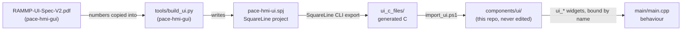
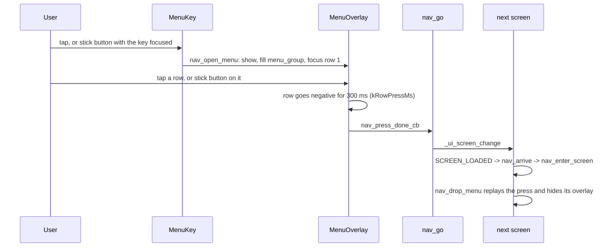
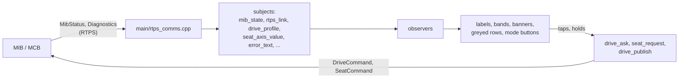

# How the UI works

This explains the HMI's user interface, from the spec PDF to a finger on the panel: where
the screens come from, how the burger menu is built and wired, how touch and the joystick
move around it, and how the chair's state reaches the screen. It is written for someone who
knows the spec and wants to know where each part of it lives in the code.

Everything below lives in `main/main.cpp` unless a file is named.

## 1. From the spec to pixels

The screens are not drawn by hand in the firmware. They are described once, in code, in
the UI repository ([pace-hmi-gui](https://github.com/rammp-org/pace-hmi-gui)), and exported
to C that the firmware compiles.



- **`tools/build_ui.py`** is the design. Every screen, component, size, font and colour is a
  line of Python with the spec's numbers in it (`build_locked`, `build_drive`,
  `build_menuoverlay`, `build_seat_axis`, ...). Running it rewrites the SquareLine project
  and, with `--export-to ../ui_c_files`, exports the C.
- **`import_ui.ps1`** (this repo) mirrors that export into `components/ui/`, converts the
  images the software renderer cannot draw, and runs **`scripts/ui_contract.py`**, which
  checks that every widget `main.cpp` reaches for still exists with the parent and text it
  expects. A menu row that moved, or a widget that was renamed, fails the import instead of
  silently binding to the wrong thing.
- **`components/ui/`** is generated. Editing it by hand is lost on the next import.
- **`main.cpp`** gives the widgets their behaviour. It finds them by name: a screen widget
  is a global `ui_<Name>` (`ui_SeatBackButton`), a widget inside a component is reached with
  `ui_comp_get_child(instance, UI_COMP_<COMPONENT>_<CHILD>)`.

The design is decoupled from the code in one direction only: `build_ui.py` can move, resize
and restyle anything freely, but renaming or removing a widget the firmware binds to needs
a matching change in `main.cpp` and in `ui_contract.py`.

## 2. What is on the panel

Every screen is 720 x 1280 and shares one layout:

| band | y | what |
| --- | --- | --- |
| TopBar | 0-55 | clock, RTPS link, battery |
| DriveBand | 55-195 | DRIVE (LOCKED / ACTIVE) and STATE; DRIVE is also the "home" button |
| body | 195-1116 | the screen's own content, 921 px |
| MenuKey | 1116-1280 | the burger key |

Two layers sit over the body, hidden until needed: the **MenuOverlay** (the burger menu)
and the **ErrorBanner** (warnings and refusals). These five pieces, TopBar, DriveBand,
ErrorBanner, MenuKey and MenuOverlay, are the *chrome*.

| screen | spec | reached from |
| --- | --- | --- |
| LockedScreen | 01 | boot; Drive row while locked; DRIVE in the band |
| DriveScreen | 02 | holding the stick button on Locked, once the MIB grants it |
| SeatScreen | 04, 04b | menu: Seat Functions |
| BenchGateScreen | - | menu: Bench (the PIN, then DEBUG ACTUATORS) |
| DiagnosticsScreen | - | menu: Diagnostics |
| JoystickScreen | - | menu: Joystick (the stick test and CALIBRATE) |
| LogScreen | - | menu: Log |
| SkunkWorksScreen | - | menu: Skunk Works |
| SettingsScreen | - | menu: UI Settings; after the PIN, DEBUG ACTUATORS |

SettingsScreen, SkunkWorksScreen and DiagnosticsScreen are built when first opened and
destroyed on the way out ("Screens built on demand" in `main.cpp`): their rows are
generated at runtime, and keeping them all resident ran internal RAM out.

## 3. The burger menu

### One component, one instance per screen

The menu is a SquareLine *component*, `MenuOverlay`, drawn by `build_menuoverlay` in
`build_ui.py`: a 720 x 921 panel with eight rows, 115 px each. Each row is a `Row<n>` panel
holding a `RowGround<n>` with a `RowLabel<n>` and a chevron.

LVGL screens are separate object trees, so a widget cannot appear on two of them. Every
screen therefore has its own instance of all the chrome, `MenuOverlay1` ... `MenuOverlay11`,
each with its own eight rows. The firmware treats them as one menu:

- **`kChrome`** (in `app_main`) lists every screen's TopBar, DriveBand, MenuKey and
  MenuOverlay.
- **`nav_attach_chrome`** wires one screen's set: the key's click and key events, and for
  each of the eight rows the click, the stick's arrows, the cursor and pressed looks, and,
  on Drive and Seat Functions, the observers that grey the row while the MCB could not act
  on it.
- **`nav_chrome[]`** remembers which key and overlay belong to which screen, so "the menu of
  the screen that is up" is one lookup (`nav_chrome_of`).

### Rows are positions, destinations are names

The menu's order is the order of `rows` in `build_menuoverlay`. The firmware mirrors it in
one enum:

```cpp
enum NavDest {
  NAV_DRIVE,    // "Drive"
  NAV_SEAT,     // "Seat Functions"
  NAV_BENCH,    // "Bench", behind the PIN gate
  ...
};
```

A row's index is its `NavDest`: `nav_row_cb` receives the index and `nav_go` switches on it.
`scripts/ui_contract.py` checks that `RowLabel<n>` still reads what the enum expects, so a
reordered export cannot open the wrong screen.

**To add, remove or reorder a row**, change all of these together:

1. `rows` in `build_menuoverlay` (pace-hmi-gui), then export and import.
2. `NavDest` and `kNavRowIds` in `main.cpp` (a new row also needs `UI_COMP_MENUOVERLAY_ROW<n>`).
3. The `case` in `nav_go`, and its line in `nav_go`'s `dest_screens` table.
4. `cui_RowLabel<n>` in `scripts/ui_contract.py`, and `MENU_ROWS` in `scripts/hmi_ui.py`.

### What happens on a pick



- A greyed row (Drive or Seat Functions while the MCB cannot act) refuses on the spot: the
  menu stays open, the refusal sounds, and the reason waits on the banner underneath.
- While **driving**, the key does not open the menu. It asks the MIB to stop
  (`drive_exit_ask(true)`), and the menu opens over the Locked screen once driving has
  actually stopped. If the MIB keeps driving, the Drive screen stays and says EXIT REFUSED.

## 4. Moving around: touch, stick and button

There are three inputs, and all of them end up as LVGL events on widgets.

| input | where it comes from | becomes |
| --- | --- | --- |
| touch | GT911, polled by LVGL | taps and presses on whatever is under the finger |
| stick | ADC task, ~30 Hz | a key (UP/DOWN/LEFT/RIGHT) for the focused widget |
| stick button | GPIO48 | a short press selects (ENTER); a hold is a gesture |

### Focus groups

The stick moves a *cursor*: LVGL's focus within a **group**. Each screen has its own group
of the widgets the stick may visit, and `nav_use_group` hands the stick that group, always
with the screen's burger key appended last, so "down past the bottom" reaches the key.

| group | screen |
| --- | --- |
| `menu_group` | the open menu: eight rows, then the key (wraps) |
| `seat_group`, `seat_adjust_group` | Seat: the function buttons; the adjustment page |
| `rd_group` | BenchGate: the PIN pad |
| `setting_group`, `actions_group`, `diag_group` | UI Settings, Skunk Works, Diagnostics |
| `log_view_group()` (`main/log_view.cpp`) | Log |
| `joystick_group` | everything else: Locked, Drive, Joystick |

`nav_arrive` runs whenever a screen comes up (SCREEN_LOADED, or by hand when a row picks
the screen already showing): it closes the menu, picks the screen's group and puts the
cursor on the first item. A backstop timer re-enters the screen if the stick is ever left
with nothing focused, and logs `nav: the stick had nothing focused` when it does.

### Grids and lists

LVGL's own focus order is a flat list, which does not match a 2-D screen. Two patterns
cover every screen:

- **Grids** (`ButtonGrid`, `grid_key_cb`): the seat pages, the PIN pad and the Skunk Works
  tiles. Each keeps a row/column cursor and moves it the way the buttons are laid out.
- **Lists** (Settings, Diagnostics, Log): UP/DOWN walks the rows; the list scrolls to keep
  the focused row in view (scroll-on-focus, which is why each list is sized to its window
  in `build_ui.py`).

### Looks

The spec's rule is that selection is the *negative* of the resting look, never a colour.
`negative()` in `build_ui.py` gives a widget inverted colours for PRESSED and CHECKED (and
FOCUSED on menu rows). LVGL does not pass a state to a widget's children, so the firmware
mirrors it down to the label (`nav_mirror_states`). Buttons show the cursor as a ring
around them (`nav_focus_ring`).

### Holds

Three things need a hold rather than a press, driven by `HoldGesture` and `hold_poll`:

| gesture | input | screen | does |
| --- | --- | --- | --- |
| `unlock_gesture` | stick button | Locked | asks the MIB to drive (the ring fills, then spins) |
| `drive_exit_gesture` | stick button | Drive | asks the MIB to stop |
| `calibrate_gesture` | stick button, or a finger on CALIBRATE | Joystick | starts or cancels calibration |

A hold has a 500 ms grace before it starts filling, so a tap (which selects) never ticks
it, and an input must be let go before it can start another hold ("let go first"), so the
hold that enters driving cannot roll on into the exit.

## 5. The chair's state on screen

The MIB owns the chair's state and the HMI only shows it and asks for changes. The data path
is LVGL *subjects* (observable values) and *observers* (callbacks bound to widgets):



- **Nothing on screen claims what the chair has not confirmed.** A drive mode button lights
  when `MibStatus.activeProfile` says so, not when it is tapped; a seat number moves when
  the next status says the seat moved.
- **`drive_screen_follow_state`** keeps the screens honest: the Drive screen is up exactly
  while the MIB says ENABLED. Driving stopping by itself brings back Locked with the reason.
- **Banners**: every warning goes through `banner_show`, which also plays the refusal
  sound when one appears on the screen in front.

## 6. Settings, sounds and the rest

- **UI Settings** rows come from `main/settings_spec.h`, one line each; the firmware builds
  a `SettingRow` per line and saves every value to `/storage/settings.txt`. Adding a
  setting is a table line, its names in `kSettingParamNames`, its subject in
  `kSettingParamValue`, and a `case` in `setting_store_observer` if it needs applying.
- **Skunk Works** tiles come from `main/actions_spec.h`, one line each.
- **Sounds**: `play_click` for a tap, a stick select or a completed hold, and
  `play_refusal` (two quick clicks) for a greyed press or an arriving warning. The
  **Sounds** setting silences all of them except warnings.
- **Themes**: every colour in the design is bound to the theme (Dark, Day), so a theme
  switch recolours every screen at once.
- **Rendering**: LVGL draws straight into the panel's two frame buffers (DIRECT mode) and
  swaps them at vsync. **Flip screen** renders into a PSRAM frame instead and has the PPA
  turn it 180 degrees into the panel buffer.

## 7. Seeing it without looking at the panel

- `python tools/shot/shoot.py` (pace-hmi-gui) renders every screen of the export through
  real LVGL on the PC, before anything reaches the board.
- With `CONFIG_HMI_REMOTE_UI` (off by default; set it only in your local `sdkconfig`), the
  board serves its screen and takes input over TCP 3333: `scripts/hmi_ui.py shot`, `tap`,
  `key`, `walk`. `scripts/rtps_mcb_sim.py` or `rtps_mcb_gui.py` play the MIB alongside.
