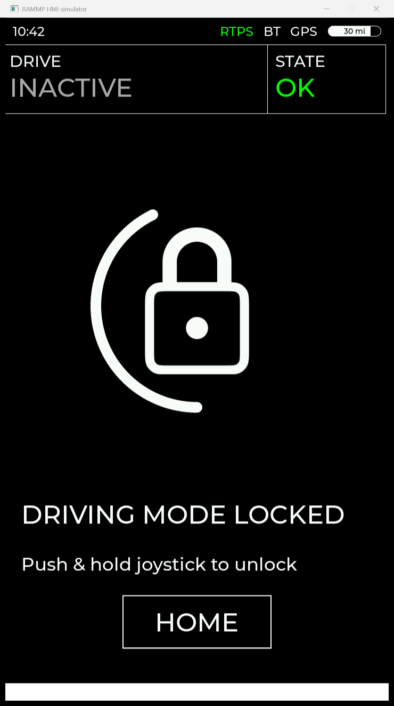
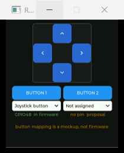

# Desktop simulator

Runs the HMI's screens on a PC, driven from a keyboard and an on-screen D-pad,
with no Tab5 and no MCB on the bench.

| | |
|:--:|:--:|
|  |  |
| The panel: exactly 720x1280, nothing but what the firmware drew | The bench: a D-pad, two buttons, and the mapping mockup |

The screens themselves are not a mockup: this compiles `main/ui/`, the same
SquareLine export the firmware builds, unmodified, against upstream LVGL 9.5.
Layout, fonts, images, colours, styles and the flex pager are the real thing at
the panel's real 720x1280. What is reimplemented is the layer around them; see
[Fidelity](#fidelity) before you trust it for anything.

## Build and run

```powershell
python run.py
```

That configures, builds and launches. Needs CMake, Ninja and a C/C++ compiler
and nothing else: no SDL, no vcpkg, no ESP-IDF, and no Python packages
(`run.py` is stdlib only, like everything in `scripts/`). LVGL is fetched by
CMake on the first run, which is the only step that needs the network; that
first build takes a few minutes, and every one after it takes seconds.

```powershell
python run.py --zoom 100    # the panel's true 720x1280 instead of half scale
python run.py --rebuild     # wipe the build dir and start over
python run.py --build-only  # compile without launching
python run.py --verbose     # show the full compiler output
```

The windows open at half scale by default because 1280 logical pixels tall does
not fit on most laptops. Only the blit is scaled, so layout and text metrics
are always the panel's.

Windows only for now. The display backend is LVGL's native Win32 driver, which
is what keeps the dependency list this short; adding LVGL's SDL backend would
lift that, and nothing in `main/ui/` would have to change.

## Two windows

**RAMMP HMI simulator** is the panel: exactly 720x1280, containing nothing but
what the firmware drew. **RAMMP HMI bench** is the chair's control surface, a D-pad
and two buttons, and nothing else. It parks itself under the panel, or
to the right of it when the panel is too tall to leave room underneath.

Everything else the sim can do (MCB status, link state, theme, reset) is on the
keyboard rather than the bench, because none of it is a control the chair has.
Press F1 in the console for that list.

They are separate windows rather than one, because LVGL will not let a screen
be smaller than its display: `lv_display.c`'s `update_resolution()` writes every
screen's coords straight from the display resolution, and the Win32 backend
re-applies that whenever the window is sized. A wider display therefore
stretches the SquareLine screens and drags every `LV_ALIGN_CENTER` in
`main/ui/` off centre. Keeping the bench on its own display is what keeps the
panel honest, and it means a screenshot of the panel window is a screenshot of
the product, with no sim affordance covering a prompt, an arrow or a status
label.

### The two buttons, and the mapping mockup

**BUTTON 1** defaults to the joystick button: GPIO48 on the board,
`RAMMP_BUTTON_JOYSTICK` on the wire. It is the only button function the
firmware actually implements, and it is what the drive screen's press-and-hold
exit listens to. Its caption says `GPIO48  in firmware`, in green.

**BUTTON 2** exists on the chair but has no pin in the firmware: `main.cpp`
brings up exactly one `espp::Button` and `rammp_rtps_spec.h` defines exactly one
button bit.

Under each button is a dropdown that assigns it a function. **This is a mockup,
not a feature.** It is there so you can feel what a second button might be for
before committing it to the firmware and the wire spec, which is the order those
changes have to happen in. Everything except "Joystick button" is a proposal,
and the window says so three ways: an amber `proposal` caption under the
dropdown, a standing footer reading *button mapping is a mockup, not firmware*,
and a line on stdout every time a proposed function fires.

| option | what it does | real? |
| --- | --- | --- |
| Not assigned | nothing | n/a |
| Joystick button | GPIO48 / `RAMMP_BUTTON_JOYSTICK`, including the drive-screen exit hold | **yes** |
| Home / back | returns to MainScreenFlex, as the exit gestures do | proposal |
| Next drive mode | steps HOLO / Normal / Auto | proposal |
| Horn | announces itself and says nothing on screen shows it | proposal |
| Lights | same | proposal |

Every action a proposal can perform is something the UI can already do by
another route, so the mockup never demonstrates behaviour the board could not
have; what is unproven is whether a *button* should trigger it. Horn and Lights
can only announce themselves, and that is the useful part of the answer: the
screen would need something new before either mapping means anything.

Both buttons can be set to "Joystick button", so the mapping can be tried both
ways round. When a mapping earns its place, put it in `rammp_rtps_spec.h` and
`main.cpp` first, then mirror it here.

## Driving it

Navigation is joystick-only, exactly as on the board: push up and hold on a
page to enter it, then hold the button (or pull, on the seat screen) to come
back. The prompt at the bottom of each screen says which.

The quickest way to feel it: hold the bench D-pad's up key. The
unlock arc fills over a second, the padlock opens, and a second later the pager
advances itself to the Drive page.

| control | key | does |
| --- | --- | --- |
| D-pad | arrows / WASD | push the stick; hold to fill a gesture arc |
| BUTTON 1 | Space | joystick button (while mapped to it) |
| | Q / E | twist left / right |
| | 1 / 2 | MCB drive status INACTIVE / ACTIVE |
| | 3 / 4 | MCB system state OK / ERROR (ERROR raises the banner) |
| | `-` / `=` | MCB speed |
| | L | step the RTPS link state |
| | C | hands-free walk through every state combination |
| | T | day/night theme |
| | R | back to the boot screen |
| | F1 | reprint the key map |
| | Esc | quit |

Clicking in the panel window is the Tab5's touchscreen. A GT911 is really
there, so that is a real input path, not a sim affordance.

Keys work whichever of the two windows has focus, and only while one of them
does. Gesture completions and fake-MCB changes are narrated on stdout, which is
why it is a console app.

## How it fits together

| file | what it is |
| --- | --- |
| [src/main.c](src/main.c) | Entry point. Stands in for `app_main()`: two displays, `ui_init()`, then pump `lv_timer_handler()` forever. |
| [lv_conf.h](lv_conf.h) | LVGL config, mirroring `../sdkconfig.defaults` option for option. |
| [src/sim_input.c](src/sim_input.c) | Keyboard and D-pad to calibrated stick, at the board's 33 ms cadence. Owns the LVGL keypad indev. |
| [src/sim_nav.c](src/sim_nav.c) | The port of `main.cpp`: subjects, bindings, hold gestures, the lock, the seat grids. |
| [src/sim_mcb.c](src/sim_mcb.c) | The fake MCB publisher, keyboard driven. |
| [src/sim_bench.c](src/sim_bench.c) | The bench window: the two buttons and the mapping mockup. |
| [src/sim_dpad.c](src/sim_dpad.c) | The D-pad widget itself. |
| [run.py](run.py) | Toolchain check, configure, build, launch. |

Two paths feed the UI, and they meet at the subjects:

```
  keyboard --+
             +-> sim_input (33 ms) --+-> calibrated x/y/twist --+-> sim_nav hold gestures -> screen changes
  D-pad -----+                       |                          +-> ADC subjects -> JoystickTest bars
                                     +-> LVGL keypad indev ------> focus walking, flex pager

  keyboard ----> sim_mcb (500 ms) -> rammp_mcb_status_t -> sim_nav_on_mcb_status -> subjects -> main/ui widgets
```

Nothing outside `sim_nav.c` touches a widget directly. Everything goes through
an `lv_subject_t` and a binding, which is how `main.cpp` does it too, and is
what makes the port checkable line against line.

## What replaces the hardware

| on the board | in the sim |
| --- | --- |
| DSI panel via the BSP | LVGL's Win32 backend, same 720x1280 RGB565 |
| 3D hall joystick on two ADCs | keyboard and bench D-pad, through the same calibration and Schmitt trigger (`sim_input.c`) |
| GPIO48 button | Space, or whichever bench button is mapped to it |
| MCB over RTPS/W5500 | `sim_mcb.c`, feeding the same `rammp_mcb_status_t` through the same entry point at the spec's 500 ms cadence |
| DRV2605 haptics, click.wav | a line on stdout |
| FreeRTOS tasks | LVGL timers on one thread, so no `lvgl_mutex` |

`sim_input.c` reproduces `espp::Joystick`'s calibration rather than compiling
it, because the espp components are fetched by the IDF component manager and
are not in the tree. It re-runs the assertions from `espp::joystick_selftest()`
at startup so a mistake in that math shows up as a failed selftest line instead
of a deadzone that quietly feels wrong.

## The D-pad

Navigation on this HMI is four discrete directions plus a hold, so a D-pad is a
truer control for it than a ring a mouse can only hold at one point: you can see
which way you are pushing, and you cannot half-press a direction by accident.

A held key is exactly a held arrow key. [src/sim_input.c](src/sim_input.c) ORs
the two together and puts them through the same ramp, calibration and Schmitt
trigger, so the deadzone is still crossed on the way in and back out; it is just
not something you steer through by hand.

Two things it deliberately cannot do, both of which the keyboard still can:
diagonals (a mouse holds one key at a time) and twist (Q and E).

It reads the cursor position and button state from the OS rather than listening
for LVGL press and release events. That is not fussiness: when an indev is reset
mid-press, which happens on the panel display whenever a completed gesture
changes a screen, LVGL forgets which object was pressed. The release is then
routed nowhere and, from that point, LVGL still believes the key is down, so the
next press raises no event either. Polling cannot drift out of step because it
never consults LVGL's state, and a direction latched on would pin the stick at
full deflection, which is the worst thing this sim could misrepresent.

## Keeping it in step with main.cpp

`sim_nav.c` is a *port*, not a shared build, so the two can drift. A sim that
disagrees with the board is worse than no sim. Everything below is named the
same on both sides on purpose, so a change on one side greps straight to the
other.

| in `main/main.cpp` | in `sim/` |
| --- | --- |
| `kHoldMs`, `kBarGraceMs`, `kHoldMax`, `kUnlockAdvanceMs`, `kHoldPollMs` | `sim_nav.c`, same names |
| `kKeyEngage`, `kKeyRelease` | `sim_input.c` **and** `sim_nav.c`, both copies |
| `kHorizontalCal`, `kVerticalCal`, `kTwistCal`, the deadzone radii | `sim_input.c` |
| `kAdcUpdatePeriod` (33 ms) | `SIM_ADC_PERIOD_MS` in `sim_input.h` |
| `kRtpsPollMs` | `sim_nav.c` |
| the `rtps_comms_on_mcb_status` lambda | `sim_nav_on_mcb_status()` |
| `flex_key_cb`, `HoldGesture`, `hold_poll`, `set_locked`, `ButtonGrid`, `grid_key_cb`, `screen_loaded_cb` | `sim_nav.c`, same names |
| every `lv_subject_t` and its bindings | `sim_nav.c`, same names |
| `CONFIG_LV_*` in `../sdkconfig.defaults` | `lv_conf.h`, commented with the key each mirrors |

So, when you change:

- **a gesture threshold or duration** in `main.cpp`, change the same constant in `sim_nav.c`.
- **the joystick calibration or deadzone**, change `sim_input.c`, and extend its selftest if the expected values move.
- **a subject or a binding**, mirror it in `sim_nav.c`. If a widget stops updating in the sim but works on the board, a missing binding here is the first thing to check.
- **an LVGL Kconfig option** in `sdkconfig.defaults`, mirror it in `lv_conf.h`. Kconfig `select`s dependencies automatically and a plain `lv_conf.h` does not, so a new option may need its dependencies spelled out too. `LV_USE_VECTOR_GRAPHIC` needing `LV_USE_MATRIX` and `LV_USE_FLOAT` is the worked example already in the file.
- **anything under `main/ui/`**, nothing: that tree is compiled as-is, and `import_ui.ps1` can rewrite it freely. The CMake glob picks up new screens and components without edits.
- **the button hardware**, in this order: add the bit to `rammp_rtps_spec.h`, read the pin in `main.cpp`, and only then move the function out of the mockup's proposal list in `sim_bench.c` and mark it `in_firmware`. The mockup exists to inform that decision, never to record it.

The one thing here that is deliberately *not* a mirror of anything is the
button-mapping dropdown. It has no counterpart in `main.cpp` and is not
supposed to acquire one; treating a selection in it as a specification is the
failure mode it is labelled against.

Making the drift structurally impossible means extracting the navigation layer
out of `main.cpp` into a hardware-free translation unit both targets compile.
That is the right fix and it is not done here.

## Fidelity

Trust it for: screen layout and styling, the flex pager, the hold-gesture
timings and arcs, focus walking, the lock flow, theme switching, and every
label that renders MCB data.

Do not trust it for: anything about timing or performance on the ESP32-P4 (this
is a desktop CPU doing software rendering, with none of the P4's frame-buffer
or PPA behaviour), the RTPS wire itself (use `scripts/rtps_mcb_gui.py` against a
real board for that), haptics, audio, or the ADC front end.

## Troubleshooting

**`run.py` says no compiler.** It prints the `winget` line for LLVM or the VS
Build Tools. Ninja is optional but much faster than the Visual Studio generator.

**The first build takes minutes.** It is compiling LVGL, ThorVG and the
generated font and image tables from scratch. Later builds are incremental.
`--rebuild` throws that away and starts again, so reach for it only when the
CMake cache is actually wrong.

**Keys do nothing.** Neither window has focus. Input is deliberately ignored
unless the foreground window belongs to the sim, because `GetAsyncKeyState` is
global and a sim that reacted to typing elsewhere would be unusable.

**One `No draw buffer` warning at startup.** Expected and harmless: the Win32
backend allocates its DIB on the window thread, so the first refresh can land
before it exists. It should appear once per window and never again.

**The panel window is taller than the screen at `--zoom 100`.** 1280 px plus a
title bar does not fit under most desktops. That is what the default half scale
is for; the bench moves beside the panel rather than under it in that case, so
it stays reachable.

**A widget updates on the board but not in the sim.** Almost always a binding
that was added to `main.cpp` and not mirrored here. See
[Keeping it in step](#keeping-it-in-step-with-maincpp).

**The joystick selftest fails at startup.** `sim_input.c`'s calibration no
longer matches the assertions taken from `espp::joystick_selftest()`. The sim
still runs, but the deadzone and range behaviour are no longer the board's, so
fix that before trusting anything you see.
